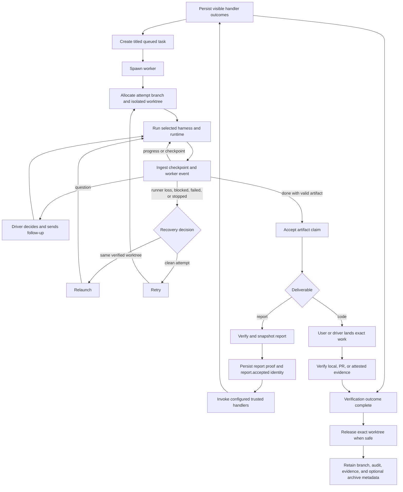

# Shephrd documentation

Shephrd is a local control plane for delegating repository work from a user-facing driver to isolated agent workers. The driver owns judgment and authorization. Shephrd records intent, creates attempt-owned Git worktrees, runs workers, routes durable events, and verifies delivery evidence.

Shephrd supports macOS and Linux and requires a POSIX environment.

This page is the concise lifecycle and command map. Detailed guides live under [`components/`](components/), and shared reference material lives under [`reference/`](reference/). The base guidance prefers worker delegation for substantive repository work, including small tasks, while keeping investigation and answers proportionate. Conversation, context-supported answers, coordination and lifecycle operations, and explicitly requested direct work can remain direct. Task decomposition, independent review, PR creation, model-family choices, successor work, and recursive delegation are not automatic.

## End-to-end lifecycle



The boundaries are deliberate: task readiness does not spawn; `done` does not prove landing; attestation does not verify; verification does not merge; notification acknowledgement does not dispose of a result; release requires proof or explicit discard authority and safe process liveness. Distinguish accepted artifacts and authoritative landing from non-authoritative branch or PR observations. Review is optional, not a task state or prerequisite for completion.

## Components and mechanisms

### Work definition and execution

- [Repository registration](components/repositories.md) canonicalizes Git roots, default branches, context files, and trusted setup hooks before task creation.
- [Tasks and titles](components/tasks.md) defines durable outcomes, persisted human titles, deterministic CLI title derivation, stable feature keys, deliverables, task states, inventory, obligations, and archive visibility.
- [Attempts and isolated worktrees](components/attempts-worktrees.md) owns attempt identity, native Git worktree allocation, branches, workspace states, setup, and exact cleanup identity.
- [Harnesses and runtimes](components/harnesses-runtimes.md) selects Claude Code, Pi, or Codex and headless, Herdr, or cmux presentation without translating model identifiers.
- [Worker event and checkpoint protocol](components/worker-protocol.md) defines strict event envelopes, checkpoint freshness, run fencing, event ingestion, and protocol failure behavior.

### Coordination and handoff

- [Opt-in repository sub-drivers](components/subdrivers.md) separates durable scoped supervision from bounded harness sessions, with original-request routing, correlated returns, general research and explicit restart recovery.
- [Notifications and watcher delivery](components/notifications-watchers.md) covers owner-routed notifications, claim leases, the Pi watcher, bounded manual drains, desktop hints, and the obligations projection.
- [Plans and evidence handoff](components/plan-evidence.md) covers persistent planning, prerequisites, report-input selection, readiness, dispatch, and immutable successor inputs.
- [Ownership, adoption, and annotations](components/ownership-annotations.md) separates cooperative owner identity, explicit transfer, revision-fenced annotation history, and replacement-driver recovery.
- [Optional review feedback](components/review-feedback.md) explains the ordinary task and report mechanics available when a user or repository requests review.

### Results, recovery, and platform state

- [Artifacts and reports](components/artifacts-reports.md) defines code and report artifact contracts, report snapshots, provenance, and bounded report inputs.
- [Report acceptance lifecycle handlers](components/lifecycle-handlers.md) defines the single typed `report.accepted` event, trusted external handlers, bounded annotations and receipts, and explicit idempotent retry.
- [Landing, attestation, verification, and release](components/delivery-release.md) separates accepted artifacts, external evidence, immutable proof, merging, verification, discard, and worktree removal.
- [Retries, relaunches, and stale attempts](components/recovery.md) selects same-worktree continuation or clean retry and explains stale generations, superseded workspaces, stopping, and reconciliation.
- [Configuration, persistence, and backends](components/configuration-state.md) covers strict configuration, environment precedence, SQLite state, migrations, executable selection, runtime backends, and trust boundaries.

### Shared references

- [Authority map](reference/authority.md) identifies the owners of worker guidance, user-selected workflow preferences, skill mechanics, CLI behavior, source-enforced behavior, and migration guidance.
- [CLI conventions and utility commands](reference/cli.md) documents bootstrap, output contracts, help, completion, and private runtime commands.
- [Repository context, memory, and workflow modules](reference/workflow-modules.md) documents lean context discovery, default-on agent-maintained memory with an opt-out, on-demand topics, and explicitly selected Markdown playbooks. No background indexer or workflow engine is involved.

## Minimal direct flow

Create repositories with ordinary Git and register existing roots with `shephrd repo add <path>`. Use a registered repository and stable feature key. Task creation queues work but does not start it. Outside an active Pi session, include `--driver-id <owner>`. `--title` remains an explicit override; when omitted, the CLI derives and returns the persisted title from the objective.

```sh
shephrd repo list --json
shephrd task create \
  --repo example \
  --feature improve-search \
  --driver-id driver:example \
  --acceptance "Tests pass and the exact artifact is reviewable" \
  "Improve repository search" \
  --json
shephrd worker spawn <task-id> --json
```

After a healthy spawn, an interactive driver returns idle. It handles later questions through the watcher or one bounded notification pass, inspects the result, performs any authorized landing, and verifies delivery explicitly.

For requested A-then-B work where A produces findings, verified reports can be attached to B with `--with-report-from <A-task-id>`. Plans remain available for durable graphs and evidence handoffs. Neither capability requires creating further work after a task completes.

## Command families

Use `shephrd help`, `shephrd <family> --help`, or `shephrd <family> <command> --help` for the current command and flag surface. CLI help comes from the Cobra command tree; the component guides explain lifecycle semantics and authority boundaries.

- `subdriver` forwards original requests to opt-in repo/general owners, correlates replies/results, and inspects or recovers bounded sessions.
- `repo` inspects project context, registers, and discovers repositories.
- `protocol validate` preflights authored worker/sub-driver event format without loading configuration or state.
- `task` creates, inspects, transfers, archives, attests, and verifies work.
- `worker` starts, observes, communicates with, stops, and recovers attempts.
- `wake` handles owner-routed notifications and claim leases.
- `plan` plans dependent work, report evidence inputs, and dispatch.
- `task annotate`/`plan annotate` record and read revision-fenced task and plan annotations.
- `workspace` reconciles and releases attempt worktrees.

Help, shell completion, output conventions, and private runtime commands are covered by the [CLI reference](reference/cli.md).

## Documentation checks

`make test-docs` checks local Markdown links and Mermaid fences. CLI tests verify command and generated output behavior separately.
