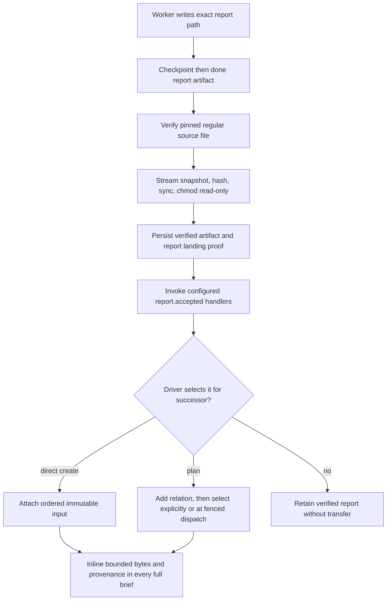

# Artifacts and reports

## Purpose

Artifacts carry worker results across the completion boundary. The task's creation-time deliverable selects one strict contract: code produces an attempt branch or GitHub pull request URL; report produces the exact task/attempt/run report path. Verified reports can become immutable ordered inputs to later tasks.

## Ownership and authority

The worker normally proposes an artifact only in a valid `done` event. Shephrd validates shape and attempt identity before accepting the claim. The filesystem supplies report bytes; Git and GitHub supply code delivery facts. The driver decides whether the result is acceptable and whether it should inform or be landed for another task. After immutable report acceptance, explicitly configured [report lifecycle handlers](lifecycle-handlers.md) may return non-authoritative presentation annotations or external receipts.

One exceptional driver-only path exists when a report worker wrote the canonical report and a current final checkpoint but terminal handoff failed without an accepted current-generation worker terminal. `attest-report-recovery` records immutable evidence without creating a worker event or accepting an artifact. The immutable record freezes worker send and same-worktree relaunch for that attempt. A separate `verify-delivery` action must revalidate that evidence before the task gains a recovered completion; an explicit clean retry creates a new attempt without changing or retargeting the old evidence.

Artifact acceptance, semantic approval, landing, verification, input selection, and release are separate actions. For simple ordered work, direct creation of B with `--with-report-from <A-task-id>` after A is verified is the default handoff; plans are reserved for graphs that need durable planning state.

## Inputs and outputs

A code task accepts `branch:<exact-attempt-branch>` or a GitHub PR URL. A branch event must name the exact current attempt branch and agree with the checkpoint branch. New report runs accept only `report:<data_dir>/<task-id>/<attempt-id>/run-<generation>/report.md`. Spawn, send and relaunch assign the destination before launching the worker. Generated briefs and follow-ups name it explicitly; `task inspect --json` exposes it as the current attempt's `report_path`. A terminal event with an artifact must name that exact destination, not an earlier run, another attempt or an arbitrary draft. Verification and eligible recovery use the same destination.

Report verification outputs immutable metadata: producer task and attempt, worker done or driver recovery provenance, original reference, SHA-256, byte count, canonical snapshot path, verification time, and the stable versioned `report.accepted` event identity. Direct task creation or plan dispatch can output ordered immutable report-input bindings with attaching-driver provenance.

## Persisted state

A non-waking system `report-destination` message binds each newly launched report run to its absolute path. The current attempt projects that binding as `report_path`; prior run bindings stay in message history. This uses the existing schema without backfilling old runs. The accepted artifact reference is stored on the task and accepted done message. `verified_artifacts` stores immutable report snapshot and acceptance-event identity. `task_report_inputs` stores ordered target-task bindings and attachment provenance. Report snapshots live under `<data_dir>/artifacts/sha256/<digest>.md` and are installed read-only.

Producer task data, including the writable original report, remains separate from the content-addressed snapshot. A recovered report keeps `claimed_done=false` and records `completion_provenance=driver_report_recovery`; the prior blocked or failed messages remain in audit history.

## Normal flow

Snapshot capture has no content-size or text restriction. Use as a successor input requires at most 64 KiB, valid UTF-8, no NUL, exact byte count and digest, a regular file, and the canonical digest path. A task can have at most 16 report inputs.

## State transitions

A worker artifact starts as an unverified accepted claim. Report verification changes it into an immutable verified artifact and complete report landing proof. A recovery attestation is not an artifact claim: verification rechecks the exact owner, attempt, generation, checkpoint, held worktree, dead process and endpoint, canonical pinned file identity and stable bytes, then installs the same ordinary immutable report snapshot. Attaching that artifact creates a separate immutable target-task input. Producer retry can create a different current eligible artifact, but existing dispatched target inputs do not change.

Code artifacts do not become verified report inputs. Branch push is delivery only; code landing transitions are canonical in [delivery and release](delivery-release.md).

## Failure and recovery

Wrong deliverable type, surrounding whitespace, wrong branch, wrong report path, missing or nonregular source, symlink or changed source identity, unstable bytes, snapshot mismatch, stale recovery identity, conflicting terminal or artifact evidence, oversize input, invalid UTF-8, NUL bytes, stale producer eligibility, duplicate producer selection, or too many inputs fails closed.

A report too large or nontextual can still be snapshotted and retained but cannot be attached. Create a bounded summary report when handoff is required. If a producer retry replaces the current report, explicitly reselect it for every undispatched plan input; dispatch never silently substitutes a stale selection. Only a relation with no prior selection can be pinned automatically, and only after exact current eligibility and immutable snapshot verification.

### Same-attempt continuation and upgrade

A follow-up or relaunch increments the run generation and assigns a new destination even when the task, attempt, branch and worktree stay the same. Earlier source reports, artifact references in messages, verified snapshots, hashes, report inputs and immutable proofs are not rewritten. Shephrd creates the destination directory, not report bytes. Workers must preserve earlier files and write the new report only at the newly assigned path.

Legacy runs without a destination binding retain their canonical `<data_dir>/<task-id>/report.md` verification and eligible recovery path. An existing proof remains immutable. Legacy noncanonical accepted artifacts do not acquire a new recovery route. Installing the new executable does not retarget an already issued brief or claim that old report bytes were produced by a later run.

For an already waiting legacy run3 with an absent process, held workspace, prior `report.md` and an unsubmitted worktree draft:

1. The existing owner, after the upgraded executable is confirmed, inspects `shephrd task inspect <task-id> --json` and `shephrd worker status <task-id> --json`. Confirm the exact current attempt, waiting run3, resumable session and ordinary process/endpoint eligibility. Do not adopt foreign work or edit generated briefs/store rows.
2. The owner runs `shephrd worker send <task-id> "Review the existing continuation draft, preserve all earlier reports, and write and submit the current run report at the newly assigned destination." --json`. This is ordinary continuation to run4, not a new attempt. The follow-up supplies `<data_dir>/<task-id>/<attempt-id>/run-4/report.md`. The worker reviews the draft in run4, writes the new report there and emits a fresh run4 checkpoint followed by `done` with `report:<absolute-run4-path>`. It must not submit the old draft or `report.md`, nor attribute run4 output to run3.
3. If the native session is not resumable, the owner can instead choose ordinary `shephrd worker relaunch <task-id> --json` after exact held-worktree and process checks. It also advances run3 to run4 but starts a fresh session in the same attempt/worktree. Choose one transition, not both.
4. Normal accepted-done verification uses the new path. If explicit verification is needed after worker exit, the owner runs `shephrd task verify-delivery <task-id> --attempt <attempt-id> --json`. A retained untracked draft can keep the workspace held even after report proof succeeds. Do not discard it merely to make release pass.

Outside the existing owner session, pass its explicit `--driver-id` only through that owner's authorized command context. A waiting run or prior accepted terminal/artifact is not eligible for exceptional report recovery; its existing gates are unchanged. Do not use retry, recovery attestation, file replacement or record repair as a destination-retargeting shortcut. New runs must be launched and verified by the upgraded CLI; old executables do not enforce the new destination binding. Binary installation, paired watcher/bridge activation and session reload remain separate main-owned operations.

## Safety invariants

- Deliverable is fixed at task creation and checked at ingestion and verification.
- A branch artifact must identify the exact attempt branch.
- A new report artifact must identify the exact task/attempt/run destination; legacy verification remains tied to its original canonical path.
- Driver recovery never synthesizes a worker message and is visibly distinct from ordinary worker completion.
- Exact recovery replay is idempotent; any evidence mismatch or concurrent identity change fails closed.
- Verified snapshots and their `report.accepted` event identities are immutable.
- Handler annotations and receipts never rewrite artifact or task authority.
- Input order and artifact identity are explicit and durable.
- Report handoff transfers bytes and provenance only, never worktree files, patches, Git state, transcripts, caches, or credentials.
- Prerequisite relations never infer report selection.
- A report task has normal worker command authority despite its artifact contract.

## Commands

The task-creation forms below are schematic option combinations, not runnable invocations. [Tasks and titles](tasks.md) owns the complete creation inputs and optional title override.

- Code selection: `shephrd task create ... --deliverable code ...`
- Report selection: `shephrd task create ... --deliverable report ...`
- Simple successor: `shephrd task create ... --with-report-from <verified-report-task-id> ...`
- `shephrd task attest-report-recovery <report-task-id> --attempt <attempt-id> --run-generation <n> --checkpoint-revision <n> --checkpoint-cursor <n> --reason <reason>`
- `shephrd task verify-delivery <report-task-id>`
- `shephrd plan report select <plan> <item> <prerequisite>`
- `shephrd task inspect <task-id>`

## Interactions with other components

[Worker protocol](worker-protocol.md) accepts artifact claims. [Report acceptance lifecycle handlers](lifecycle-handlers.md) run only after immutable snapshot acceptance. [Plans](plan-evidence.md) plan ordered selection. [Review loops](review-feedback.md) use report tasks for findings. [Delivery](delivery-release.md) persists landing proof and conditionally releases producer worktrees. [Recovery](recovery.md) preserves target input identities across retry and relaunch.

## Design rationale

Creation-time deliverables prevent a completion claim from changing the expected evidence contract. Content-addressed snapshots separate immutable handoff from mutable task storage. Explicit bounded report inputs provide useful predecessor evidence without creating hidden filesystem or task dependencies.
