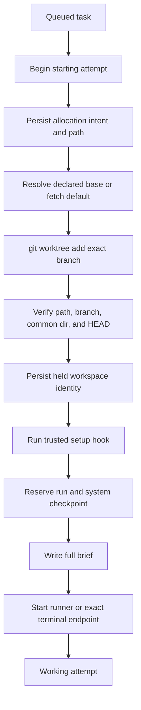
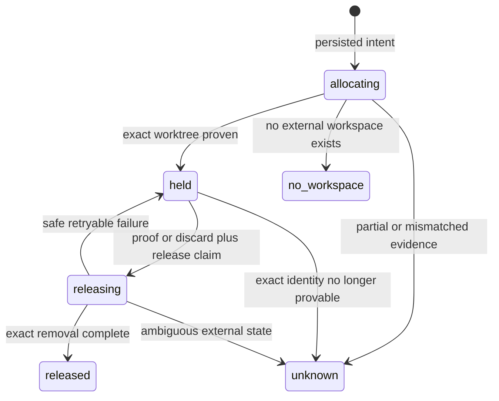

# Attempts and isolated worktrees

## Purpose

An attempt is one execution lineage for a task. It owns one branch, one native Git worktree, one harness/model/runtime selection, one native session lineage, and one or more fenced run generations.

## Ownership and authority

`internal/control` coordinates allocation and launch, `internal/worktree` proves native Git identity, and `internal/store` persists intent before external effects. Git and the filesystem are authoritative for branch, path, HEAD, gitdir, common directory, and dirt. SQLite records the expected identity and lifecycle.

The driver separately authorizes spawn, recovery, stop, landing, and discard. An attempt record does not grant any of those actions by itself.

## Inputs and outputs

Spawn consumes one queued task, its registered repository, selected harness/model/runtime, verified report inputs, current executable, and an explicit base selection. It produces an attempt ID, deterministic branch, attempt-owned worktree, run generation, system checkpoint, brief, runner or terminal endpoint, and updated task state.

Attempt branches are `shephrd/<task-id>` for attempt 1 and `shephrd/<task-id>-attempt-<n>` thereafter. Native worktrees live below `<worktree_root>/<repo-id>/<attempt-id>/<repo-name>`.

## Persisted state

The attempt row stores attempt number, harness/model, runtime and executable, run/runtime generations, session, resume provenance, exact terminal endpoint, workspace backend and state, intended and actual paths, gitdir, common directory, branch, declared base strategy/reference, resolved base commit, process/cursor/status, landing proof fields, discard authority, and release saga state.

The branch remains after worktree release. Worktree contents do not become SQLite state.

## Normal flow

A report task receives the same isolated worktree and execution authority as a code task. Deliverable changes artifact validation, not sandboxing.

Ordinary spawn and clean retry use `default_branch`, resolved at allocation time. The `--base-branch`, `--base-task`, and `--base-commit` flags explicitly select stacked work. Branch selection resolves a local branch; task selection resolves the selected task's current native attempt branch; commit selection requires a full immutable Git object ID. The selection is recorded before allocation effects, and the resolved commit is immutable for that attempt.

## State transitions

Current attempts use `native_git_worktree`. Historical `treehouse` values remain readable but have no current allocator or cleanup path.

## Failure and recovery

Failure before `git worktree add` with no path or registration records `no_workspace`. Partial creation or unprovable identity records `unknown` and never triggers guessed cleanup. Setup or launch failure after exact allocation leaves the worktree held.

`worker status` samples process, session, checkpoint, endpoint, and workspace state. `alive-busy` means the recorded runner is live. `alive-idle` means a waiting task has a resumable session but no live runner; it is a heuristic, not process proof.

Use [recovery](recovery.md) to choose relaunch, retry, stop, or reconcile. Use [delivery and release](delivery-release.md) for proof-gated removal.

## Safety invariants

- Allocation intent is durable before external creation.
- Attempt path, branch, gitdir, common directory, and base HEAD must agree before `held`.
- Symlink escape, traversal, path reuse, branch reuse, and mismatched worktree identity fail closed.
- Registered-root dirt and ignored files are never copied.
- Retry never reuses or transfers the old worktree.
- Same-worktree relaunch never re-resolves a base; it retains the attempt's exact resolved commit.
- Clean retry inherits the prior declared base strategy unless the driver explicitly selects another one.
- Unknown identity is never automatically removed.
- Worktree release never deletes the attempt branch.
- Git worktrees isolate Git state but do not sandbox processes, files, credentials, or network access.

## Commands

- `shephrd worker spawn <task-id>`
- `shephrd worker status <task-id>`
- `shephrd workspace reconcile`
- `shephrd workspace release <task-id>`

The latter two are mutating recovery and cleanup commands, not read-only status operations.

## Interactions with other components

[Repositories](repositories.md) provide base and setup. [Harnesses and runtimes](harnesses-runtimes.md) launch inside the worktree. [Worker checkpoints](worker-protocol.md) stamp current Git facts. [Recovery](recovery.md) preserves or replaces the attempt. [Delivery](delivery-release.md) proves when the exact worktree may be removed.

## Design rationale

One worktree per attempt provides simple Git isolation and independent cleanup. Persisting intent before Git effects makes interrupted allocation classifiable. Keeping branches after worktree removal preserves artifact history, while refusing cleanup under uncertain identity avoids destroying unrelated state.
