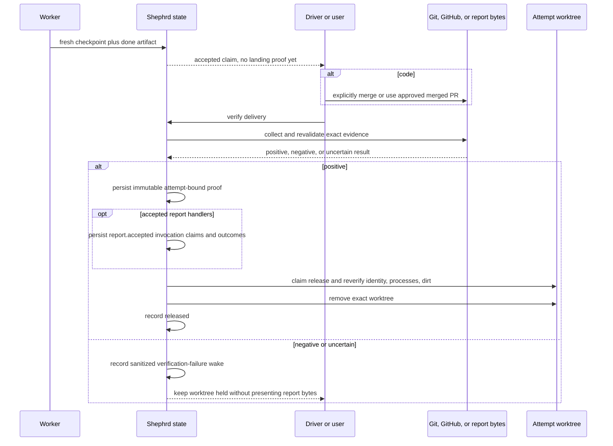
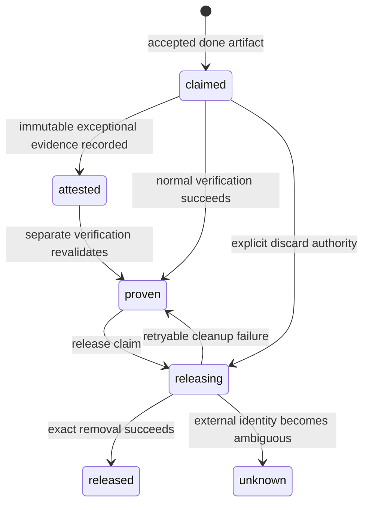

# Landing, attestation, verification, and release

## Purpose

This mechanism proves what happened to an accepted artifact and removes an attempt worktree only when exact proof or explicit discard authority exists. It keeps worker completion, artifact delivery, landing, attestation, verification, and release distinct.

## Ownership and authority

The worker owns only its `done` claim. The user or driver performs code landing. Git, GitHub, and report bytes provide external evidence. Shephrd validates and stores immutable attempt-bound proof. The current driver alone can record exceptional external, local code, or report recovery attestations. Worker context is forbidden.

Verification observes and records evidence; it never merges, pushes, replaces an artifact, selects a PR, or grants review approval. After report proof persistence, configured [report acceptance lifecycle handlers](lifecycle-handlers.md) run before the result is presented and remain non-authoritative. Release removes an exact worktree after proof or discard; it never deletes the branch.

External GitHub observation for delivery attestation runs through the explicitly configured, SHA-pinned first-party `shephrd-github-observer` extension. Core supplies only the exact registered remote identity, accepted artifact, and sealed commit; the extension returns bounded immutable observations plus its identity and version and never claims landing or release. Core revalidates the observation against task, attempt, checkpoint, response binding, and registered identity state, computes the evidence digest, and applies every proof gate before anything is recorded. Ordinary exact-head PR artifact verification remains a separate direct `gh pr view` path; local-only flows launch no observer extension.

## Inputs and outputs

Verification selects the current attempt unless an eligible attempt is named. It consumes the accepted done event, final worker checkpoint, artifact reference, repository identity, and external evidence. It outputs delivery observations, an immutable landing proof when positive, and current release state.

External attestation consumes a canonical merged GitHub PR URL and full sealed checkpoint commit. Local artifact-mismatch recovery consumes the full sealed commit for a legacy accepted wrong branch reference. Report recovery consumes the explicitly named current attempt, run generation, final checkpoint revision and cursor, and a bounded driver reason after failed terminal handoff. All three record evidence only; a separate verification revalidates and consumes it.

Explicit discard consumes driver authorization to destroy unlanded or residual worktree contents.

## Persisted state

Attempts store landing kind, source commit, target ref and commit, checkpoint revision, verification time and reason, discard authorization, release claim owner/time/state/reason, and release time. Immutable artifact fields store the stable `report.accepted` event identity, and durable invocation rows store configured handler outcomes and receipts. Immutable tables store report metadata, external PR attestations, local code recovery evidence, and report recovery evidence binding owner, task, attempt, generation, checkpoint, held worktree, canonical path, regular-file identity, SHA-256, byte count, reason, and time. Landing views accept only complete proof shapes.

Accepted proof kinds are report artifact, exact local default-branch ancestry, exact-head merged PR, attested PR ancestry, and attested local recovery ancestry.

## Normal flow

### Verification paths

- Ordinary report verification snapshots the exact assigned task/attempt/run report after an accepted worker done event, records report proof, and can release the clean worktree. Legacy unbound runs retain their original canonical task report path; new bound runs never fall back to it. See [same-attempt continuation and upgrade](artifacts-reports.md#same-attempt-continuation-and-upgrade).
- Exceptional report recovery attestation requires a blocked or failed current report attempt with no accepted worker terminal or artifact, a dead runner and terminal endpoint, exact held native worktree identity, a current worker checkpoint, and stable canonical regular-file bytes. Later verification revalidates every binding, records a system recovery provenance rather than a worker event, installs the ordinary report snapshot, transitions the task to recovered done, and releases under the ordinary proof rules.
- Local code verification requires exact accepted attempt branch, final clean checkpoint, branch and HEAD at the sealed commit, shared registered common Git directory, a code delta from base, and sealed commit ancestry into the local registered default branch.
- Ordinary PR verification requires the accepted PR head branch to match the attempt branch, merged state into the registered default branch, and exact PR head equal to the sealed checkpoint commit.
- External PR attestation is the stronger path when a merged follow-up PR contains the sealed commit but has a later head. It validates registered origin, PR repository/base/merge identity, sealed commit membership and ancestry, and merge reachability from current default. The observer extension collects the PR graph and compare facts through bounded paginated read-only GitHub queries; timeout, crash, malformed, stale, or dishonest responses fail closed without recording evidence. Core recomputes the evidence digest over the exact observation and stores it with the immutable attestation, while re-verification revalidates the immutable attestation fields without treating a moved default head as a conflict.
- Local recovery attestation exists only for a legacy artifact mismatch already accepted by an older binary. It preserves the wrong original artifact while proving the attempt branch's sealed commit is in local default.

Ordinary PR verification has a current known limitation: it does not establish the stronger registered-repository membership and default-head reachability relation used by external attestation. Use attestation when that relationship is the delivery path.

## State transitions

Proof persistence precedes handler invocation and cleanup, so handler or release failure retains report acceptance and proof. Release preserves the accepted report notification even when handler recovery is still pending; presentation remains gated until every handler has a terminal visible outcome. A released attempt remains fully auditable. Discard can authorize removal without landing but does not itself change task status or establish closure.

## Failure and recovery

An open or unmerged PR, pushed branch, dirty final code checkpoint, wrong branch, changed ref, missing code delta, squash/rebase/cherry-pick without an accepted attestation path, GitHub outage, mismatched attestation, live process, dirty landed worktree, or uncertain identity keeps the workspace held.

Before proof, report verification failure keeps the done result hidden and creates one durable sanitized wake for the current completion. It contains a failure classification and exact inspect and retry commands, but no artifact reference, report bytes, or verifier diagnostic. After proof, fix safe process, dirt, provider, handler configuration, or identity blockers and run verification or release again. A report handler failure is returned alongside the accepted result and retries only on an explicit `verify-delivery` invocation with the same event and invocation identities. Residual dirt after landing requires explicit discard authority before forced removal. Use `worker stop --discard` when both task stop and workspace discard are intended; `workspace release --discard` alone does not stop the task.

## Safety invariants

- `done` is not landing proof.
- Attestation is evidence recording, not verification or landing.
- Verification never mutates repository history.
- Release loads complete proof rather than trusting a boolean projection.
- No worktree is removed while the runner or a conflicting process is live.
- Non-discard release requires exact clean native worktree identity.
- Unknown or allocating workspace state cannot be released.
- Discard authority is explicit, attempt-bound, and persisted before forced removal.
- Original artifact references and immutable attestations are never rewritten.
- The GitHub observer collects external attestation evidence only; it cannot claim landing, release, or any lifecycle outcome, and external attestation is unavailable when it is unconfigured.
- Report handler failure never rolls back report acceptance and handler output never authorizes another lifecycle action.
- Verification failure presentation cannot expose or accept unverified report bytes.
- Release preserves pending report-result notification obligations across handler recovery.
- Attempt branches and audit evidence survive release and discard.

## Commands

- `shephrd task attest-delivery <task-id>`
- `shephrd task attest-report-recovery <task-id> --attempt <attempt-id> --run-generation <n> --checkpoint-revision <n> --checkpoint-cursor <n> --reason <reason>`
- `shephrd task verify-delivery <task-id>`
- `shephrd task verify-delivery <task-id> --local`
- `shephrd workspace release <task-id>`
- `shephrd worker stop <task-id> --discard`

## Interactions with other components

[Artifacts](artifacts-reports.md) define accepted references and report snapshots. [Report acceptance lifecycle handlers](lifecycle-handlers.md) consume accepted snapshot identity and return only bounded advisory output. [Attempts](attempts-worktrees.md) supply exact cleanup identity. [Ownership](ownership-annotations.md) gates attestation. [Notifications](notifications-watchers.md) remain independent from proof and release. [Recovery](recovery.md) handles held superseded or uncertain attempts.

## Design rationale

External systems cannot participate in one SQLite transaction, so Shephrd uses small persisted sagas and revalidation. Separating attestation from verification preserves driver approval as evidence without treating it as proof. Retaining branches and immutable records after worktree removal favors recoverability and audit over aggressive cleanup.
