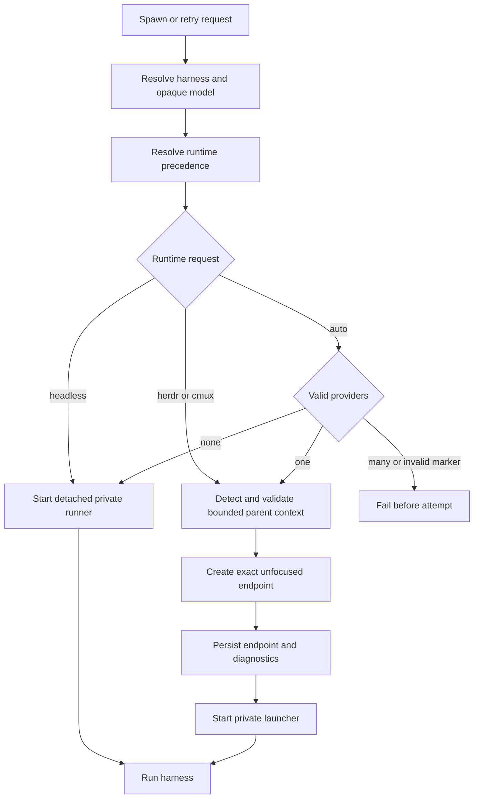

# Harnesses and runtimes

## Purpose

Harness selection chooses the agent interface. Runtime selection chooses how the Shephrd runner is presented and supervised. These are orthogonal persisted choices for each attempt.

Supported harnesses are `claude-code`, `pi`, and `codex`. Persisted runtimes are `headless`, `herdr`, and `cmux`; `auto` is a request resolved before attempt creation.

## Ownership and authority

Explicit user choices and configured defaults select the harness and model. The base guidance imposes no model-family preference. Shephrd treats model IDs as opaque harness-specific strings and never translates, catalogs, or escalates them. `internal/adapter` owns invocation construction and native stream parsing. `internal/terminal` owns the terminal provider contract, explicit extension routing, and exact endpoint operations. The harness and provider processes remain external authorities for native session and process state.

## Inputs and outputs

For a new worker or never-started sub-driver, harness precedence is explicit spawn selection (workers only), registered-repository override, then global `default_harness`. A configured `current` default requires valid driver harness context. Model precedence is explicit model (including empty), repository model if the selected harness matches its override, global `default_model` if the selected harness matches the static global default, matching driver model context, then the harness-native default. An explicit harness switch never carries an incompatible configured model.

Retry inherits the prior harness and model when staying on the same harness unless explicitly overridden. Cross-harness retry never carries the old model. Relaunch keeps the stored harness, model, and runtime and accepts no override.

### Harness/model selection contract

- `default_harness` accepts `claude-code`, `pi`, `codex`, or `current`. Optional `default_model` requires a static global harness. `[repository_models.<repo-id>]` accepts a required `harness` (`claude-code`, `pi`, or `codex`) and nonempty `model` for that registered repository ID. No role routing or model catalog exists.
- `worker spawn` and `worker retry` accept `--harness` and `--model`. Explicit selections win. `--model=""` deliberately uses the selected harness's native default rather than inheriting a model.
- Without a matching configured model, initial model inheritance reads only `SHEPHRD_DRIVER_HARNESS` and `SHEPHRD_DRIVER_MODEL`. Both must be supplied to inherit an exact model, and the declared harness must match the selected harness. `PI_MODEL` alone is not a Shephrd selection input. Driver context cannot override configured harness/model defaults.
- Without configured or matching driver model context, the model is empty and the harness's `--model` argument is omitted. That native-default behavior is intentional; it does not guarantee the model running in the caller's Pi session. Set a default, supply the matching driver pair, or pass an explicit model when exact selection matters. Shephrd does not change harness-native configuration.
- A sub-driver saves its initial harness/model and exports that pair to its worker-spawn commands. Later environment changes do not replace its stored selection, including an empty model. Explicit worker flags still win. See [generation-fenced sub-driver model correction](subdrivers.md#correcting-a-retained-model).

For example, with `default_harness = "current"`, a caller can supply an exact verified harness/model pair for a new owner or initial worker:

```sh
SHEPHRD_DRIVER_HARNESS=pi SHEPHRD_DRIVER_MODEL="$VERIFIED_PI_MODEL_ID" \
  shephrd worker spawn <task-id> --json
```

A caller can instead use explicit worker flags without changing defaults:

```sh
shephrd worker spawn <task-id> --harness claude-code \
  --model "$VERIFIED_CLAUDE_MODEL_ID" --json
```

The variables above are caller-owned shell values, not Shephrd settings. Resolve product names to identifiers supported by the chosen harness outside Shephrd; identifiers are forwarded unchanged and not authenticated or validated against a provider. If a planning sub-driver and implementation workers need different models, select the worker model explicitly. Retry keeps the stored selection on the same harness; on an explicit harness switch it still uses only an explicit or matching driver model (not new configuration). Relaunch and retained sub-driver turns keep stored values. Shephrd does not infer roles or use model names from request prose.

Runtime precedence is command request, runtime environment, configuration, then `headless`. `auto` chooses one valid detected provider, uses headless when none is marked, and fails on invalid or ambiguous marked context.

The outputs are persisted harness, model, runtime, runtime executable, native session, and, for terminal runtimes, exact endpoint and nonsecret capability diagnostics.

## Persisted state

Attempts store harness, model, runtime backend, runtime executable, run and runtime generations, native session, generic terminal socket/window/workspace/tab/pane/surface identity, provider and protocol versions, and required capabilities. Credentials, raw capability responses, labels, current focus, and full environments are not durable authority.

## Normal flow



Headless harnesses use machine-readable output with adapter-assigned record authority. Claude Code main-session assistant records explicitly carry null parent authority; forwarded subagent records carry parent or equivalent nested metadata and are ignored as worker protocol. Pi and Codex retain their native top-level assistant record boundaries. Under terminal providers, Pi and Claude Code use native interactive TUIs with private trusted bridges; Codex remains machine-readable. Each worker terminal invocation is ephemeral, and a follow-up creates a replacement endpoint for the same native session. [Sub-driver turns](subdrivers.md#bounded-fresh-sessions) reuse these native Pi/Claude interfaces but always start a fresh session, with sub-driver-specific event validation and a bounded deadline.

Herdr requires valid parent markers and protocol 17 or newer. cmux is explicit macOS support requiring a private socket, exact caller identity, socket protocol version 2, and required exact-target methods.

The first-party Herdr and cmux extensions route terminal presentation through `shephrd-terminal-herdr` and `shephrd-terminal-cmux`. Both declare version 1 of the same typed terminal operation contract for detect, diagnostics, create, start, inspect, process attribution, read, focus, close, and presentation state. The provider-neutral host also carries the typed [report acceptance lifecycle handler](lifecycle-handlers.md), [notification presentation](notifications-watchers.md), and [`driver.delivery`](notifications-watchers.md#driverdelivery-v1) capabilities. It validates a pinned executable, exact wire and typed-capability manifests, request/response identity, bounded strict JSON, deadlines, diagnostics, redaction, and subprocess-tree termination. Each extension owns its provider protocol while core retains worker bridges, event ingestion, task and attempt state, endpoint persistence, process attribution, verification, reconciliation, and release authority. Create uses a prepared frame followed by core endpoint persistence and an explicit commit; a failed or uncertain create resolves through explicit bounded abort cleanup that must prove its outcome, and never through a fixed EOF grace. Omitting a provider's extension table refuses new operations for that provider with a typed error; headless remains the built-in default and launches no extension process. Endpoints persisted before the cutover are recovered exactly only through the corresponding configured extension; without it, held attempts remain held rather than released or reinterpreted. There is no provider registry, in-process provider, additional terminal selector, notification provider selector, or terminal fallback. Headless runtime selection does not launch a terminal extension, and disabled notifications do not launch a notification extension.

## State transitions

Run generation fences worker invocations. Runtime generation separately fences replacement terminal endpoints. Terminal operations revalidate persisted identity, protocol, and required capabilities before focus, read, process attribution, replacement, or close.

An accepted terminal event ends the invocation. Shephrd requests graceful shutdown and can force-stop after a bounded grace period without changing the already accepted event. A headless protocol failure terminates and reaps the detached harness process group before durable failure publication, so descendants cannot continue writing after the task appears blocked.

## Failure and recovery

Missing harness executables fail validation. Invalid `current` context, ambiguous `auto`, unavailable provider, invalid parent context, unknown assistant authority, or uncertain process cleanup fails closed. Terminal transport, authentication, protocol, topology, process attribution, or cleanup uncertainty keeps the worktree held and blocks unsafe follow-up or release.

Claude workspace trust remains a user decision. Shephrd neither bypasses the trust dialog nor scrapes it. A missing acknowledgment eventually blocks safely.

Restore the exact provider context before retrying endpoint operations. Choose relaunch or retry only after inspecting the persisted attempt as described in [recovery](recovery.md).

## Safety invariants

- Model identifiers never cross harnesses implicitly.
- Driver harness/model context is convenience input, not owner identity or authorization.
- Worker environments strip driver context and terminal credentials and force the Pi watcher off.
- Only an explicitly authoritative native assistant record can reach worker event parsing.
- Headless failure publication follows process-tree termination and reaping.
- Endpoint IDs, not labels or focus, authorize terminal operations.
- Endpoint identity and diagnostics are persisted before start.
- Only exact not-found evidence means a terminal endpoint disappeared.
- Terminal presentation flows only through explicitly configured, SHA-pinned first-party extension binaries; there is no provider registry, in-process provider, or public plugin ABI.
- The extension host exposes only exact typed capabilities; it has no hook bus, callback API, wildcard subscription, scanner, installer, daemon, database, marketplace, or project-local loading.

## Commands

- `shephrd worker spawn <task-id>`
- `shephrd worker retry <task-id>`
- `shephrd worker relaunch <task-id>`
- `shephrd worker status <task-id>`
- `shephrd worker focus <task-id>`
- `shephrd worker peek <task-id>`

## Interactions with other components

[Configuration](configuration-state.md) supplies defaults and executable paths. [Report acceptance lifecycle handlers](lifecycle-handlers.md) and [notifications](notifications-watchers.md) reuse the host without entering terminal provider selection. [Attempts](attempts-worktrees.md) persist resolved choices. [Worker protocol](worker-protocol.md) normalizes harness output. Notifications receive accepted wake events, not scraped terminal text. [Recovery](recovery.md) determines whether stored choices are retained or replaced.

## Design rationale

Separating harness from runtime allows the same worker contract to run headlessly or visibly. Opaque model IDs avoid an inaccurate cross-provider model matrix. Exact terminal endpoint identity and capability revalidation trade convenience for safe cleanup and recovery under changing local UI state.
