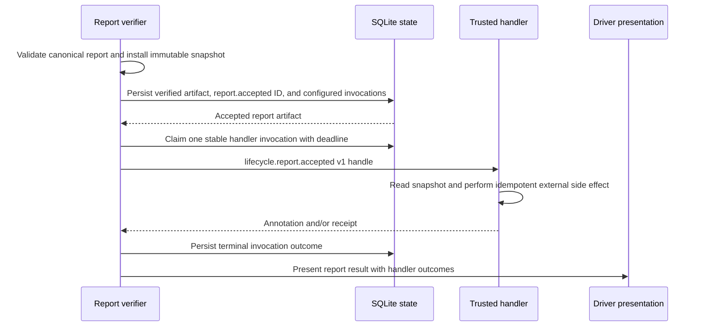
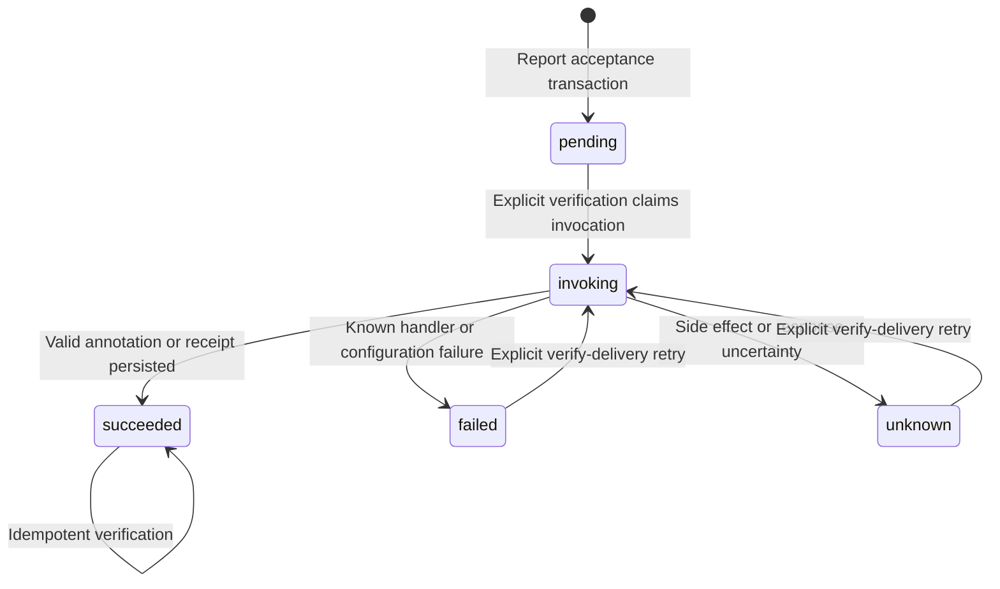

# Report acceptance lifecycle handlers

## Purpose

The first lifecycle handler boundary is the single named, versioned `report.accepted` event. It lets explicitly configured trusted executables summarize an accepted immutable report, perform their own external memory-style side effect, and return a bounded presentation annotation or external receipt. The handler result is advisory and non-authoritative.

This is not a general hook system. There are no before or after hooks, wildcard subscriptions, project-local handlers, scanners, installers, daemons, policy callbacks, shell evaluation, or automatic retries.

## Ownership and authority

`internal/verify` emits `report.accepted` only after report validation, immutable content-addressed snapshot installation, and verified artifact persistence. `internal/lifecycle` owns the exact event protocol and invokes the existing provider-neutral process extension host. `internal/store` owns stable event and invocation identity, outcomes, receipts, and retry fencing.

The local user explicitly trusts each configured executable and pinned digest. The process runs with same-user authority and is not sandboxed. The protocol gives it no task mutation, worker event, artifact acceptance, verification, landing, release, discard, or database operation. It receives no database path, mutable original report path, worker channel, terminal credential, driver identity, objective, acceptance criteria, or Shephrd environment variable. A handler response can only contain the bounded annotation and receipt fields described below.

A handler reads the read-only immutable snapshot path and may write only to its own external system. It cannot use its response to rewrite the report, emit worker events, mutate Shephrd state, accept artifacts, change task state, verify delivery, land code, or authorize release or discard. Because trusted same-user code is not an operating-system sandbox, only configure executables that honor this contract.

## Inputs and outputs

Handlers are an ordered global configuration. Each name is unique and each executable has an exact extension identity, argument vector, digest, and optional environment allowlist:

```toml
[[lifecycle_handlers.report_accepted]]
name = "memory"
extension_id = "example.report-memory"
command = ["/absolute/path/to/report-memory-handler", "/absolute/path/to/memory-data"]
sha256 = "64-lowercase-hex-digits"
environment = ["MEMORY_TOKEN"]
```

At most eight handlers are accepted. The executable path is absolute. The host rejects symlinks, nonregular or nonexecutable files, group or world writable files, and digest changes before every process start. It executes the vector directly without a shell or `PATH` lookup. At most 16 explicitly named environment variables are copied. `SHEPHRD_*`, `LD_*`, and `DYLD_*` names are rejected.

### Exact extension protocol

The executable implements the existing extension host `describe` and `invoke` commands. Its manifest must exactly declare one capability:

```json
{
  "wire": {"major": 1, "minor_min": 0, "minor_max": 0},
  "extension": {"id": "example.report-memory", "version": "1.0.0"},
  "capabilities": [
    {"name": "lifecycle.report.accepted", "version": 1, "operations": ["handle"]}
  ]
}
```

The host sends its ordinary strict request envelope with capability `lifecycle.report.accepted`, capability version `1`, operation `handle`, a stable request deadline, and this exact payload:

```json
{
  "event": {
    "id": "report_event_...",
    "name": "report.accepted",
    "version": 1,
    "accepted_at": "2026-08-17T00:00:00Z"
  },
  "invocation": {
    "id": "lifecycle_invocation_...",
    "handler": "memory"
  },
  "report": {
    "artifact_id": "artifact_...",
    "kind": "report",
    "sha256": "...",
    "size_bytes": 123,
    "snapshot_path": "/.../artifacts/sha256/...md"
  },
  "task": {
    "id": "task_...",
    "attempt_id": "attempt_...",
    "run_generation": 1,
    "repo_id": "repo_...",
    "repo_name": "example",
    "title": "Investigate behavior",
    "feature_key": "investigate",
    "deliverable": "report",
    "completion_provenance": "worker_done"
  }
}
```

The event and invocation IDs do not change on retry. `snapshot_path` is limited to 4096 bytes. Repository name and title are limited to 1024 bytes, feature key to 512 bytes, and repository ID to 256 bytes. Metadata must be valid UTF-8 without control bytes. The outer host frame remains limited to 1 MiB. Report bytes are not copied into the protocol frame.

A successful response uses the ordinary exact host response envelope and contains at least one of these fields:

```json
{
  "annotation": "Bounded report summary",
  "receipt": {
    "system": "example-memory",
    "id": "memory-record-123"
  }
}
```

`annotation` is at most 4096 bytes. Receipt system is at most 128 bytes and receipt ID at most 512 bytes. All are valid UTF-8 without control bytes. Unknown fields, empty success results, oversized values, identity mismatches, trailing output, and malformed JSON are protocol failures. Extension failures use the existing host error envelope with bounded `class`, `code`, `message`, and `effect` values. The persisted outcome exposes the failure code, bounded diagnostic, and effect. The effect is `none`, `known`, or `unknown`.

## Persisted state

Every newly accepted verified report stores the stable event ID, exact `report.accepted` name, and version 1 on the immutable verified artifact. Each handler configured at that acceptance boundary gets one ordered invocation row containing stable event, artifact, task, attempt, handler, extension, and configuration identities.

Invocation states are `pending`, `invoking`, `succeeded`, `failed`, and `unknown`. The row also stores attempt count, claim and deadline fencing, bounded annotation, receipt, failure kind and message, effect classification, and timestamps. A successful handler outcome is never invoked again. Task inspection exposes the complete handler projection.

Existing verified reports are not retroactively emitted to newly configured handlers.

## Normal flow



The report done notification is not claimable, the desktop presentation capability is not invoked, and successor input selection rejects the report while any configured invocation is `pending` or `invoking`. Releasing an already accepted report workspace preserves this pending notification obligation; it becomes claimable after explicit recovery records terminal handler outcomes. A claimed report notification includes the terminal handler projections alongside the unchanged worker payload. `failed` and `unknown` are terminal visible outcomes, so handler failure does not hide the accepted report.

If canonical report verification fails before immutable snapshot acceptance, Shephrd transactionally records a separate `report-verification-failed` system wake while the unverified done wake remains hidden. This presentation contains only a bounded failure classification, explicit inspect and retry commands, and the statement that report bytes were not presented. It has no artifact reference and never includes canonical report bytes or a verifier diagnostic. Repeated failures for the same current report completion reuse the same durable message and notification. This failure presentation does not accept the report, emit `report.accepted`, create handler invocations, change task state, or authorize release.

A deterministic external fixture is available at `internal/lifecycle/testdata/reporthandler`. Build it as a separate executable, pin its SHA-256, and configure its command as `[executable, memory-directory, "success"]`. It reads the immutable snapshot, derives a deterministic first-line summary, and atomically writes one local memory-style JSON receipt keyed by the stable invocation ID. Modes `fail` and `unknown` exercise visible failure and an interrupted response after a deduplicated side effect. It has no third-party dependency.

## State transitions



An interrupted row remains `invoking` until its deadline. No background process changes it.

## Failure and recovery

Handler failure never rolls back report acceptance, landing proof, or completion. The delivery result and `shephrd task inspect <task-id>` show handler state, annotation, receipt, failure, effect, attempt count, and the explicit retry command.

Run `shephrd task verify-delivery <task-id> --json` to retry explicitly. A live unexpired invocation is not duplicated. After an interrupted owner's deadline, the same invocation and event IDs are reclaimed and sent again. Trusted handlers must use the invocation ID as their idempotency key and return the same receipt for an already completed side effect. This prevents a retry from creating a hidden duplicate when the external write completed but its response or Shephrd outcome persistence was interrupted.

Restore the exact accepted handler configuration before retrying a missing or changed handler. There is no scheduled retry, daemon, or fallback executable. A handler protocol or host failure with uncertain effect remains `unknown` until an explicit idempotent retry succeeds or produces another visible outcome.

## Safety invariants

- Only the exact `report.accepted` event version 1 exists.
- Emission follows immutable snapshot and artifact persistence and precedes report-result presentation.
- Only handlers configured at acceptance are invoked, in configured order.
- Event and invocation identities are stable across restart and retry.
- Handler success requires a bounded annotation or receipt.
- Handler outcomes carry no lifecycle authority.
- Handler failure never rolls back report acceptance.
- Pre-acceptance verification failure has a durable sanitized wake and leaves the done result hidden.
- Release preserves a verified report's pending done notification while handler recovery remains outstanding.
- Unexpired invocation claims prevent concurrent duplicate calls.
- Retry is explicit and uses the same external idempotency key.
- No shell, wildcard event, project-local hook, background daemon, automatic schedule, or policy engine exists.

## Commands

- `shephrd task verify-delivery <task-id>` emits a newly accepted report event and explicitly retries recoverable handler invocations.
- `shephrd task inspect <task-id>` shows persisted event, invocation, annotation, receipt, failure, and retry state.

## Interactions with other components

[Artifacts](artifacts-reports.md) supply immutable report identity and bytes. [Delivery](delivery-release.md) owns report verification and release. [Configuration](configuration-state.md) owns global trusted executable selection. [Notifications](notifications-watchers.md) delay report result presentation until invocation outcomes are visible. [Harnesses](harnesses-runtimes.md) documents the shared provider-neutral extension host.

## Design rationale

A single typed lifecycle capability keeps the first integration narrow and reviewable. Persisting event identity on the verified artifact binds the event to the immutable acceptance boundary. A focused invocation saga is necessary because an external side effect cannot share SQLite's transaction. Stable idempotency identity, explicit retry, and visible receipts provide crash recovery without introducing a daemon or pretending Shephrd can make an arbitrary external system transactional.
