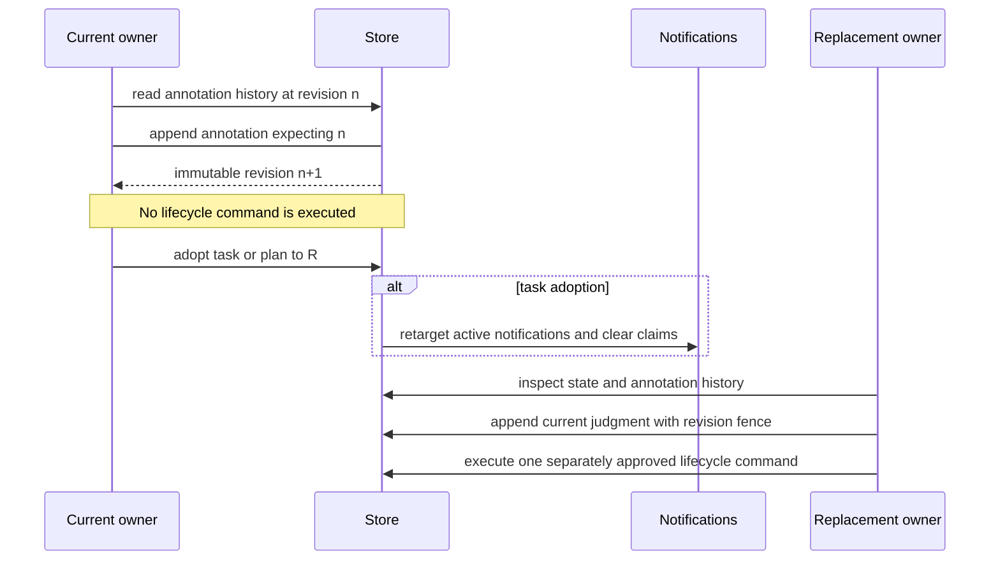

# Ownership, adoption, and annotations

## Purpose

Ownership routes cooperative driver operations and notifications. Adoption transfers that routing explicitly. Annotations preserve bounded driver judgment across turns and driver replacement without executing the recorded next action.

## Ownership and authority

Every task and plan has one `driver_id`. Current owner checks prevent accidental cross-session operations by cooperative processes under the same local account. They are not authentication against a malicious local user.

Only the current owner may append an annotation or adopt the scope. An annotation is context, not authorization. The next action still requires user authorization and current lifecycle facts.

## Inputs and outputs

Task creation and plan creation receive an owner explicitly or from supported Pi/config context. Wake claim shorthand uses the current Pi owner when available and checks every explicit owner override against that inferred identity and the stored claim owner. Adoption receives the current owner and new owner. Task adoption returns transfer counts and retargets active notifications. Plan adoption changes only plan ownership.

An annotation append selects exactly one task or one plan item, supplies a nonblank judgment, optional bounded reason and next action, and the expected prior revision. It outputs the next immutable revision. Revision 0 means no prior entry.

## Persisted state

Tasks and plans store their current owner. Notifications store the target owner and claim state. `annotations` stores immutable ID, author, exactly one scope, per-scope revision, judgment, reason, next action, and timestamp.

Task inspection includes all task annotations. Plan show includes the latest annotation for each live item. Removed undispatched items retain readable annotation history but accept no new annotations.

## Normal flow

[Opt-in sub-drivers](subdrivers.md) own ordinary workers as `coordinator:<id>`, independently of their current harness generation. These worker tasks cannot be adopted by a replacement main driver. Use `subdriver adopt-request` to transfer only a request's main return route; worker ownership and active attempts remain unchanged.

Pi task creation uses `driver:pi:<session-id>`. Other integrations provide stable owner identity. Driver harness/model environment variables do not set owner identity.

## State transitions

Adoption changes current ownership but preserves task/plan lifecycle, attempts, evidence, prior annotation authors, and acknowledged notifications. Claimed task notifications become available under the new owner without being acknowledged.

Annotation revisions increase by one per scope. Concurrent writers using the same expected revision produce one winner; losers receive `annotation_revision_conflict` and must reread before deciding whether the judgment still applies.

## Failure and recovery

Owner mismatch, blank identity, nonexistent scope, mixed task/item scope, removed item append, duplicate plan-name conflict after adoption, invalid text, or stale revision fails without a partial transfer or append. A replacement Pi driver cannot use an explicit wake flag to impersonate the prior owner. The wake error returns the exact task adoption and fresh drain command; those commands remain explicit and release the old claim without acknowledging it.

When recovering existing work, a replacement driver can use both disclosure surfaces:

1. Run `shephrd task obligations --all-drivers --json` for exact task obligations and relevant plan identities and owners.
2. Run `shephrd plan ls --all-drivers --json` for every plan's exact ID, name, owner, ownership marking, and dispatched/live evidence summary.
3. Adopt each relevant plan and each live task independently when authorized.
4. Inspect task details, waiting question, checkpoints, dirt, attempts, evidence, plan remainder, and annotation histories.
5. If recording a new judgment, append with the current revision.
6. Take only the authorized continuation or recovery action; discovery does not require starting more work.

Both initial listing commands are read-only. Discovery never claims work or implies adoption.

## Safety invariants

- Ownership transfer is explicit and scope-specific.
- Wake identity derivation never transfers ownership or weakens the full store mutation fence.
- Plan adoption never adopts dispatched tasks.
- Task adoption retargets but never acknowledges notifications.
- Annotations are append-only, revision-fenced, and bounded.
- Annotations do not affect readiness, status, notification routing, landing, release, or closure by themselves.
- Historical authors remain unchanged after adoption.
- A recorded next action is not executed automatically.

## Commands

- `shephrd task adopt <task-id>`
- `shephrd plan adopt <plan-id>`
- `shephrd task annotations <task-id>`
- `shephrd task annotate <task-id> <judgment>`
- `shephrd plan annotations <plan> <item-id>`
- `shephrd plan annotate <plan> <item-id> <judgment>`
- `shephrd task obligations --all-drivers`
- `shephrd plan ls --all-drivers`

## Interactions with other components

[Notifications](notifications-watchers.md) use task ownership for claims. [Plans](plan-evidence.md) have independent plan ownership. [Recovery](recovery.md) includes the latest task annotation in full retry and relaunch briefs. [Optional review feedback](review-feedback.md) can use annotations to preserve findings and decisions. [Authority mapping](../reference/authority.md) keeps annotation history distinct from policy.

## Design rationale

Explicit cooperative ownership prevents two interactive sessions from accidentally consuming the same work. Revision fencing preserves an auditable order without a scheduler. Keeping annotations inert makes restart context durable while requiring every consequential lifecycle action to remain explicit.
