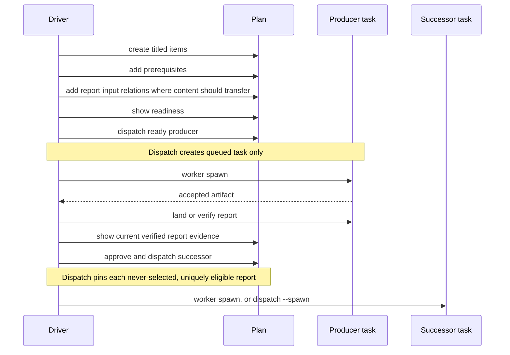

# Plans and evidence handoff

## Purpose

A plan is the advanced persistent driver-owned tool for restart-safe ordered graphs, fan-out and fan-in, multiple report evidence gates, and cross-repository sequencing. A direct verified report handoff is the default for simple A-then-B work. A plan is not a scheduler.

## Ownership and authority

The plan owner authors and adopts planning state and explicitly dispatches items. Shephrd computes readiness from durable facts and atomically rechecks it at dispatch. Readiness is evidence for a driver judgment, never authorization.

A prerequisite declares ordering. A report-input relation declares that one prerequisite report may be selected. Explicit `plan report select` or eligible dispatch-time selection pins an artifact. These remain distinct durable facts and none starts a worker by itself.

## Inputs and outputs

A plan has a name and owner. Each stored ordered item has a nonblank title and objective and can carry description, acceptance criteria, repository, feature key, and code or report deliverable. `plan add --title` is optional and uses the same deterministic derivation as direct task creation. Before dispatch, the owner can edit, move, or remove the item and can add acyclic same-plan prerequisites and ordered report-input relations.

For independent ready siblings, the driver can dispatch every selected item, collect the exact queued task IDs, and then start one bounded parallel wave. The plan records each item independently and never schedules a worker.

`plan report select` remains available to pin the prerequisite task's current eligible verified report before dispatch. If a relation has never been selected, `plan dispatch` may pin it atomically only when every unselected relation resolves to exactly one current done, landed, verified report whose immutable snapshot passes verification. The transaction fences prerequisite task, attempt, done message, report identity, and relation identity; it preserves report-input order and uses the same selection provenance as explicit selection. A stale prior selection is never replaced automatically.

`plan dispatch` first outputs and records one ordinary queued task, copies the item title unchanged, combines objective and description, copies pinned report inputs in order, and records the dispatched task ID. `--spawn` then invokes ordinary worker spawn semantics in the same user command as a separate durable transition. Its optional `--harness`, `--model`, and `--runtime` inputs are rejected without `--spawn`, and an explicit model requires an explicit harness.

`plan ls --all-drivers` is a read-only disclosure surface. It returns exact plan ID, human-readable name, owner, owned-or-unowned marking, item counts, and exact dispatched task status, attempt, and landed evidence summaries. Listing never adopts, claims, dispatches, spawns, or mutates a plan or task.

## Persisted state

Plan tables store plan identity and owner; ordered item scope and dispatched task link; prerequisite edges; ordered optional artifact selections and selection provenance. Item-scoped annotations retain the plan and item identity even after an undispatched item is removed.

The dispatched task and its report inputs are ordinary task records. The plan does not own their later lifecycle.

## Normal flow

Prerequisites must be dispatched, `done`, and landed. A report-input relation must point to a prerequisite and have a current verified report before successor dispatch. The maximum successor report-input count is 16.

Typical readiness reasons include missing repository, feature, or acceptance criteria; feature conflict; prerequisite not dispatched, done, or verified; missing or stale report selection; too many report inputs; and invalid immutable snapshot. `report_not_selected` stays visible before dispatch even when dispatch can resolve it. Every other reason blocks dispatch, and dispatch rechecks all report identities atomically.

## State transitions

An item is editable planned state until dispatch. Dispatch freezes its scope, relations, selections, and dispatched task link. Dispatched items cannot be edited or removed. There is no plan archive or delete command.

A producer retry can create a new eligible report identity. Any undispatched selection of the old report remains visible as stale until explicitly reselected. A dispatched successor keeps immutable copied inputs even if the producer later changes.

## Failure and recovery

Cycles, cross-plan relations, edits after dispatch, duplicate dispatch, owner mismatch, ambiguous or ineligible reports, stale selections, changed producer attempts or report identities, feature conflicts, and incomplete scope fail without spawning. `plan show` reports exact reasons and available evidence.

If `--spawn` fails before an attempt transition, the already queued task is retained and the error returns its exact ID plus `shephrd worker spawn <task-id>`. A later spawn failure retains both dispatch and any separate attempt transition for ordinary inspection and recovery; dispatch is never rolled back or hidden.

Recover a dispatched task through the ordinary [relaunch or retry](recovery.md) commands. Re-evaluate downstream selections after producer recovery. Remove only undispatched abandoned items; terminalize and clean up already dispatched tasks through their own lifecycle.

Plan adoption does not adopt dispatched tasks. A replacement driver transfers each live task separately as described in [ownership and annotations](ownership-annotations.md).

## Safety invariants

- Planning, readiness, dispatch, and spawn are separate durable boundaries even when one command requests dispatch and spawn.
- Parallel scheduling remains an explicit driver decision; the plan is not a scheduler.
- Prerequisites transfer no report bytes.
- Report-input relations select no artifact until explicit selection or the fenced dispatch transaction.
- Dispatch creates exactly one queued task before optional worker control and performs no merge, verify, release, stop, discard, or acknowledgement.
- Selected report identity and order are explicit and never replace stale prior selection silently.
- Dispatched task inputs are immutable across relaunch and retry.
- Cross-repository items still create separate tasks and worktrees.

## Commands

- `shephrd plan create`
- `shephrd plan ls`
- `shephrd plan ls --all-drivers`
- `shephrd plan show`
- `shephrd plan adopt`
- `shephrd plan add`
- `shephrd plan edit`
- `shephrd plan rm`
- `shephrd plan requires add`
- `shephrd plan requires rm`
- `shephrd plan report add`
- `shephrd plan report select`
- `shephrd plan report move`
- `shephrd plan report rm`
- `shephrd plan dispatch`
- `shephrd plan annotate`
- `shephrd plan annotations`

## Interactions with other components

[Tasks](tasks.md) are created at dispatch. [Artifacts and reports](artifacts-reports.md) define report eligibility and immutable bytes. [Ownership](ownership-annotations.md) owns plan adoption and item annotations. [Notifications](notifications-watchers.md) includes ready and blocked plan rows in obligations. [Review feedback](review-feedback.md) explains why mutable same-branch review usually is not modeled as a one-time plan chain.

## Design rationale

Separating plan state from tasks makes incomplete future work editable without inventing worker states. Separating prerequisite, report-input relation, selection, dispatch, and spawn prevents readiness from becoming accidental execution authority. Immutable copied inputs give successors stable evidence even when producer history later changes.
