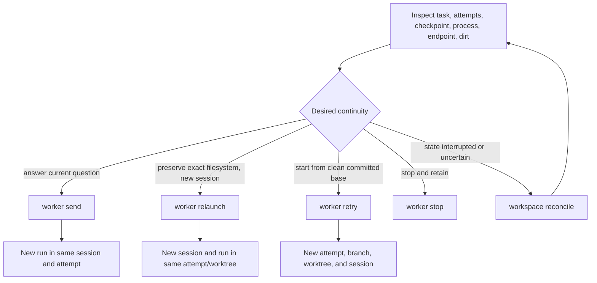

# Retries, relaunches, and stale attempts

## Purpose

Recovery makes the filesystem choice explicit. A follow-up resumes the same native session, a relaunch starts a new session in the exact held worktree, and a retry creates a clean attempt and worktree. Reconciliation classifies interrupted external effects without deciding which worker action should happen next.

## Ownership and authority

The driver chooses recovery after inspecting task, attempt, checkpoint, process, endpoint, worktree, report evidence, and annotation facts. Shephrd verifies eligibility and identity and executes the selected mechanism. Checkpoints provide bounded continuity but do not prove external facts or authorize recovery.

## Inputs and outputs

`worker send` consumes a waiting current task, dead prior runner, resumable native session, absent prior terminal endpoint, valid provider parent where needed, and nonblank follow-up. It outputs a new run generation in the same attempt, session, branch, and worktree.

`worker relaunch` consumes a current non-done, nonsuperseded, nonunknown, unreleased attempt with a fully reaped runner process tree and exact held worktree. It outputs a new native session and run generation while retaining branch, files, harness, model, and runtime.

`worker retry` consumes waiting or terminal work, stops active nonterminal work when safe, and outputs a new attempt number, branch, clean worktree, session, generation, and system checkpoint. Harness, model, runtime, and base strategy can be explicitly reselected under retry rules. With no base flag, retry inherits the prior declared strategy and resolves its commit again.

## Persisted state

Attempts retain status, run and runtime generations, session, workspace, checkpoint, resume source attempt and revision, failure reason, and release obligation. Retry marks the old attempt superseded but never deletes or releases it. Messages record follow-up, relaunch, retry, stop, stale events, and recovery failures.

Recovery briefs include the latest applicable task annotation, system-stamped workspace facts, bounded audit tail, pinned report inputs, and checkpoint provenance. They do not include raw transcripts or source-attempt files.

## Normal flow

### Choosing a mechanism

| Need | Mechanism | Preserved |
| --- | --- | --- |
| Answer a waiting question or send approved review feedback | Send | Attempt, worktree, branch, native session; new run generation |
| Recover valuable exact filesystem state after runner/session failure | Relaunch | Attempt, worktree, branch, files, harness, model, runtime; new session and run |
| Accept an already complete canonical report after terminal handoff failure | Report recovery attestation, then verification | Immutable driver evidence, canonical bytes, prior blocked or failed audit, ordinary report snapshot |
| Prefer an independent clean execution | Retry | Task and immutable report/checkpoint context only; new attempt and filesystem |
| End current work without destroying it | Stop | Worktree and branch remain held |
| Recover an expired or replacement-owner notification claim | Fresh owner drain, with explicit task adoption first when ownership changed | No acknowledgement is inferred; the old claim expires or is released |
| Classify interrupted allocation or release | Reconcile | No guessed worker action; may finish already-authorized release |

## State transitions

Run generations increase within an attempt for send and relaunch. Each newly launched report run receives a distinct task/attempt/run destination in its brief or follow-up, preserving earlier report files and message references. [Legacy waiting-run upgrade](artifacts-reports.md#same-attempt-continuation-and-upgrade) uses the same ordinary transition, not a new attempt or a rewritten artifact. Runtime generations increase for replacement terminal endpoints. Retry supersedes the prior attempt and makes the new one current. Old-attempt, old-run, old-session, old-cursor, and old-repair events remain stale audit and cannot mutate current task state or publish current notifications.

Reconciliation can classify allocating as no-workspace, recover an exact interrupted allocation as held, mark mismatched evidence unknown, finish an already-authorized interrupted release, and classify held work as working, process conflict, resume eligible/degraded, or superseded held. It never launches, retries, relaunches, chooses a model, or invents proof or discard authority.

## Failure and recovery

Send fails unless the task is waiting and the current session is resumable. Relaunch fails for done, superseded, unknown, released, live, mismatched, or process-conflicted attempts. A headless protocol failure publishes blocked state only after its harness tree is reaped, allowing immediate relaunch eligibility checks to agree with OS liveness. The exact worktree and any existing report bytes remain held, while rejected or unrepaired event candidates grant no artifact acceptance. For a complete canonical report with a current final checkpoint and no accepted worker terminal in the current generation, obligations can return the exact exceptional attestation command. The owner must run it explicitly, inspect immutable evidence, and then run the returned `verify-delivery` command. Once attested, that attempt rejects worker send and same-worktree relaunch before reserving a generation or creating any continuation side effect; the only advertised paths are exact verification or an explicit clean retry. Relaunch remains the normal path when no attestation exists and the report is incomplete or any identity is uncertain. Retry does not transfer dirty files, patches, commits, generated output, ignored dependencies, or caches; inspect the old held attempt separately if those matter.

Terminal provider uncertainty must be restored or reconciled before replacement or cleanup. An unknown workspace remains held until identity is externally restored and classified. A superseded held worktree remains an obligation until independently proven and released or explicitly discarded.

Archive can hide a terminal task from the default list but does not change recovery. Explicit retry or eligible relaunch reactivates the task and clears archive metadata.

Wake acknowledgement and renewal errors report the missing or conflicting claim identity and an exact recovery command. Expiry recovers through a fresh bounded drain. A changed inferred Pi owner recovers through explicit task adoption followed by a fresh drain. Neither path acknowledges the old claim, resumes a worker, or chooses a task disposition.

## Safety invariants

- Recovery choice is explicit and driver-owned.
- Report attestation is exceptional, never inferred from file existence, and never substitutes for verification.
- Immutable report recovery evidence freezes same-attempt worker continuation while preserving separate verification and clean retry.
- Relaunch never resets, cleans, switches, or reruns setup in the held worktree.
- Relaunch retains the exact attempt base commit; clean retry re-resolves the declared strategy.
- Retry never copies filesystem state from the source attempt.
- Pinned successor report inputs remain the same across retry and relaunch.
- Late stale events and repair corrections are audit-only.
- Protocol recovery never runs concurrently with an unreaped prior harness tree.
- Supersession does not release or discard old work.
- Reconcile mutates classification but never invents authority or chooses a worker action.
- Stop without discard keeps the worktree held.

## Commands

- `shephrd worker send <task-id> <follow-up>`
- `shephrd worker relaunch <task-id>`
- `shephrd worker retry <task-id>`
- `shephrd worker stop <task-id>`
- `shephrd task attest-report-recovery <task-id> --attempt <attempt-id> --run-generation <n> --checkpoint-revision <n> --checkpoint-cursor <n> --reason <reason>`
- `shephrd task verify-delivery <task-id> --attempt <attempt-id>`
- `shephrd workspace reconcile`
- `shephrd task inspect <task-id>`
- `shephrd worker status <task-id>`

## Interactions with other components

[Attempts](attempts-worktrees.md) own workspace identity. [Worker protocol](worker-protocol.md) supplies checkpoint and stale-event fences. [Harness selection](harnesses-runtimes.md) defines retained and override behavior. [Ownership and annotations](ownership-annotations.md) preserves replacement-driver context. [Delivery](delivery-release.md) closes each held attempt independently.

## Design rationale

A single generic retry would either lose valuable state or transfer it unsafely. Three explicit continuation modes make the filesystem and session consequences visible. Retaining superseded attempts prevents clean retry from silently destroying the evidence or work that motivated recovery.
