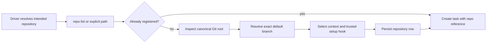

# Repository registration

## Purpose

The repository registry gives every task one canonical Git root and default branch. Registration also records the repository context file and an optional trusted setup hook used for every new attempt worktree.

## Ownership and authority

The driver selects which repository to register when a request is ambiguous. `internal/repository` canonicalizes and inspects the selection; `internal/store` owns the durable row. The filesystem and Git prove the root and branch. A stored alias is convenient identity, not proof that a path is still a valid repository.

Repository `AGENTS.md` or `CLAUDE.md` governs work in that repository. It does not grant lifecycle authorization or ownership of other tasks; see the [authority map](../reference/authority.md).

## Inputs and outputs

Registration accepts an existing path, configured-discovery-root-relative name, or unique discovered basename. Inputs can also include a unique alias, explicit existing local default branch, context path, and setup-hook command. The output is a repository ID, alias, canonical path, default branch, context file, and setup hook.

Shephrd registers existing repositories only. Create repositories with ordinary Git, then register an existing root with `shephrd repo add <path>`.

## Project context discovery

`shephrd repo context <path> --json` resolves an explicit Git directory to its repository or worktree root and returns `repository_path`, optional relative `overview_path` for `.shephrd/context.md`, and the global `memory.enabled` setting. It reads no notes and does not require registration, a default branch, or the task database. Existing AGENTS.md/CLAUDE.md files are neither replaced nor edited.

The overview must be a regular file resolving within that checkout. Missing optional context is normal; invalid or escaping context is an error. Worker brief assembly performs the same overview discovery in the attempt worktree, without falling back to dirty root files. Agents follow the [context and memory convention](../reference/workflow-modules.md) using ordinary file tools; discovery does not activate modules or parse task/repository opt-outs.

## Persisted state

The `repos` table stores canonical path, unique name, default branch, context file, setup hook, and timestamps. Registration does not copy source, credentials, dirty files, or repository history into SQLite.

## Normal flow

`repo list` reads stored registrations. `repo scan` invokes the explicitly configured, SHA-pinned `repository.discovery` capability and presents path-only candidates. The first-party `shephrd-repository-scanner` executable recursively scans configured roots and skips common dependency and hidden directories. Core independently bounds and validates every canonical Git root returned by the extension. Scan never registers, updates, names, or otherwise authorizes a candidate. The driver must select a candidate with an ordinary `repo add <canonical-path>` command.

Default-branch detection first uses `origin/HEAD`. Without it, only a checked-out `main` or `master` is inferred. Other cases require an explicit existing local branch.

## State transitions

A repository has no public lifecycle status. It is absent or durably registered. A repeated add can upsert current metadata for the same canonical identity. There is no public unregister command.

At worker spawn, repository state begins a separate attempt allocation lifecycle described in [attempts and worktrees](attempts-worktrees.md). An unstacked attempt resolves the registered default branch at allocation time. Shephrd prefers `origin`, or a sole configured remote when `origin` is absent, and fetches only that branch without checkout, merge, or rebase. If no remote is configured, the current local default ref supplies the base.

## Failure and recovery

- Missing or invalid discovery configuration, extension timeout or failure, malformed output, and invalid candidates fail the complete scan without registry changes.
- Ambiguous paths or names require an absolute path or explicit selection.
- Missing `origin/HEAD` with a nonstandard checked-out branch requires an explicit default branch.
- The selected default branch must resolve to a local commit.
- A configured remote must expose the selected upstream branch; fetch or authentication failure during spawn creates no fallback from stale local state.
- When local and fetched tips diverge, spawn refuses rather than choosing an uncertain base.
- Multiple remotes without `origin` are ambiguous for ordinary base resolution and fail closed.
- Fetch refreshes Git references only; it never checks out, merges, rebases, or dirties the registered root.
- Active submodules or Git LFS attributes are rejected before native worktree creation.
- A setup-hook failure occurs after the exact worktree is held. Recover or discard that attempt through [recovery](recovery.md), not by silently changing the registration.

## Safety invariants

- Canonical paths and Git roots must agree.
- Aliases are unique and ambiguous discovery fails.
- Discovery candidates are bounded, canonical, unique, contained by configured roots, stable while checked, and independently confirmed as Git roots.
- A discovery candidate has no registration authority and carries no alias, branch, context, setup hook, task binding, or lifecycle permission.
- Dirty registered-root state is never copied into an attempt.
- The setup hook is arbitrary shell code executed as the Shephrd user and is a privilege boundary.
- Registration does not authorize task creation, spawn, landing, or release.

## Commands

- `shephrd repo context <path>`
- `shephrd repo list`
- `shephrd repo scan`
- `shephrd repo add <path-or-name>`

`repo context`, `repo list`, and `repo scan` do not mutate the registry. Only `repo add` performs the explicit registration transition.

## Interactions with other components

[Tasks](tasks.md) bind to a repository ID. [Attempts](attempts-worktrees.md) consume its default branch, path, setup hook, and context file. [Worker briefs](worker-protocol.md) point to the context file without snapshotting it. [Delivery verification](delivery-release.md) uses the registered default branch and origin identity.

## Design rationale

Canonical registration prevents later commands from guessing among paths or branches. Keeping recursive discovery in one narrow process extension prevents filesystem search from becoming lifecycle authority. Recording context separately from task prose preserves standing repository guidance. Running setup once per isolated worktree supports repository-specific bootstrapping, but treating it as trusted code makes its security boundary explicit.
