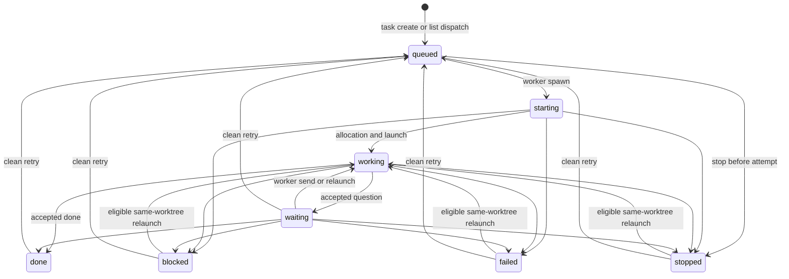

# Tasks and titles

## Purpose

A task is one durable requested outcome in one registered repository. It carries the work definition and current-attempt projection while keeping execution, evidence, landing, and release as separate records.

## Ownership and authority

The creating driver owns the task through `driver_id`. The driver defines scope and acceptance, decides when to spawn, handles questions, reviews results, and authorizes landing or discard. Shephrd enforces task identity and transitions but does not decide whether the outcome is desirable.

Every stored task has nonblank human display context. The CLI's `--title` is an optional explicit override, while the store and schema continue to reject blank titles. The feature key is stable machine identity, and the objective plus acceptance criteria define the full outcome. None substitutes for another.

## Inputs and outputs

Creation requires a registered repository, stable feature key, nonblank objective, owner, and deliverable. Acceptance criteria, an explicit title, and ordered verified report inputs are optional at the CLI. Pi can infer the owner from its session; other callers provide one explicitly.

One deterministic helper chooses the final title. A nonblank explicit title wins unchanged except for surrounding trim. Otherwise objective whitespace is normalized and the result is bounded to 80 Unicode code points with a final ellipsis, so truncation never splits UTF-8. Only a blank objective falls back to a humanized feature key. Direct task creation and plan item creation return the final persisted title in text and JSON. Existing stored titles are never recalculated.

The output is one titled `queued` task. Creation never allocates a worktree or starts a worker.

## Persisted state

The task row stores repository and feature identity, title, owner, objective, acceptance criteria, deliverable, status, current attempt, accepted artifact claim, remote-delivery projections, discard projection, archive time, and timestamps. `(repo_id, feature_key)` remains unique for the lifetime of the database, including archived tasks.

Attempt rows, messages, checkpoints, annotations, notifications, report inputs, and delivery evidence remain separate durable records and appear through inspection.

## Normal flow

`waiting` means a current worker question is ready for driver handling. `done` means a valid terminal event and artifact were accepted; it does not mean the artifact landed or the worktree was released. Review is not a task status or default requirement. If a requested workflow needs same-attempt feedback, a worker can remain waiting while ordinary report tasks and follow-ups provide it.

Durable plans provide planned structure. Explicit task, report-input, and annotation identities preserve evidence relations. Direct tasks have no inferred or free-form correlation relation.

## State transitions

Only initial spawn and clean retry create attempts. Initial spawn defaults to the allocation-time default-branch base and may receive one explicit stacked base; clean retry re-resolves the declared base strategy unless the driver supplies a new one. Same-worktree relaunch reserves a new run generation and session on the current attempt; it changes a `waiting`, `blocked`, `failed`, or `stopped` task directly to `working` before launch. Relaunch is eligible only when the task is not `done`, the current attempt remains unreleased and is neither `superseded` nor `workspace_unknown`, no runner is alive, and the exact held-workspace identity verifies. The task status mirrors the current attempt and ignores late stale events for state mutation. Retry explicitly reactivates terminal or waiting work as `queued` before starting a new attempt. Archive adds visibility metadata without changing the status.

`task obligations` derives attention buckets from all recorded task, attempt, notification, and planning facts. It does not write a task status or perform a lifecycle action.

## Failure and recovery

Invalid repository, duplicate feature, blank objective, invalid deliverable, ineligible report input, or missing owner fails before task creation. Direct non-CLI store calls and schema writes with a blank title still fail. A terminal task cannot be spawned or sent a follow-up. A `blocked`, `failed`, or `stopped` task can use same-worktree relaunch when the identity, release, and liveness checks above pass; use clean retry when a new isolated attempt without filesystem transfer is intended. A `done` task cannot be relaunched, but it can be cleanly retried.

A terminal task can be archived only after its worker exits. Archived unresolved work still appears as high priority in obligations. Retry or eligible same-worktree relaunch clears archive metadata as explicit reactivation.

## Safety invariants

- One task has one repository and one deliverable contract.
- Title, feature key, and objective remain distinct.
- Queueing never starts a worker. Plan `dispatch --spawn` first commits queueing, then invokes the ordinary spawn transition explicitly.
- `done`, landing, verification, release, notification acknowledgement, and archive are independent facts.
- Archive never deletes history, proves closure, releases a worktree, or authorizes discard.
- Cross-repository work uses separate tasks and worktrees.

## Commands

- `shephrd task create`
- `shephrd task list`
- `shephrd task inspect`
- `shephrd task obligations`
- `shephrd task archive`

Task ownership transfer is canonical in [ownership and annotations](ownership-annotations.md). Delivery commands are canonical in [delivery and release](delivery-release.md).

## Interactions with other components

[Repositories](repositories.md) supply task scope. [Plans](plan-evidence.md) can atomically create ordinary queued tasks. [Attempts](attempts-worktrees.md) execute the current task. [Worker protocol](worker-protocol.md) updates task status through fenced events. [Artifacts](artifacts-reports.md) enforce the creation-time deliverable.

## Design rationale

A task models an outcome rather than a workflow template. Persisted titles improve operator recognition without forcing routine callers to repeat the objective or overloading stable feature identity. Keeping current projections on the task while retaining attempt history supports fast inventory and safe recovery without pretending one row proves every lifecycle fact.
