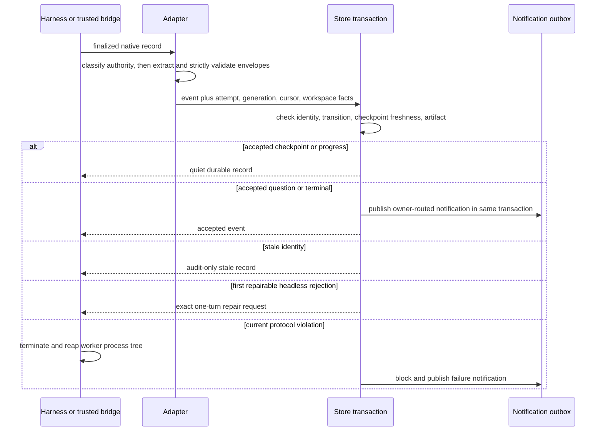

# Worker event and checkpoint protocol

## Purpose

The worker protocol turns harness output into bounded durable lifecycle events. It preserves enough semantic context for recovery while keeping worker claims separate from Git, filesystem, process, and delivery authority.

## Ownership and authority

`internal/adapter` classifies each native harness record and accepts exact event envelopes only from the assigned top-level worker's finalized assistant text. `internal/model` validates event and checkpoint shape. `internal/store` transactionally fences and persists accepted events. `internal/control` stamps checkpoint workspace facts and publishes notifications.

Claude Code records have explicit authority: an assistant record with a null `parent_tool_use_id` and no nested-agent marker is assigned-worker output. A nonempty parent tool-use ID or equivalent nested-agent metadata is non-authoritative. Missing, malformed, or unknown authority metadata fails closed. Nested output is never parsed, persisted as progress, checked for framing, or granted checkpoint, terminal, or artifact authority. Successfully completed Pi `message_end` assistant records and Codex completed `agent_message` records retain their top-level authority.

Workers author payloads and semantic checkpoint fields. Shephrd stamps attempt, generation, cursor, session, branch, HEAD, dirt, provenance, and capture time. Git and the filesystem remain authoritative for stamped workspace observations; worker-reported checks and paths are informational.

## Inputs and outputs

Recognized event types are `progress`, `checkpoint`, `question`, `done`, `blocked`, and `failed`. Every event uses one exact `<shephrd-event>` JSON envelope. Candidate recognition requires an opening tag followed by optional whitespace and a JSON object. Bare tags named in ordinary prose or Markdown are not candidates. Once recognized, unknown fields, malformed or trailing JSON, malformed, nested, or oversized framing, empty or oversized payloads, invalid types, invalid ordering, and invalid artifacts are rejected strictly.

A checkpoint has schema version 1 and exactly these fields:

```text
<shephrd-event>{"type":"checkpoint","payload":"Implemented parser","checkpoint":{"schema_version":1,"summary":"Implemented parser","completed":["Parser"],"next_steps":["Run tests"],"decisions":[{"decision":"Reuse the adapter parser","reason":"Keep one validation authority"}],"changed_paths":["internal/parser.go"],"checks":[{"command":"go test ./internal/adapter","result":"passed"}],"blockers":[]}}</shephrd-event>
```

`schema_version` is integer 1; `summary` is a string. `completed`, `next_steps`, `changed_paths`, and `blockers` are string arrays. `decisions` is an array of objects with string `decision` and `reason` fields. `checks` is an array of objects with string `command` and `result` fields. Strings in either object array are invalid, not shorthand. Use actual facts and `[]` when there are no entries, rather than dropping rejected report content.

Prefer a one-sentence summary and terse factual entries, normally around 1 KB. This is a soft target, not a limit: each checkpoint is a complete recovery snapshot, never a delta. Carry forward unresolved blockers and decisions, exact checks/results, artifact/evidence identities and recovery requirements; exceed the target rather than omit necessary evidence, within existing schema bounds. Keep every schema field, typed objects and empty arrays. Readiness and checks do not authorize lifecycle actions.

A worker `done` event requires one artifact. Artifact fields on other event types do not establish a result. A checkpoint normally has at least one next step; an immediately following `done` may use an explicit empty list.

## Read-only format preflight

Every supported harness can call the same CLI before emitting output:

```sh
shephrd protocol validate --role worker --file authored-output.txt --json
shephrd protocol validate --role subdriver --file authored-output.txt --json
```

Or pass the exact authored text on stdin, with no temporary file:

```sh
shephrd protocol validate --role subdriver --json <<'EOF'
<shephrd-event>{"type":"checkpoint","payload":"Turn handled","checkpoint":{"schema_version":1,"summary":"Turn handled","completed":[],"next_steps":[],"decisions":[{"decision":"Retain existing work","reason":"Already dispatched"}],"changed_paths":[],"checks":[],"blockers":[]}}</shephrd-event>
<shephrd-event>{"type":"done","payload":"Turn handled"}</shephrd-event>
EOF
```

Supply authored assistant text, not native harness JSON records or transcripts. The default role is `worker`; sub-driver session `done` is artifact-free. The adapter parses the entire candidate set using the same model validation as ingestion, including unknown fields, JSON types, trailing JSON, framing, payload/checkpoint bounds and duplicate or post-terminal envelopes. Sub-driver checkpoints also have the 4096-byte limit. The command reads at most 256 KiB and retains the adapter's per-envelope limit of less than 96 KiB; oversize input is rejected, not truncated and accepted.

Exit zero and `{"valid":true,"scope":"format-only",...}` mean only that the authored candidate set passed format checks. A rejection exits nonzero with a bounded `diagnostic` on JSON stdout plus the ordinary CLI error on stderr. For example, `EVENT_SCHEMA_TYPE_MISMATCH` identifies `checkpoint.decisions[]` and shows `{"decision":"choice made","reason":"why"}`, or identifies `checkpoint.checks[]` and shows `{"command":"test command","result":"observed result"}`. Correct the authored fields and validate the full output again.

Preflight never loads configuration or SQLite, writes state, runs a harness, publishes notifications, acknowledges input, accepts/persists an artifact, authorizes actions, or establishes landing/delivery proof. It does not inspect artifact files or current task identity, checkpoint freshness, ownership, or branch/report contracts. Those remain ingestion and verification fences. A single milestone checkpoint can pass without a terminal. Optional preflight cannot guarantee that a model emits the validated bytes or complies with the protocol later. Actual worker and sub-driver briefs include this guidance and typed examples.

## Persisted state

Every accepted event becomes an ordered message. A rejected repairable candidate creates only one bounded protocol-repair audit containing its cursor, diagnostic code, repair ID, and candidate SHA-256; no event, checkpoint, terminal, or artifact from that candidate is persisted. The latest accepted checkpoint replaces the prior semantic fields in a structured attempt projection with monotonic revision; omitted prior blockers or decisions are not merged back. Prior checkpoint messages remain in history. Messages carry task, attempt, run generation, cursor, stale and wake flags, payload, artifact, and optional checkpoint JSON.

A new attempt starts with a system checkpoint. Worker wake events require a later worker-produced checkpoint in the same current run.

## Normal flow



`question`, `done`, `blocked`, and `failed` are wake-worthy. A report `done` notification is durably published with event ingestion but remains unclaimable until immutable report verification and configured `report.accepted` handler outcomes complete. The fresh checkpoint must be from the same run, after the previous accepted wake event, and before the new event cursor. A code branch artifact must exactly name the attempt branch and agree with the checkpoint branch.

## State transitions

Progress and checkpoint events do not change task state. A question moves working to waiting. Done, blocked, and failed move to their matching terminal states. A valid later same-generation terminal event can currently replace waiting on the headless path; interactive bridges end the invocation after an accepted question.

Attempt ID, run generation, native session, cursor, endpoint generation, and current task identity fence mutation. Late old-attempt or old-generation events remain audit-only and cannot update current state or notify the current owner.

## Pi transport completion

The native bridge and headless adapter check assistant completion before extracting or parsing protocol text. Pi completion reasons `stop`, `length`, `toolUse` and `deferred` retain normal text-block handling and strict envelope validation. `error`, `aborted`, missing, unknown or still-`pending` completion reasons confer no protocol authority. This applies even when failed output contains a complete, otherwise valid checkpoint and terminal batch. Streaming deltas and tool results are never substitute candidates.

Pi 0.85.1 already supplies three agent-level transient retries at 2/4/8 seconds by default (`retry.enabled=true`, `maxRetries=3`, `baseDelayMs=2000`, provider retries zero). Shephrd adds no retry loop, timing override or error classifier. Failed text cannot prematurely shut down the native bridge or consume the reporting-correction budget. Pi retains completed tool context when continuing; Shephrd does not replay tools, dispatches, claims or lifecycle actions. Exhaustion, cancellation and nonretryable auth/schema failures remain failures, not requests for generic reporting repair.

`message_end` arrives before Pi decides whether to retry. A low-level `agent_end`, even with SDK `willRetry=false`, is not overall settlement: compaction and queued continuations can still run. Native extensions use the supported `agent_settled` hook, not SDK-only `auto_retry_*` hooks. Headless failure tracking clears a prior transport error only at `agent_settled` after a successful assistant completion; `auto_retry_end.success` alone is insufficient, including when an aborted message precedes it. An unsuccessful retry end retains its final error. Missing terminal output, process/stream failure and native settlement without an accepted terminal fail closed, retaining earlier accepted evidence and recoverable work.

These gates also apply inside the existing reporting-only correction: failed correction transport text is ignored while Pi retries, without granting a second correction or resetting the 120-second deadline or overall bounded turn. Successful malformed output still receives strict schema rejection and only the established one-correction path.

Evidence: the read-only investigation `task_cee32162603b` exercised the installed SDK/bundle with controlled providers and measured the default backoff, one completed tool effect and cancellation. Current `internal/cli/subdriver_terminal_e2e_test.go` runs the built CLI and actual native bridge with deterministic Pi events and isolated state; `internal/control/pi_transport_test.go` covers worker ingestion, exact report artifacts and preserved prior evidence. Both cover empty/partial/complete failed text, recovery, exhaustion, cancellation, abort, auth/schema errors and transport failure during correction, with prior effects once. Adapter, runner and extension tests cover completion shapes and settlement ordering. These are not live-provider or VPN-causation evidence. Durable sub-driver resume is separate from response retry and still requires explicit recovery authority.

## Failure and recovery

A repairable top-level headless rejection gives the same assigned native session exactly one explicit correction turn with a 120-second deadline. The request contains bounded validator feedback, repair identity, and candidate hash, and requires exactly one current checkpoint followed by exactly one corrected terminal envelope with no prose or tools. The correction is reparsed from scratch and committed atomically only after attempt, current-attempt identity, generation, session, repair identity, hash, cursor order, checkpoint freshness, artifact contract, and terminal state are revalidated. A stale, replayed, mismatched, ambiguous, duplicate, second-invalid, missing, oversized, post-terminal, or non-authoritative correction persists no partial worker event. Interactive Pi uses the same complete-batch ingestion and repair identity fence. Its bridge sends the entire finalized assistant text candidate, not one envelope at a time, so a malformed suffix or duplicate terminal cannot leave an accepted prefix. A corrected checkpoint and terminal must arrive together in one assistant message; a checkpoint-only, prose-bearing, or second-invalid correction is not partially persisted. The existing bridge blocks tool calls throughout the correction turn. The adapter's actionable diagnostic message is included in the repair prompt.

Sub-driver Pi sessions reuse this bounded reporting repair: headless resumes the same native session once with `--no-tools`; native Pi queues one tool-blocked correction in that session. Both require exactly checkpoint then artifact-free done, reparse the complete corrected output, and retain generation/token/session, monotonic cursor, repair ID/hash and terminal fences. Rejection metadata is bounded in the existing sub-driver session log; repair state is invocation-local, not a new recovery queue. The correction has a 120-second limit within the sub-driver's overall 20-minute turn deadline. Previously issued dispatches, returns, input handling and acknowledgements are neither repeated nor undone. Correcting a report does not handle outstanding input or claims: ordinary settlement checks still apply. Claude/Codex sub-driver reporting failures remain held because no tool-free correction path is established here. A crashed or exhausted repair stays held for explicit inspection/recovery, never an automatic task retry.

A nonrepairable rejection or failed correction first terminates and reaps the headless harness process tree, then records the durable blocked recovery state and notification. Missing terminal events, malformed bridge frames, session changes, settlement without terminal, stream failure, or runner death also fail closed. The last accepted checkpoint, worktree, and existing report bytes remain recoverable, but no rejected artifact is accepted. Recover through [relaunch or retry](recovery.md) after inspecting the checkpoint and workspace. If the canonical report is already complete, the current owner may instead use the explicit report recovery attestation and separate verification flow. That driver-authorized completion remains distinct from a worker `done`: no worker message is synthesized, the rejected candidate stays stale audit, and a late worker terminal cannot override the recovered task.

An interactive Pi process exiting without an accepted terminal can report either `Pi bridge closed before a terminal envelope` or `Pi exited without a valid terminal <shephrd-event> envelope`, depending on whether socket EOF or process exit reaches the bridge loop first. `TestReportWriteSurvivesHeadlessAndInteractiveProtocolHandoffFailure` accepts these two diagnostics while requiring the same preserved report/checkpoint, blocked task, held workspace and unaccepted artifact. Diagnostic ordering is not a recovery-state guarantee.

## Safety invariants

- Wake-worthy worker events require a fresh current worker checkpoint.
- Stale attempts, generations, cursors, sessions, and repair identities cannot mutate current state.
- Checkpoint prose never overrides stamped Git facts.
- Artifact shape is enforced against the task deliverable at ingestion and verification.
- Ordinary assistant text, bare-tag prose, nested assistant output, and terminal display output are not lifecycle events.
- Trusted bridges carry bounded structured candidates and identity, not full transcripts.
- A rejected candidate has no partial persistence, and one correction can produce one terminal at most.
- Durable headless protocol failure is published only after the harness process tree is reaped.
- A protocol failure keeps recoverable work held without accepting an artifact.
- Canonical report file existence alone never creates completion; only explicit driver attestation followed by verification can recover it.

## Commands

- `shephrd protocol validate --role worker|subdriver --file <path|-> --json`
- `shephrd task inspect <task-id>`
- `shephrd worker status <task-id>`
- `shephrd task attest-report-recovery <task-id> --attempt <attempt-id> --run-generation <n> --checkpoint-revision <n> --checkpoint-cursor <n> --reason <reason>`
- `shephrd _run`
- `shephrd _claude-hook`

The hidden commands are private runtime protocols, not operator APIs.

## Interactions with other components

[Harnesses](harnesses-runtimes.md) supply native events or trusted bridge frames. [Tasks](tasks.md) receive state transitions. [Notifications](notifications-watchers.md) publish wake records in the same transaction. [Artifacts](artifacts-reports.md) validate `done` references. [Report acceptance lifecycle handlers](lifecycle-handlers.md) run after immutable snapshot persistence without changing worker event authority. [Recovery](recovery.md) carries the latest bounded checkpoint without claiming filesystem transfer.

## Design rationale

Strict envelopes avoid scraping terminal output and prevent prose from becoming accidental control input. A latest semantic checkpoint is compact enough for recovery, while full message history preserves audit. Requiring checkpoint freshness immediately before wake events prevents a terminal claim from relying on stale execution context.
