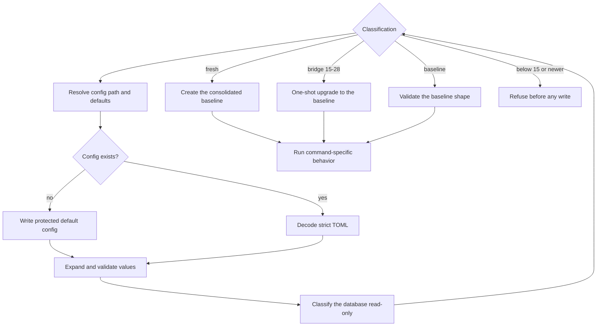

# Configuration, persistence, and backends

## Purpose

Configuration selects local paths and defaults. SQLite preserves lifecycle state across command and driver restarts. Backend configuration chooses worker presentation while current workspace allocation remains the native Git worktree backend.

## Ownership and authority

`internal/config` owns strict TOML defaults, path expansion, validation, and initial file creation. `internal/store` owns SQLite migrations and durable records. The operating system, filesystem, Git, harnesses, and terminal providers remain authoritative for external state.

The local user administers configuration and stored data. Shephrd has no remote policy service, secret manager, privilege separation, or encrypted state.

## Inputs and outputs

The first ordinary command creates configuration at `~/.config/shephrd/config.toml` unless overridden. Defaults are:

| Setting | Default |
| --- | --- |
| repository discovery | disabled |
| GitHub observer extension | disabled |
| `default_harness` | `claude-code` |
| `default_model` | unset (harness-native or matching driver context) |
| `repository_models` | none |
| `worker_runtime` | `headless` |
| `database_path` | `~/.local/state/shephrd/shephrd.db` |
| `data_dir` | `~/.local/share/shephrd/data` |
| `worktree_root` | `~/.local/share/shephrd/worktrees` |
| `memory.enabled` | `true` |
| wake | enabled, batch 10, maximum 20, claim 5 minutes bounded by 30 seconds and 30 minutes, generated stable driver ID |
| notifications | disabled with no extension and bounded rate defaults |
| Pi watcher | disabled, polling from 1 to 15 seconds |
| Herdr extension | disabled |
| cmux extension | disabled |
| report.accepted lifecycle handlers | none |

To select exact opaque models for all new workers and sub-drivers except one registered repository, use its ID from `shephrd repo list --json`:

```toml
default_harness = "pi"
default_model = "openai-codex/gpt-6-sol:xhigh"

[repository_models.repo_887acd1c4f50]
harness = "claude-code"
model = "claude-opus-5-5"
```

This selects Glide by registered ID, not by path or name; other registered repositories and general sub-drivers use the global default. It does not modify existing attempts, retained sub-drivers, product reviewer models, or harness-native effort settings. Glide's high-effort preference remains separately managed; this table does not guarantee effort. Model IDs are forwarded without validation or authentication. An override requires both valid harness and nonempty model; `default_model` requires a static `default_harness`. See [selection precedence](harnesses-runtimes.md#harnessmodel-selection-contract).

Unknown keys and invalid values are rejected. Paths expand environment and `~` and become absolute. The retired `workspace_roots` key is rejected rather than treated as an alias, and the retired `worktree_backend` key is rejected with removal guidance: the worktree backend is fixed to the native Git worktree, so the key has no accepted value.

Project memory is agent-maintained Markdown, enabled by default. Set `[memory] enabled = false` to disable automatic recall and writes without deleting notes or disabling repository guidance and selected workflows. The driver reads the setting with `shephrd repo context <path> --json`; worker briefs and follow-ups carry it, and the runner reapplies a current disable before harness invocation. Task/repository opt-outs are additional agent instructions, not project-local configuration. This setting does not control harness-native memory, arbitrary file access, or any separately configured lifecycle handler. See [project memory](../reference/workflow-modules.md#memory-setting).

Repository discovery is an explicit global extension opt-in:

```toml
[repository_discovery]
roots = ["~/Projects"]
command = ["/absolute/path/to/shephrd-repository-scanner"]
sha256 = "64-lowercase-hex-digits"
```

The selected executable must declare only the version 1 `repository.discovery` capability. Core sends up to 16 configured roots and accepts at most 1024 path-only candidates. It independently rejects malformed, duplicate, non-canonical, escaping, non-Git, or identity-changing paths. Discovery never writes the repository registry. Each selected candidate must be registered through an ordinary `repo add` command. There is no fallback scanner, executable search, extension registry, project-local configuration, or automatic registration.

GitHub delivery observation is an explicit global extension opt-in:

```toml
[github_observation]
command = ["/absolute/path/to/shephrd-github-observer"]
sha256 = "64-lowercase-hex-digits"
```

The selected executable must declare only the version 1 `forge.github-observation` capability. External delivery attestation and attested-delivery re-verification send only the exact registered remote identity, accepted PR artifact, and sealed commit, plus the wire request identity and deadline. The extension performs read-only paginated GitHub GraphQL and compare queries, returns bounded immutable observations with commit lists, compare facts, and its identity and version, and never claims landing or release. Core revalidates the observation against registered state, applies every proof gate, and stores a core-computed evidence digest with the immutable attestation. Timeout, crash, malformed, stale, or dishonest responses fail closed. Omitting the table launches no observer process and keeps external attestation unavailable. Ordinary exact-head PR artifact verification remains the verifier's direct `gh pr view` path; local-only flows launch no observer extension.

macOS Notification Center presentation is an explicit global extension opt-in:

```toml
[notifications]
enabled = true
details = false
task_per_minute = 2
global_per_minute = 10

[notifications.extension]
command = ["/absolute/path/to/shephrd-notification-macos"]
sha256 = "64-lowercase-hex-digits"
```

Enabling notifications requires this exact small trust shape. Omitting the extension or leaving notifications disabled launches no notification process. The retired `adapter` key is rejected rather than aliased. Core retains durable records, presentation eligibility, bounded title/body construction, deduplication, rate limiting, invocation timing, and delivery logs. The extension receives only the sanitized title and body and returns a non-authoritative presentation result.

The first-party Herdr and cmux process extensions are explicit global opt-ins:

```toml
[terminal_extensions.herdr]
command = ["/absolute/path/to/shephrd-terminal-herdr"]
sha256 = "64-lowercase-hex-digits"

[terminal_extensions.cmux]
command = ["/absolute/path/to/shephrd-terminal-cmux"]
sha256 = "64-lowercase-hex-digits"
```

Each configured executable must be absolute, regular, executable, non-symlinked, not group/world-writable, and match its pinned digest before every start. Shephrd executes each argument vector directly without a shell or `PATH` lookup. A configured extension is the only path for new operations on that provider; there is no in-process provider and no failure fallback. Without the table, new operations for that provider are refused with a typed error, headless remains the built-in default, and persisted endpoints are recovered exactly only through the configured extension. No second legacy selector exists, and explicit headless selection never describes or invokes an extension.

The first named lifecycle handler is also an explicit global opt-in:

```toml
[[lifecycle_handlers.report_accepted]]
name = "memory"
extension_id = "example.report-memory"
command = ["/absolute/path/to/report-memory-handler", "/absolute/path/to/memory-data"]
sha256 = "64-lowercase-hex-digits"
environment = ["MEMORY_TOKEN"]
```

At most eight uniquely named handlers are accepted. They reuse the same pinned process extension host as the terminal extensions. Handler commands are absolute vectors executed without a shell, and only explicitly allowlisted environment names are copied. Shephrd, dynamic-loader, wildcard, project-local, and automatic discovery configuration is rejected. See [report acceptance lifecycle handlers](lifecycle-handlers.md) for the exact protocol and authority boundary.

Important environment inputs are `SHEPHRD_CONFIG`, `SHEPHRD_STATE_DIR`, `SHEPHRD_DATA_DIR`, `SHEPHRD_EXECUTABLE`, `SHEPHRD_WORKER_RUNTIME`, `SHEPHRD_DRIVER_HARNESS`, `SHEPHRD_DRIVER_MODEL`, `SHEPHRD_PI_WATCHER_ENABLED`, and the XDG config/state/data roots. Driver harness/model values are selection convenience only. `PI_MODEL` alone is not inherited. There is no `default_model` or repository/role model table; see the [exact harness/model selection contract](harnesses-runtimes.md#harnessmodel-selection-contract).

## Persisted state

SQLite schema version 30 extends the immutable version-29 consolidated baseline with opt-in sub-driver ownership, correlated requests/events and worker associations. Existing notifications gain a distinct sub-driver-event source. It creates no sub-driver owners or model sessions. See [sub-driver rollout and recovery](subdrivers.md).

The version-29 baseline stores repositories, tasks and schema-required nonblank titles, attempts including declared base strategies and references, messages, latest checkpoints, notifications and delivery log, verified reports and task inputs, plans and relations, annotations, attestations and local recovery, release sagas, archive metadata, landing projections, and a single `schema_baseline_provenance` row recording the original version and validated old-ledger digest of upgraded databases. A partial unique notification index fences settlement wakes by attempt and run generation.

Task data storage retains briefs, recovery briefs, follow-ups, reports, launchers, runner logs, and content-addressed report snapshots. Worktrees and Git branches live outside SQLite.

SQLite uses WAL, foreign keys, immediate write transactions where needed, a busy timeout, and bounded setup contention retry. Fresh databases execute the consolidated baseline body followed by the sub-driver migration. Databases at the supported bridge versions 15-28 validate the complete frozen identity manifest and released schema shapes before a one-shot upgrade converges them on the baseline, recording the original version and old-ledger digest. Schemas below 15 are refused for in-place upgrade and are read-only export candidates for the bounded legacy window; unknown newer schemas are always refused.

## Normal flow



Help, shell completion, and the private Claude hook bypass ordinary bootstrap. `repo context` loads configuration but never opens the task database or registers a repository. Other read commands can create a fresh baseline database before their read; below-floor and newer databases are refused before any read-write handle exists, with exact recovery instructions and no database changes.

## State transitions

Config is absent or present; there is no command-driven config migration. Open classifies the database read-only, then creates, upgrades, or validates the baseline. Unknown newer versions, frozen-identity drift, schema-shape divergence, or unmet upgrade preconditions cause open to fail before writes. The ledger retains the baseline identity and adds the version-30 sub-driver migration identity; the provenance row still carries the original version and validated old-ledger digest.

Worker runtime requests resolve to headless, Herdr, or cmux before attempt creation as detailed in [harnesses and runtimes](harnesses-runtimes.md). `auto` is never persisted. Workspace backend for new attempts is always `native_git_worktree`.

The baseline upgrade preserves the complete durable evidence contract: every task, attempt, message, checkpoint, artifact and snapshot, report input, annotation, attestation, landing proof, notification, handler obligation, and held or unknown workspace fact. It refuses, with exact recovery instructions, while any worker, terminal, release, or handler operation is active; while any Treehouse attempt lacks complete released evidence; while any legacy Herdr and canonical terminal endpoint identity conflicts; while any nonempty legacy task-list table lacks an accepted export digest; while any local mismatch recovery candidate remains unreleased or unproven; or while any report snapshot diverges from its stored size or hash. The retired duplicate Herdr endpoint columns and the exported legacy task-list tables are the only objects the baseline drops, and it drops them only after the equality and export preconditions pass.

## Failure and recovery

The baseline migrator creates its own timestamped SQLite backup and retained-data manifest next to the database before the first bridge write; rollback after a committed upgrade is stop all processes and restore that backup with its manifest. A newer unknown schema, checksum mismatch, shape mismatch, or refused precondition requires the matching binary or the signed previous-binary cleanup, never manual migration-row deletion.

Databases below the version 15 floor are refused for in-place upgrade while the compiled export window is open, and `shephrd legacy export <output-dir>` publishes a read-only bundle with the content-addressed digest; the signed Shephrd v23 legacy upgrader performs the in-place upgrade. After the window closes, only the archived signed legacy exporter may read them. Bridge-version databases (schema 15-28) whose retired legacy task-list tables still hold rows are exported the same way; the baseline migration accepts their digest for this binary's lifetime, so the export is not window-bounded for those schemas.

Changing `worktree_root` or a path-derived default while attempts are held can break containment checks. Restore the original configuration before reconciliation or release. A `worktree_backend` key in existing configuration is rejected at load with removal guidance.

An invalid `SHEPHRD_EXECUTABLE` falls back to the current absolute executable when that file is valid. Selection never searches `PATH` for the fallback. The exact selected path is persisted per attempt.

## Safety invariants

- Configuration is strict; unknown keys do not silently change behavior.
- Generated config and sensitive task directories use restrictive permissions.
- Migration identities are frozen at release and validated before any upgrade write; the baseline shape is validated before and after convergence.
- Old and new binaries mutually refuse incompatible schemas: a pre-baseline binary sees the baseline version as unknown and refuses before writes, and the baseline binary refuses identities and shapes it did not release.
- Worker runtime selection occurs before attempt allocation.
- Current workspaces use only native Git worktrees.
- Configured setup hooks, extension processes, and worker processes execute with the local user's authority.
- Notification, terminal, and report lifecycle extensions are trusted same-user code, not sandboxes or project plugins.
- Archive is not deletion, and no TTL, encryption, redaction, or secure erase workflow exists.
- Git worktree isolation is not process sandboxing.

## Commands

- `shephrd help`
- `shephrd workspace reconcile`
- `shephrd worker status <task-id>`

## Interactions with other components

[Repositories](repositories.md) use explicitly configured discovery roots and store setup/context metadata. [Report acceptance lifecycle handlers](lifecycle-handlers.md) consume only explicitly configured trusted handler identities. [Attempts](attempts-worktrees.md) use worktree and data paths. [Harnesses](harnesses-runtimes.md) consume harness/runtime and executable defaults. [Notifications](notifications-watchers.md) consume wake, hint, and watcher settings. [Delivery](delivery-release.md) stores proof and report snapshots under configured state.

## Design rationale

Strict local configuration makes startup failures visible instead of accepting misspelled safety settings. Embedded monotonic migrations let every bounded CLI process share durable state without a daemon. Persisting resolved runtime choices and executable paths prevents later ambient environment changes from rewriting attempt identity.
