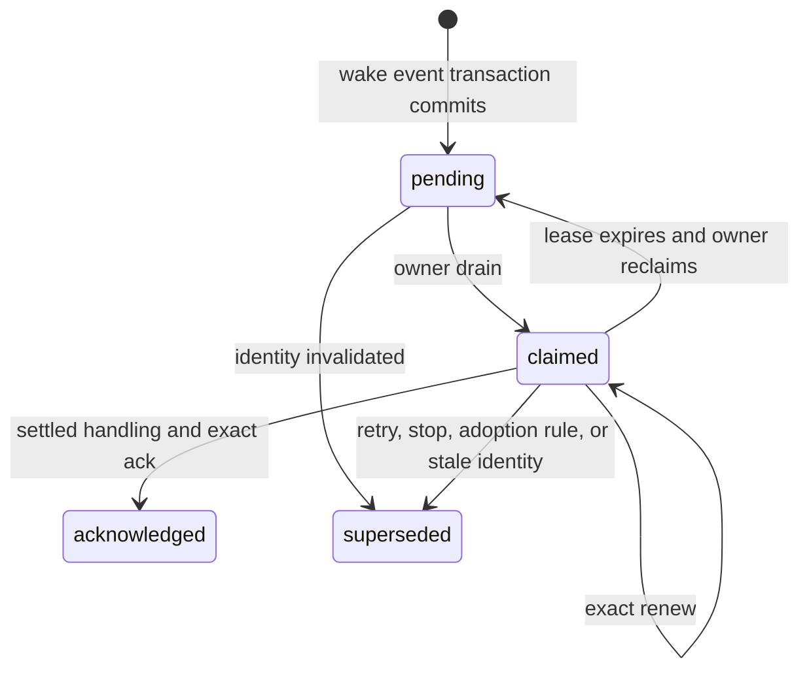

# Notifications and watcher delivery

## Purpose

Notifications make worker questions and terminal results durable without keeping a driver turn open. Delivery is owner-routed, claim-leased, and independent from task disposition. The obligations projection gives a read-only restart and portfolio view over the same durable facts.

## Ownership and authority

Each wake-worthy message copies the task's current `driver_id` into `target_driver_id` in the same transaction. Only that owner and the exact driver generation and claim token can renew or acknowledge a claim. The CLI may derive the notification ID and generation from a presented claim token, but it resolves them to the same full fenced store request before mutation. This is cooperative race prevention for one local account, not an authentication boundary.

The optional Pi watcher, or the driver-agnostic [`wake watch`](#driver-agnostic-watcher) for a non-Pi owner, owns notification consumption while active. Without one, an integration may perform one bounded pass at a normal turn boundary. Notification handling and desktop presentation results never authorize spawn, recovery, verification, landing, release, retry, archive, or discard.

## Inputs and outputs

Accepted current `question`, `done`, `blocked`, and `failed` events create notifications. Runner death and current protocol failure can also publish wake records. When a runner later settles after its accepted terminal notification was already acknowledged or superseded, Shephrd publishes one bounded artifact-free `settled` system notification only if the existing obligations classifier still finds actionable task residue. The attempt and run generation uniquely fence that non-authoritative wake. A pending or claimed terminal notification remains the trigger instead, and a quiescent released task stays silent. Progress and checkpoint events remain quiet. A report `done` record remains unpresentable until the immutable report snapshot exists and every configured [report acceptance lifecycle handler](lifecycle-handlers.md) has a terminal visible outcome. Failed pre-acceptance report verification creates a separate sanitized `report-verification-failed` system notification with no artifact or report bytes.

`wake drain` accepts an owner, optional task, driver generation, batch limit, and claim lease. It returns claimed notifications plus exact owner, generation, token, and expiry data. Inside Pi, an omitted drain owner resolves to `driver:pi:$PI_SESSION_ID`; outside Pi it falls back to `wake.driver_id`.

The routine renewal is `shephrd wake renew --claim-token <token> --json`. The routine acknowledgement after handling settles is `shephrd wake ack --claim-token <token> --json`. Both look up exactly one stored claim, require the inferred or configured current owner to match, derive the notification ID and generation, and submit a full owner/generation/token-fenced request to the store. A first acknowledgement with no `--handling-id` creates a fresh stable handling ID. Human output prints it, and JSON returns it in a schema 1 acknowledgement receipt. Repeating the shorthand after success derives the stored handling ID and is idempotent.

The existing notification positional argument plus `--driver-id`, `--driver-generation`, and `--handling-id` remain advanced compatibility overrides. Every supplied override is checked against the claim and current inferred Pi owner; a conflict fails closed instead of replacing stored identity.

`task obligations` accepts owner, repository, and portfolio filters and returns schema 2 derived buckets, counts, omission instructions, planned readiness, and exact recorded-state recovery commands without external probes. With `--all-drivers`, it also returns exact relevant plan IDs, names, owners, and dispatched/live evidence summaries rather than counts alone.

[Opt-in sub-drivers](subdrivers.md) reuse these claims. Worker notifications target the durable sub-driver owner, while correlated `subdriver-question`, `subdriver-result`, `subdriver-blocker` and `subdriver-handoff` returns target the requesting main driver. Those returns carry request and sub-driver-event IDs instead of task/attempt evidence. The Pi watcher relays them without adopting or supervising descendants. `wake drain` performs a bounded activation pass for already-created owners with pending work. While one main claim remains outstanding, the watcher instead runs `wake pump --driver-id <main-owner> --json` on its serialized `poll_min` cadence, without draining or changing that main claim. Each pass retains the existing two-owner launch bound and process, endpoint and generation fences. Closed requests remain eligible through their pending worker notifications. Pumping never provisions sub-drivers or schedules ordinary worker retries. Empty queues make no model calls. Independent activation requires a matching CLI and watcher; see [mixed-version activation requirements](subdrivers.md#activation-requirements).

## Persisted state

Notification rows store message/task/attempt identity, target owner, worker generation and cursor, kind, payload and artifact, state, claim lease, acknowledgement, handling identity, and supersession data. Report handler annotation, receipt, and failure state remain in the report result and task inspection projection and are included alongside a claimed report notification without rewriting the worker message payload. A delivery log records claim, reclaim, renew, notify, acknowledge, adopt, supersede, and deduplication operations. `wake watch` records each `driver.delivery` attempt as a `notify` row whose result is `delivered`, `retryable`, `rejected`, or `undeliverable`; only `sent` or `suppressed` notify rows count as completed desktop presentation.

The obligations view has no table. It is derived in one read transaction from tasks, attempts, final checkpoints, accepted current-generation worker terminal counts, report recovery attestations, notifications, landing projections, plans, and latest bounded task annotations.

Schema 30 permits sub-driver-return notifications with NULL task/message/attempt IDs. The task notification aggregate selects only task-backed rows; sub-driver-owned worker tasks still count under their durable sub-driver owner, not the requesting main driver. Sub-driver returns remain on the request-correlated notification path and are not task obligations. Zero task counts do not mean those returns were acknowledged or their requests resolved. Mixed-source regression coverage lives in `internal/store/attention_notifications_test.go` and the built-CLI `internal/cli/attention_e2e_test.go`.

When the trusted notification extension is enabled, core checks durable presentation eligibility, prevents a repeated completed presentation, formats one sanitized title/body pair, applies deduplication and rate limits, and invokes version 1 of `notification.presentation` through the provider-neutral extension host. The first-party `shephrd-notification-macos` executable owns the only Notification Center and `osascript` interaction. Its typed result is advisory. Core alone records the delivery attempt and retains notification, claim, acknowledgement, and lifecycle authority.

## Normal flow

A drain first sweeps dead recorded runners, including attempts that accepted a terminal event before the runner crashed, reclaims expired owner claims, supersedes stale identities, and then claims a bounded FIFO batch. A dead terminal runner uses the same settlement transaction and idempotency fence as normal process exit. It skips a task with an active claim and returns no more than two notifications per task.

The Pi watcher runs only in a trusted interactive Pi TUI session. It drains one owner, takes one owner-scoped schema 2 `task obligations` count snapshot, injects those bounded counts with one follow-up, confirms matching input persistence, renews near expiry, and acknowledges only after a successful settled assistant turn. As soon as an accepted notification passes the generation, owner, single-claim and duplicate guards, the watcher shows one info notice and a `shephrd-wake` footer status naming the source: `Sub-driver: <registered repository>` or `Sub-driver: General` for sub-driver returns, `Worker <task label>` for worker events. The notice says whether the handling turn starts now or waits until the current turn settles; the status changes to handling once the follow-up is injected and is cleared by the settled acknowledgement or claim loss. This receipt is machine detection evidence only. It does not interrupt an active turn, acknowledge early, or bound the model's summary latency, which remains behind busy-turn injection and provider response time. Immediately before acknowledgement it takes one final count snapshot. A transient acknowledgement retry reuses that snapshot, so a wake turn performs at most two read-only obligations queries. Nonzero residue or a bounded query failure is persisted as counts and count delta only, then surfaced on the next natural turn without triggering another turn or readiness wake. Quiescence persists no obligations context.

The watcher consumes the schema 1 acknowledgement receipt and persists the returned handling ID in its Pi entry. Worker Pi sessions force the watcher off. Shorthand resolution does not cause acknowledgement before the settled-turn boundary, and an obligations command failure does not consume the claimed notification twice.

Its injected guidance is limited to current identity, authorization, held-work safety, and no-polling mechanics. It does not require review, a spawn sequence, successor work, or lifecycle actions before acknowledgement. A `settled` wake and residual counts are evidence only. Handling may report a result or missing decision without starting more work; acknowledgement remains tied to the matching successful settled assistant turn, not workflow completion.

## Driver-agnostic watcher

`shephrd wake watch --driver-id <main-owner> [--json-log]` is a long-running foreground process for one non-Pi main driver, intended for a user service manager. It gives that owner the Pi watcher's delivery and activation semantics without a Pi TUI. It requires `wake.enabled` and a pinned `[wake_watch.delivery]` extension, describes and validates that extension before claiming anything, and refuses an empty owner, any `driver:pi:*` owner, sub-driver owners, ordinary worker sessions, and sub-driver sessions.

Each process start uses one `watch:<uuid>` driver generation and takes an exclusive per-owner `flock` on `<data_dir>/watch/<sha256(owner)>.lock` for its lifetime, recording its generation and PID. A second watcher for the same owner exits with `wake_watch_active`. While the lock is held, `wake drain` and `wake pump` for that owner also fail closed with `wake_watch_active` and name the watcher generation and PID. For owners a watcher may serve, those manual commands create the lock file if absent and hold a shared lock on it for their own duration, so a watcher cannot start mid-command; that refusal omits watcher identity because no watcher holds the lock. `driver:pi:*` and sub-driver owners, which `wake watch` refuses, take no lock and create no lock file. Other owners and `wake ack` are unaffected.

With no outstanding claim the watcher performs the same pass as `wake drain`: sweep recorded runner deaths, run the bounded sub-driver activation pass, then claim at most one FIFO notification under `wake.claim_ttl`. That claim is owner-exclusive: in the same transaction that reclaims expired leases, the watcher claims nothing while any unexpired claim for the owner remains, including one held by an earlier watcher generation or a manual drain, and waits for that claim to be acknowledged or to expire without touching it. An empty or fenced queue backs off from `wake_watch.poll_min` to `poll_max` and makes no model calls. A claim is handed to version 1 of `driver.delivery`; while it remains outstanding the watcher wakes every `poll_min`, or earlier when the next renewal falls due first (never sooner than one second), to:

- read the stored notification and settle on stored state rather than renewal errors; if the read fails the watcher logs `observe_failed` and skips that pass entirely, neither renewing, delivering, pumping, nor draining until stored state is observable again: `acknowledged` under its claim identity drains the next notification immediately; `superseded`, reclaimed `pending`, a changed owner/generation/token, or an expired lease clears the claim without acknowledgement;
- renew the exact claim on the Pi watcher's cadence, half the remaining lease bounded to 1-60 seconds, until `wake_watch.renew_horizon` after the first claim; a stale renewal clears the claim, any other renewal failure withholds delivery until a later pass re-reads stored state, and after the horizon the lease expires and a later drain redelivers it under a new claim;
- retry a `retryable` delivery, or an extension timeout or crash, with backoff from `poll_min` to `poll_max` while renewable; `delivered`, `rejected`, and protocol or validation failures (`undeliverable`) stop delivery for that claim, which still renews until the horizon;
- start a pump-only activation pass for the owner in the background when none is in flight, without draining or changing the main claim, so a slow pass never delays observation, renewal or delivery; at most one pass runs at a time, the next drain waits for an in-flight pass before its own, and pump failures are logged and non-fatal.

Delivery outcomes are advisory and never mutate notification state. SIGINT or SIGTERM stops the process after any in-flight activation pass finishes, without acknowledging, releasing, or renewing anything further. Events are written as tab-separated lines, or one JSON object per event with `--json-log`; logs omit claim tokens.

### `driver.delivery` v1

The manifest must declare exactly `{"name": "driver.delivery", "version": 1, "operations": ["deliver"]}` under the configured `extension_id`. The strict request payload carries:

- `driver`: the owner `id` and watcher `generation`;
- `notification`: `notification_id`, canonical `kind` (`subdriver-*`, never `coordinator-*`), `request_id`, `subdriver_id`, `subdriver_repo_name`, `subdriver_event_id`, `task_id`, `task_title` truncated at 1 KiB on a UTF-8 boundary, `attempt_id`, `artifact` (omitted rather than truncated when it exceeds 1 KiB; `task inspect` returns it in full), `payload` truncated at 8 KiB on a UTF-8 boundary with `payload_truncated`, and `created_at`. A sub-driver return has no task identity; a task-backed notification has no sub-driver identity;
- `claim`: `claim_token`, current `claim_until`, and the 1-based `delivery_attempt` for this claim;
- `commands`: exact argument vectors beginning with bare `shephrd`. Sub-driver returns get `subdriver event`, `subdriver request`, and `subdriver reply ... --driver-id <owner>`; task-backed notifications get `task inspect` and `worker send` with no `request`. Every delivery gets `wake ack --claim-token <token> --driver-id <owner> --json`. `<text>` and `<key>` are literal placeholders the consumer fills;
- `obligations`: an optional owner-scoped schema 2 count snapshot taken at claim time.

The response is `{"outcome": "delivered" | "retryable" | "rejected", "detail": "<at most 512 bytes>"}`. Core validates the request before invocation and the result after it, with a 10-second deadline per attempt.

The first-party `shephrd-delivery-webhook` extension (`shephrd.delivery-webhook`) posts the validated payload as JSON. It signs with [Standard Webhooks](https://www.standardwebhooks.com/) headers: `webhook-id` is the hex SHA-256 of `notification_id + ":" + claim_token`, so retries of one claim deduplicate while a redelivered claim is distinct and the raw token never appears in a header; `webhook-signature` is `v1,<base64 HMAC-SHA256 of "{id}.{timestamp}.{body}">`. Its command takes `--url`, `--secret-file`, and optional `--allow-http`. The URL must be HTTPS unless plain HTTP is explicitly allowed, and must not carry credentials. The secret file must be an absolute, non-symlinked regular file owned by the current user with mode 0600 or stricter; a `whsec_` value is base64-decoded into the key, and any other value is used as raw bytes. 2xx maps to `delivered`; 408, 429, 5xx, timeout, or connection failure to `retryable`; any other status, including an unfollowed redirect, to `rejected`. Bodies are bounded, response reads are capped, proxies and redirects are not used, and the detail never echoes receiver output.

The receiving driver treats every field as untrusted data, handles the notification, and runs the `ack` vector only as the final step of its successful settled handling turn. Acknowledgement means handled, not answered; later answers use the `reply` vector. It never drains, pumps, or renews for an owner with an active watcher. Delivery is at least once: crashes, expiry, and the horizon redeliver under a new claim, so consumers should deduplicate on `webhook-id`.

`internal/wakewatch` tests the loop against a real store with fake activation and delivery plus timing-out and crashing pinned extensions; `internal/driverdelivery` covers the strict contract, manifest, digest pin and environment allowlist; `internal/driverdelivery/webhook` covers the Standard Webhooks signature vector, `webhook-id`, status mapping, settings, bounds and redirects. `internal/cli/wake_watch_e2e_test.go` runs the built CLI and webhook extension against an isolated database and a loopback receiver for refusals, signed single-claim FIFO delivery, owner exclusivity, pump-only activation, consumer acknowledgement, retry, horizon redelivery and SIGTERM. These are deterministic fixtures, not a live watcher activation.

## State transitions

Task adoption retargets pending and claimed notifications, releases old claims, and does not acknowledge them. Retry, stop, stale attempt/run identity, and most releases can supersede notifications. An unhandled `settled` notification survives release only while actionable residue independent of that notification remains; claim, renewal, acknowledgement, and adoption keep their existing fences. A current accepted report `done` notification backed by complete report landing proof remains active after report worktree release, including while a handler invocation is still `pending` or `invoking`, so the result is not lost before recovery and handling. Report result presentation still waits for `succeeded`, `failed`, or `unknown`, which are visible terminal presentation states.

Obligations buckets include action now, needs disposition, result ready, planned ready, underway, queued, planned blocked, and closed. A blocked or failed current report attempt with a dead recorded runner, held workspace, no accepted artifact, current worker checkpoint, and zero accepted worker terminal events in the current generation projects `report_recovery_available` plus the exact attestation command. An ordinary accepted worker blocked or failed event instead retains normal terminal recovery choices. An existing attestation projects `report_recovery_attested` with exact verify and clean-retry commands and never offers same-worktree relaunch. These are inspection evidence only; attestation still revalidates the process, terminal endpoint, worktree, checkpoint, path, and bytes before recording anything. Closure requires terminal status, no active notification or worker, every attempt released or no-workspace, no uncertain workspace, and recognized landing, discard, or no-work outcome. Archive is visibility only and cannot satisfy closure.

## Failure and recovery

Expired, ambiguous, mismatched, wrong-owner, wrong-generation, wrong-token, or conflicting-handling claims fail rather than acknowledging another handler's work. Repeating the exact acknowledgement and handling ID is idempotent; shorthand repetition resolves that stored identity. Identity errors name the missing or conflicting field and return an exact `recovery_command`.

When a watcher turn aborts or fails, its claim remains durable for renewal or expiry. An expired claim's recovery command performs a fresh owner drain. If the current inferred Pi driver differs from the stored owner, the recovery command explicitly adopts the task and drains again; identity inference never performs adoption. Without a watcher, do not loop or sleep after an empty drain. When recovering work under a replacement driver, use `task obligations --all-drivers` and `plan ls --all-drivers` to discover it, then adopt each relevant task and plan explicitly when authorized. Neither disclosure command mutates ownership.

A `wake watch` crash or restart takes a new generation; the new watcher delivers nothing further until the previous generation's outstanding claim is acknowledged or expires, then redelivers it first under a new claim, and the lock prevents overlap. A digest mismatch or manifest violation refuses startup; a later protocol violation marks only that claim undeliverable.

Best-effort macOS hints can fail, time out, be cancelled, deduplicate, or rate-limit without changing durable notification state. Failures remain bounded delivery-log evidence. Default and disabled configurations start no notification extension.

## Safety invariants

- Message transition and notification publication commit together.
- A claim is presentation authority only, not task authority.
- Acknowledgement and desktop presentation record handling evidence, not approval, verification, landing, release, retry, or closure.
- Only the current owner can claim, renew, or acknowledge.
- An active watcher and manual drain must not compete. A `wake watch` owner lock makes `wake drain`, `wake pump`, and a second watcher for that owner fail closed.
- `wake watch` holds one main claim at a time across its own restarts, never acknowledges, never takes over another generation's unexpired claim, and settles on stored notification state; delivery outcomes are advisory.
- One main claim blocks further main drains, not bounded sub-driver activation; pump-only passes do not consume main notifications.
- Empty drains return immediately and consumers do not poll.
- Obligations is a recorded-state projection and performs no Git, GitHub, process, terminal, file, or workspace mutation.
- Wake-turn obligations reuse that projection, issue at most two owner-scoped read queries, and never schedule or wake on readiness changes.
- A projected report recovery command is not authorization and does not imply that the canonical file currently passes attestation.
- Contradictory or incomplete closure facts surface as attention rather than safe closure.
- Report result notification never precedes its configured handler outcomes.
- Failed report verification has a separate durable notification that never carries unverified report bytes.
- A settlement wake carries no artifact, proves no disposition, and is unique per attempt and run generation.
- Release does not supersede an accepted report notification solely because handler recovery remains pending.

## Commands

- `shephrd wake drain`
- `shephrd wake pump --driver-id <main-owner>` (bounded activation only; no main notification consumption)
- `shephrd wake watch --driver-id <main-owner> [--json-log]` (long-running non-Pi delivery watcher)
- `shephrd wake renew --claim-token <token>`
- `shephrd wake ack --claim-token <token>`
- `shephrd wake renew [notification-id] --claim-token <token> [--driver-id <id>] [--driver-generation <generation>]`
- `shephrd wake ack [notification-id] --claim-token <token> [--driver-id <id>] [--driver-generation <generation>] [--handling-id <id>]`
- `shephrd task obligations`
- `shephrd task adopt <task-id>`

## Interactions with other components

[Worker events](worker-protocol.md) publish notifications. [Report acceptance lifecycle handlers](lifecycle-handlers.md) gate only accepted report result presentation, not worker event authority. [Ownership and adoption](ownership-annotations.md) controls routing transfer. [Review loops](review-feedback.md) often use questions as the feedback boundary. [Delivery](delivery-release.md) and [tasks](tasks.md) remain independent from acknowledgement and obligations projections.

## Design rationale

Durable owner-routed claims let the CLI remain process-bounded and avoid a control daemon. Lease fencing handles crashes without losing records. Keeping handling separate from disposition prevents an injected or acknowledged message from silently authorizing a lifecycle action.
