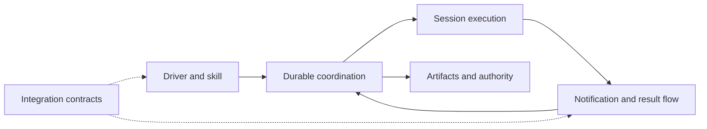

# Shephrd system design (proposal)

**Status:** proposed high-level direction for discussion. It describes intent, not present behavior or implementation. Detailed behavior, interfaces and trade-offs for each system belong to later component specs, each reviewed on its own.

## Goal

Shephrd lets a driver, human or agent, hand repository work to isolated workers and keep a durable, trustworthy record of what happened. It should be useful from one laptop and stay safe when the driver, sub-drivers and workers run on different machines.

## Principles

1. **Minimal first.** The core is a small CLI and a default skill that are useful on their own. It owns only what safety requires. Everything else is optional, and a local user needs no distributed deployment.
2. **Native SSH is core.** Operating across machines over SSH is a built-in capability of the same CLI, not a plugin. A main driver, sub-drivers and workers may each run on a different host.
3. **Users own their workflow.** Routing, decomposition, review, model choice, placement and presentation are policy. Users and plugins define them through documented extension contracts; the core does not dictate one workflow.
4. **One authority per fact.** Each lifecycle fact has a single durable owner. Anything reported from elsewhere is evidence for that owner, never authorization.
5. **Durable evidence.** Progress, questions, results and artifacts are recorded durably with their lineage, so work can be inspected and recovered later.
6. **Explicit authorization.** Readiness, results and acknowledgements are evidence. Irreversible actions such as landing, discarding or releasing work need authority the user grants explicitly, and Shephrd records where it came from.
7. **Fail closed on uncertainty.** When ownership, liveness, lineage or release state is unclear, Shephrd refuses the destructive action, keeps recoverable state and names the way forward. Unreachable means unknown, not gone.

## System responsibilities

Shephrd needs a few logical systems. They are responsibilities, not mandatory services or layers.

| System | Responsibility |
|---|---|
| **Driver and skill** | The CLI surface a driver uses, plus a default skill that teaches the core commands and safety rules. |
| **Durable coordination** | The single authority for tasks, attempts, ownership and lifecycle state. |
| **Session execution** | Starting, observing and stopping worker and sub-driver sessions in isolated workspaces, locally or on another host over SSH. |
| **Notification and result flow** | Carrying progress, questions, replies and results between sessions and drivers until a named party takes responsibility for them. |
| **Artifacts and authority** | Recording artifacts, their lineage and proof, and gating irreversible actions on explicit authorization. |
| **Integration contracts** | Documented, versioned boundaries where skills, plugins and user workflows attach. |

How they relate:

- Drivers act only through durable coordination. Sessions, notifications and integrations report evidence back to it; none of them decide lifecycle outcomes on their own.
- Session execution may span hosts, but each session still answers to the one coordination authority, and its host is part of its identity.
- Artifacts and authority sit apart from execution, so finishing work never implies permission to land or release it.
- Integrations attach at documented contracts. Sub-drivers, watchers, alternative presentation and forge integrations are optional roles built on these systems, not extra layers every user must run.

## Essential boundaries

- **Evidence versus authority.** Worker messages, checkpoints, readiness, verification and acknowledgements never stand in for an explicit decision.
- **Host boundaries.** Crossing a machine never weakens ownership, generation or liveness checks. A lost connection leaves state held and recoverable, not released.
- **Core versus policy.** The core enforces safety mechanics. Workflow choices stay in skills, plugins and user configuration.

## Left to component specs

Later specs decide, for each system, its data model, command and protocol shape, transport and trust details, recovery behavior, contract versioning, and how existing behavior migrates. This proposal only fixes the responsibilities, principles and boundaries those specs must respect.
