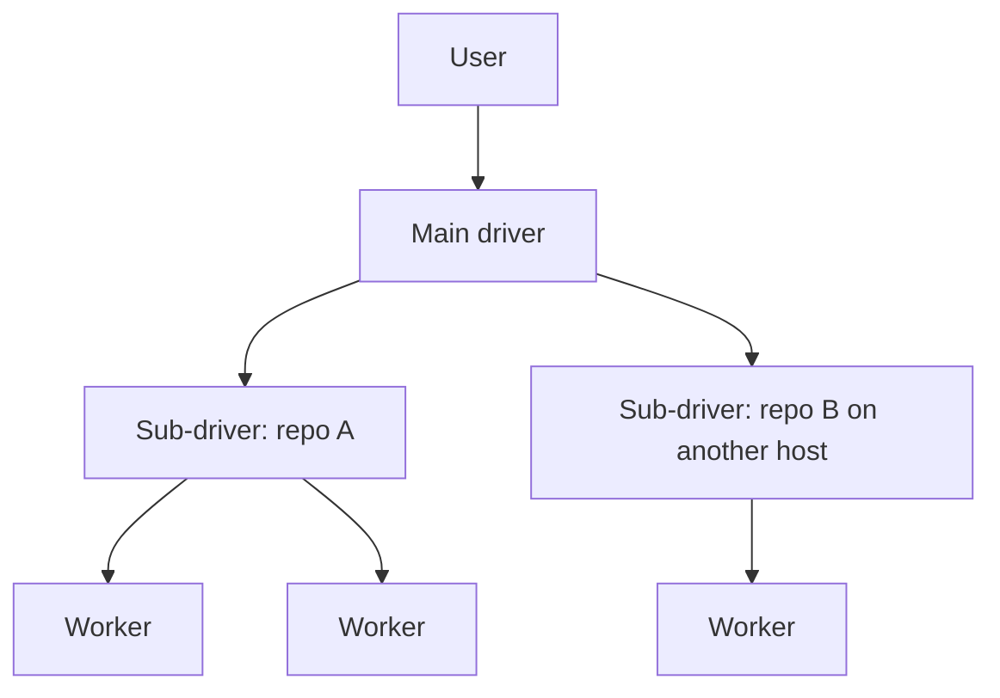
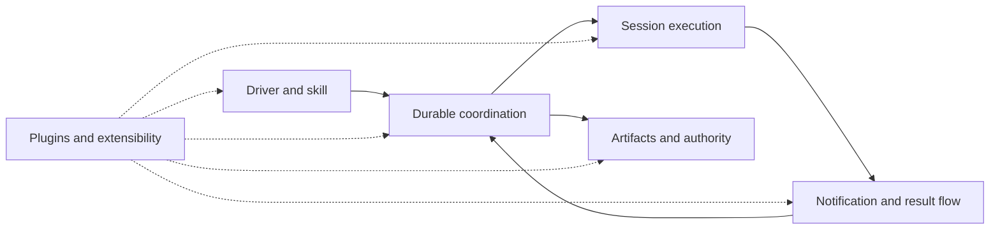

# Shephrd system design

**Status:** approved high-level direction. It describes intent, not present behavior or implementation. Detailed behavior, interfaces and trade-offs for each system belong to later component specs, each reviewed on its own.

## Goal

Shephrd lets a user talk to one main driver that hands repository work, as early as possible, to sub-drivers and isolated workers, and keeps a durable, trustworthy record of what happened. It should be useful from one laptop, stay safe when the driver, sub-drivers and workers run on different machines, and let people shape it to their own way of working.

## Principles

1. **Minimal first.** The core is a small CLI and a default skill that are useful on their own, with no plugin installed. It owns only what safety requires, and a local user needs no distributed deployment.
2. **One main driver, recursive delegation.** The user talks to one main driver, which stays free by delegating as early as possible. Any session that owns work can delegate it further. A sub-driver is a session that owns tasks and delegates them, not a separate kind of entity, so it uses the same task, ownership and notification primitives as every other session.
3. **Extensible by design.** Plugins are built in, not bolted on. The core publishes stable, documented, versioned surfaces: durable events, intercept hooks, providers, commands and skills. Workflow, adapters, integrations and presentation attach through them, and anyone can add or replace these without forking the core. Plugins run as separate processes in any language, act under the same identity and authorization rules as any caller, and can tighten but never loosen the core's guarantees. Every system defines its own plugin surfaces. There is no in-process SDK, marketplace or orchestration framework.
4. **Native SSH with command parity.** Operating across machines over SSH is a built-in capability of the same CLI, never a plugin. A main driver, sub-drivers and workers may each run on a different host. Every command behaves the same locally and over SSH, with the same inputs, outputs and authorization rules: JSON in and out, long input on stdin, no dependence on the caller's terminal or environment, and safe to retry after a dropped connection. Limiting a remote caller is a matter of authorization by owner, not a smaller command set.
5. **Mechanism in core, policy outside it.** The core provides the mechanisms of delegation: tasks with parent and child links, dependencies on finished work, result handoff, and a routing target per task naming its owner, host, harness and model. How to decompose work, where to route it, review, model choice and presentation are policy. Users, skills, configuration and sub-drivers define them through those mechanisms. The core ships sensible defaults but does not dictate one workflow.
6. **One authority per fact.** Each lifecycle fact has a single durable owner. Anything reported from elsewhere, including from a plugin, is evidence for that owner, never authorization.
7. **Durable evidence.** Progress, questions, results and artifacts are recorded durably with their lineage, so work can be inspected and recovered later.
8. **Explicit authorization.** Readiness, results and acknowledgements are evidence. Irreversible actions such as landing, discarding or releasing work need authority the user grants explicitly, and Shephrd records where it came from.
9. **Fail closed on uncertainty.** When ownership, liveness, lineage or release state is unclear, Shephrd refuses the destructive action, keeps recoverable state and names the way forward. Unreachable means unknown, not gone. No plugin can relax this.

## Delegation

Delegation forms a tree. The main driver hands a request to a sub-driver, which plans it and supervises workers, and each result flows back up to the owner that delegated it. Every level uses the same commands and records, wherever it runs.

## System responsibilities

Shephrd needs a few logical systems. They are responsibilities, not mandatory services or layers.

| System | Responsibility |
|---|---|
| **Driver and skill** | The CLI surface every session uses, locally or over SSH, plus a default skill that teaches the core commands, early delegation and safety rules. |
| **Durable coordination** | The single authority for tasks, the delegation tree, dependencies, attempts, ownership and lifecycle state. |
| **Session execution** | Starting, observing and stopping sub-driver and worker sessions in isolated workspaces, locally or on another host over SSH. |
| **Notification and result flow** | Carrying progress, questions, replies and results between sessions and the owners that delegated to them until a named party takes responsibility for them. |
| **Artifacts and authority** | Recording artifacts, their lineage and proof, and gating irreversible actions on explicit authorization. |
| **Plugins and extensibility** | The shared plugin mechanism: manifests, packages declared in configuration, the durable event bus and its dispatcher, intercept hooks, providers and plugin commands, through which plugins attach to every other system. |

How they relate:

- Drivers act only through durable coordination. Sessions, notifications and plugins report evidence back to it; none of them decide lifecycle outcomes on their own.
- Delegation reuses the same systems at every level. A sub-driver creates and supervises tasks exactly as the main driver does, and its results flow up to the owner that delegated to it.
- Session execution may span hosts, but each session still answers to the one coordination authority, and its host is part of its identity.
- Artifacts and authority sit apart from execution, so finishing work never implies permission to land or release it.
- Plugins attach to every system, but only at its documented surfaces. They observe durable events, intercept actions at fixed points where they can block but never allow, provide capabilities, and call the same commands under the same rules as any caller. Watchers, alternative presentation and forge integrations are optional plugins built this way, not extra layers every user must run.

## Essential boundaries

- **Evidence versus authority.** Worker messages, checkpoints, readiness, verification, acknowledgements and plugin output never stand in for an explicit decision.
- **Delegation versus authority.** Each delegated task has exactly one owner. Delegating work does not delegate authority to land, discard or release it; that authority passes down only when granted explicitly, and the grant is recorded.
- **Host boundaries.** Crossing a machine never weakens ownership, generation or liveness checks, and never changes what a command does. A lost connection leaves state held and recoverable, not released.
- **Core versus plugins.** The core keeps owner and host identity, recursive delegation and its task graph, lifecycle authority, durable evidence, fail-closed recovery, native SSH with command parity and the plugin mechanism itself. Plugins choose workflow policy, adapters, integrations and presentation, and cannot weaken any of the core's guarantees.

## Left to component specs

Each system has its own spec:

- [Durable coordination](systems/coordination.md) (approved)
- [Command surface and SSH parity](systems/commands.md) (approved)
- [Plugins and extensibility](systems/extensibility.md) (approved)
- [Session execution](systems/execution.md) (approved)
- [Notification and result flow](systems/notifications.md) (approved)
- [Artifacts and authority](systems/artifacts.md) (approved)
- [Driver and worker guidance](systems/skill.md) (approved)

Later specs decide, for each system, its data model, command and protocol shape, transport and trust details and recovery behavior. Every system spec also has an **Extensibility** section defining its events, intercept points, providers and limits on plugins, as described in [what each system spec defines](systems/extensibility.md#what-each-system-spec-defines). This proposal only fixes the responsibilities, principles and boundaries those specs must respect.

The new core is built fresh, with no legacy compatibility or migration from the current implementation. The current behavior and its end-to-end tests inform the specs as a record of failure modes to handle, but do not constrain them. The [implementation plan](implementation.md) orders the build.
