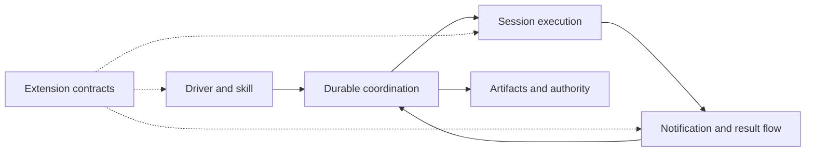

# Shephrd system design (proposal)

**Status:** proposed high-level direction for discussion. It describes intent, not present behavior or implementation. Detailed behavior, interfaces and trade-offs for each system belong to later component specs, each reviewed on its own.

## Goal

Shephrd lets a driver, human or agent, hand repository work to isolated workers and keep a durable, trustworthy record of what happened. It should be useful from one laptop, stay safe when the driver, sub-drivers and workers run on different machines, and let people shape it to their own way of working.

## Principles

1. **Minimal first.** The core is a small CLI and a default skill that are useful on their own, with no plugin installed. It owns only what safety requires, and a local user needs no distributed deployment.
2. **Extensible by design.** The core publishes stable, documented, versioned extension contracts, and workflow, adapters, integrations and presentation attach through them. Anyone can add or replace these without forking the core. Extensibility is a pressure to keep the core small and its contracts stable, not a reason to add a mandatory registry, in-process SDK, hook bus, marketplace or orchestration framework.
3. **Native SSH is core.** Operating across machines over SSH is a built-in capability of the same CLI, never a plugin. A main driver, sub-drivers and workers may each run on a different host.
4. **Users own their workflow.** Routing, decomposition, review, model choice, placement and presentation are policy. Users, skills and plugins define them through the extension contracts; the core does not dictate one workflow.
5. **One authority per fact.** Each lifecycle fact has a single durable owner. Anything reported from elsewhere, including from a plugin, is evidence for that owner, never authorization.
6. **Durable evidence.** Progress, questions, results and artifacts are recorded durably with their lineage, so work can be inspected and recovered later.
7. **Explicit authorization.** Readiness, results and acknowledgements are evidence. Irreversible actions such as landing, discarding or releasing work need authority the user grants explicitly, and Shephrd records where it came from.
8. **Fail closed on uncertainty.** When ownership, liveness, lineage or release state is unclear, Shephrd refuses the destructive action, keeps recoverable state and names the way forward. Unreachable means unknown, not gone. No extension can relax this.

## System responsibilities

Shephrd needs a few logical systems. They are responsibilities, not mandatory services or layers.

| System | Responsibility |
|---|---|
| **Driver and skill** | The CLI surface a driver uses, plus a default skill that teaches the core commands and safety rules. |
| **Durable coordination** | The single authority for tasks, attempts, ownership and lifecycle state. |
| **Session execution** | Starting, observing and stopping worker and sub-driver sessions in isolated workspaces, locally or on another host over SSH. |
| **Notification and result flow** | Carrying progress, questions, replies and results between sessions and drivers until a named party takes responsibility for them. |
| **Artifacts and authority** | Recording artifacts, their lineage and proof, and gating irreversible actions on explicit authorization. |
| **Extension contracts** | The stable, documented, versioned boundaries where skills, plugins, adapters and user workflows attach to the other systems. |

How they relate:

- Drivers act only through durable coordination. Sessions, notifications and extensions report evidence back to it; none of them decide lifecycle outcomes on their own.
- Session execution may span hosts, but each session still answers to the one coordination authority, and its host is part of its identity.
- Artifacts and authority sit apart from execution, so finishing work never implies permission to land or release it.
- Extensions attach only at documented contracts and act through the same commands and evidence rules as any driver. Sub-drivers, watchers, alternative presentation and forge integrations are optional roles built this way, not extra layers every user must run.

## Essential boundaries

- **Evidence versus authority.** Worker messages, checkpoints, readiness, verification, acknowledgements and plugin output never stand in for an explicit decision.
- **Host boundaries.** Crossing a machine never weakens ownership, generation or liveness checks. A lost connection leaves state held and recoverable, not released.
- **Core versus extensions.** The core keeps owner and host identity, lifecycle authority, durable evidence, fail-closed recovery and native SSH. Extensions choose workflow, adapters, integrations and presentation, and cannot weaken any of the core's guarantees.

## Left to component specs

Later specs decide, for each system, its data model, command and protocol shape, transport and trust details, recovery behavior, extension contract shape and versioning, and how existing behavior migrates. This proposal only fixes the responsibilities, principles and boundaries those specs must respect.
