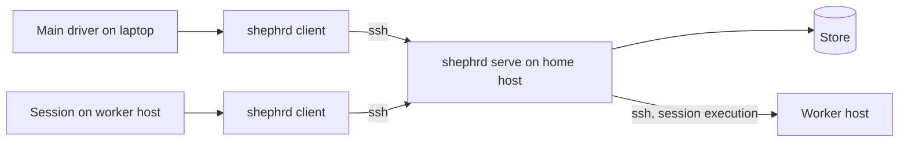

# Command surface and SSH parity

**Status:** approved. Implements the [system design](../design.md).

## Purpose

This spec defines how every caller invokes Shephrd, locally or from another host over SSH, and the conventions every command follows. Each system's spec defines the meaning of its own commands.

Parity holds by construction: there is one binary and one command tree, and a forwarded request runs the same command code on the home host as a local one. There is no second command list for remote callers to drift from.

## Topology

- **Home host:** holds the store and runs `shephrd daemon`. It may also run sessions. Its configuration has no `home`. Exactly one per installation.
- **Client host:** configuration sets `home` to an SSH target. Every public command run there is forwarded to the home host.
- **Worker host:** a client host where sessions run. Session execution reaches it over SSH to create workspaces and start runs.

Put the home host where sessions run most and keep it always on. Sessions report constantly and the daemon wakes sub-drivers constantly, so that traffic stays local. If the home host sleeps, delegation pauses with it.



On a single machine, that machine is the home host and nothing is forwarded. This is the default.

### Example: three machines

| Machine | Role | Runs |
|---|---|---|
| `workhorse` | Home host | Store, daemon, registered repositories, sub-drivers and workers |
| `hermes` | Client host | The main driver, whose commands are forwarded to `workhorse` |
| `laptop` | Worker host, or its own installation | Extra sub-drivers and workers for `workhorse`, or a separate Shephrd with its own home |

The main driver on `hermes` is just a caller. If `hermes` goes down, work on `workhorse` continues and results wait for it. A `laptop` used as a worker host can sleep: its runs then have liveness `unknown`, and anything that needs them gone is refused until it returns. Route only work that tolerates that to it.

## Requests

A request is argv plus optional stdin.

- **Long text comes from stdin**, named with `-`, for example `task create --objective -`. File paths are never part of the contract, because they mean nothing on another host.
- **Identity comes from context**, never from argv over SSH. See [identity](#identity-and-authorization).
- **`--key`** is accepted by every mutating command. The CLI generates one when absent, and the transport reuses it on retry.
- **`--if-revision <n>`** is an optional optimistic check on mutations of an existing task.
- **Sizes are bounded** per field. Oversize input is refused, never truncated.

Over SSH, the client sends one JSON object in the SSH command: `{"v":1,"argv":[...],"key":"...","run_token":"..."}`, with stdin piped through unchanged. Nothing is shell-parsed on the home side.

## Responses

- **Success:** one JSON object on stdout. Watch commands write JSON lines and accept `--after <seq>` to resume where a dropped stream stopped.
- **Warnings:** a successful result may carry `warnings`, a list of `{kind, message}`, for conditions the caller should know about without failing, such as `daemon_not_running`.
- **Failure:** one JSON object on stderr: `{"error":{"kind":"...","message":"...","next":[["shephrd","task","show","t_1"]]}}`. `next` lists exact commands that safely move forward, when there are any.
- **Exit codes:**
  - `0` success.
  - `1` refused: nothing changed.
  - `3` outcome unknown: the request may have taken effect. Retry with the same key, or read the state.

All output is JSON. Help is the only text output and is rendered by the local binary.

## Identity and authorization

| Caller | Locally | Over SSH |
|---|---|---|
| Driver | `driver` in configuration, or `--as driver:<name>` | Fixed by the key's forced command: `shephrd serve --as driver:<name>`. `--as` in a request is refused. |
| Run | `SHEPHRD_RUN_TOKEN` set by session execution | Token carried in the request. The worker host's key forces `shephrd serve --host <name>`, and a token is accepted only for a run started on that host. |
| Plugin | `SHEPHRD_CALL_TOKEN` given to the plugin process by Shephrd | Fixed by the key's forced command: `shephrd serve --as plugin:<name>`. |
| Operator | Local OS user on the home host, outside any run | Not through `serve`. A normal SSH login to the home host is a local session. |

A run token or call token present in the environment takes precedence, and `--as` is then refused, so neither a session nor a plugin can act as a driver.

Authorization is the same rule everywhere, using ownership from [coordination](coordination.md#callers-and-ownership):

- **Read:** the caller's own subtree. The operator reads everything.
- **Mutate a task:** its owner only. A run may also report on its own task.
- **Irreversible actions** (landing, discard, release) additionally need a recorded grant, defined by artifacts and authority.
- **Host administration** (`init`, `repo add`, `plugin sync`) is operator-only, because it changes what runs on a host.

A remote driver is limited by what it owns and what it has been granted, not by a reduced command list.

## Retries and versions

- Mutations are idempotent by key, so the transport retries a forwarded request after a connection failure with the same key, a bounded number of times, then exits `3`.
- Reads are always safe to retry.
- The request carries the protocol version. A mismatch is refused with `version_mismatch` naming both versions. All hosts run the same release; there are no compatibility shims.
- JSON fields are a contract within a version. Additions are allowed; removals and renames need a new version.

## Configuration

One TOML file per host at `~/.config/shephrd/config.toml`, overridden by `SHEPHRD_CONFIG`. Precedence is flag, then environment, then file. The only environment variables are `SHEPHRD_CONFIG`, `SHEPHRD_RUN_TOKEN` and `SHEPHRD_CALL_TOKEN`.

For the [three-machine example](#example-three-machines):

```toml
# workhorse: home host
host = "workhorse"
driver = "main"
max_depth = 3

[hosts.laptop]
ssh = "me@laptop"

[defaults]
harness = "claude-code"
model = "claude-opus-5-5"

[plugins.linear]
package = "acme"
```

Plugins and their packages are declared here too; see [packages and configuration](extensibility.md#packages-and-configuration).

```toml
# hermes: client host for the main driver
home = "me@workhorse"
```

```toml
# laptop: worker host
host = "laptop"
home = "me@workhorse"
```

On `workhorse`, `authorized_keys` pins each caller: `hermes`'s key to `shephrd serve --as driver:main`, and `laptop`'s key to `shephrd serve --host laptop`. On `laptop`, `workhorse`'s key is pinned to `shephrd agent`, so the home host can run [host operations](execution.md#hosts) there.

Paths for the store, workspaces and data have defaults and are set only when needed.

## Command map

Provisional. Rows owned by later specs are placeholders for those specs to finalize.

| Command | Purpose | Spec |
|---|---|---|
| `init` | Create configuration, and the store on the home host | Command surface |
| `version` | Binary and protocol version | Command surface |
| `serve` | SSH forced-command entry point | Command surface |
| `repo add`, `repo list` | Register and list repositories | Coordination |
| `task create` | Create a root task, or a child task from a driver run | Coordination |
| `task show`, `task list` | Read a task with its children and log, or list a subtree | Coordination |
| `task start`, `stop`, `resume`, `retry` | Start a run, stop, new run on the same attempt, new attempt | Coordination, session execution |
| `task log` | Read a run's session log | Session execution |
| `task send` | Message or reply to a task | Coordination, notification |
| `task cancel`, `task adopt`, `task note` | Cancel, adopt a root, record a note | Coordination |
| `task data set` | Write the caller's plugin data namespace on a task | Coordination |
| `report` | A run reports progress, a question, a result or a blocker | Notification |
| `inbox` | An owner waits for, reads and acknowledges events | Notification |
| `task land`, `task discard`, `grant` | Irreversible actions and their authority | Artifacts and authority |
| `workspace reconcile` | Classify interrupted effects on every host | Session execution |
| `host list` | Hosts with reachability, version and installed providers | Session execution |
| `events` | Read or follow the public event stream from a cursor | Plugins and extensibility |
| `daemon` | Deliver events to plugins and owners on the home host | Plugins and extensibility |
| `plugin sync`, `list`, `status`, `skill` | Fetch declared packages, and inspect declared plugins | Plugins and extensibility |
| `<plugin-name> ...` | Subcommands added by plugins | Plugins and extensibility |

That is about 25 core commands, against about 60 today.

## What this replaces

| Today | New |
|---|---|
| `gate` and its allowlist | `serve`, with one authorization rule |
| `--json` and text output | JSON always |
| `--driver-id` on every command | Caller identity from context |
| `--request-file <path>` | stdin |
| `subdriver`, `plan`, separate annotation commands | `task` with roles, dependencies and notes |
| `worker` family | `task start`, `stop`, `resume`, `retry`, `send` |
| `legacy`, `--legacy-coordinator-json`, `protocol validate` | Removed |

## Extensibility

Follows [plugins and extensibility](extensibility.md). SSH transport, identity resolution and the request and response conventions are core and are not replaceable by plugins.

### Plugin subcommands

`shephrd <plugin-name> ...` is forwarded and authorized like any command, and runs the plugin on the home host. The plugin receives the arguments, stdin and the caller's identity, plus a call token valid only for that invocation. Any command the plugin makes with that token acts with the caller's permissions, so a plugin command can never do more than its caller. Its JSON output and errors follow the same conventions as core commands.

### Events

| Event | `data` |
|---|---|
| `request.refused` | Caller, command path, error kind. Never arguments or stdin. |

Successful requests already appear as the events of the system they changed.

### Intercept points

None. Each system declares intercept points on its own commands. A hook on every request would put plugins in the path of reads and of the transport itself.

### Errors

| Kind | Meaning |
|---|---|
| `plugin_blocked` | An intercept hook refused the command. The error names the plugin and its reason. |
| `plugin_failed` | An intercept hook or provider timed out, crashed or answered invalidly, or a declared plugin is unavailable. |
| `plugin_unknown` | No enabled plugin provides that subcommand. |

All three are refusals: nothing changed, and exit status is `1`.

### Limits

Plugins cannot shadow core commands, change how callers are identified, receive run tokens or another caller's credentials, or alter the transport. A plugin running on another host is an ordinary remote caller with its own SSH key.

## Settled decisions

1. **JSON-only output.** Human-friendly views are presentation, which can be a plugin subcommand or `jq`.
2. **Repository registration is operator-only** for now, since it runs setup on a host.
3. **The home host defaults to the current machine.** Multi-machine setups put it on an always-on machine where sessions run, as in the [three-machine example](#example-three-machines).
