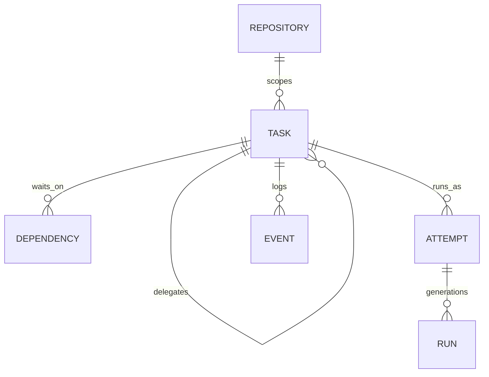
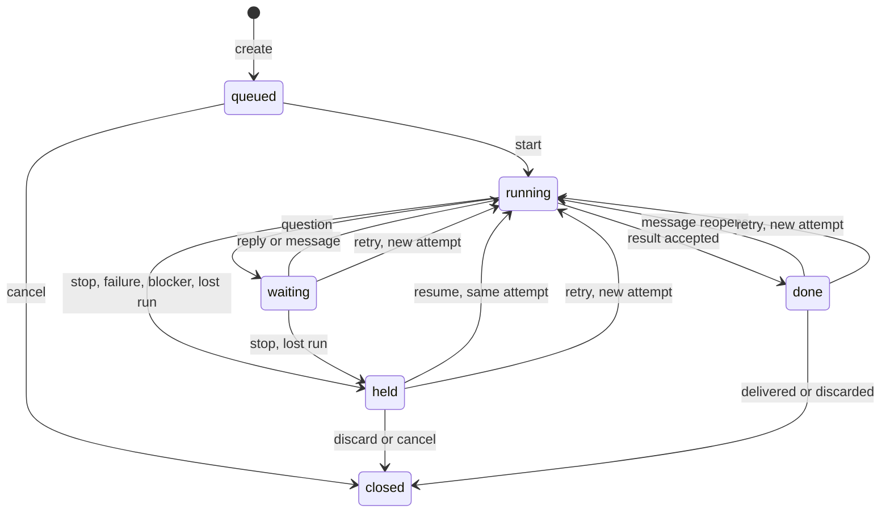

# Durable coordination

**Status:** approved. Implements the [system design](../design.md).

## Purpose

Durable coordination is the single authority for delegated work: who asked for it, who owns it, what state it is in, which attempts ran it and what it reported. Every other system reads from it and reports evidence to it. It decides no workflow.

**Owns:** identity and ownership, repositories, tasks and the delegation tree, dependencies, attempts, runs, the task event log and idempotency records.

**Does not own:** how sessions start or how liveness is observed ([session execution](execution.md)), how events reach their owner and are acknowledged ([notification and result flow](notifications.md)), what makes a result valid or a landing proven, and authority grants ([artifacts and authority](artifacts.md)), command and transport conventions ([command surface](commands.md)), or the plugin mechanism itself ([plugins and extensibility](extensibility.md)).

## Model

### Callers and ownership

A caller is whoever invokes a command. There are four kinds:

- **Driver** (`driver:<name>`): a session Shephrd did not start, such as the main driver the user talks to. Its name comes from configuration locally or from its SSH key remotely.
- **Run**: one session Shephrd started for a task. It acts with its task's authority and proves itself with the run token Shephrd issued when it started.
- **Plugin** (`plugin:<name>`): an installed plugin acting on its own, such as when handling an event. It owns the root tasks it creates, as their driver. See [plugins as callers](extensibility.md#plugins-as-callers).
- **Operator**: the local OS user on the home host, outside any run. The operator can act as any driver. This is cooperative fencing, not a security boundary against the local account.

Every task has exactly one owner, fixed by the tree: a driver for a root task, or the parent task for every other task. Ownership belongs to the task, not to whichever run is current, so a sub-driver that crashes and is resumed or retried still owns its children.

- An owner may act on the tasks it directly owns. A run acts as its task: it reports on that task and, for a driver task, acts on its children.
- Any caller may read its own subtree. A driver reads its roots and all their descendants.
- Ancestors above the owner can read but not act, except for a tree-wide stop. The main driver does not supervise grandchildren.
- Only a root task can change owner, by explicit adoption from one driver to another. Child tasks never change owner.

### Repository

A registered Git root on one host: ID, host, canonical path, name and default branch. The same project cloned on two hosts is two registrations. Registration is explicit, and workspace details belong to session execution.

### Task

One delegated outcome. Fields:

| Field | Meaning |
|---|---|
| `id`, `key` | Opaque ID, and the creator's idempotency key, unique per owner. |
| `parent` or `driver` | The owner: parent task, or the driver for a root. |
| `request` | For a child of a driver task, the request on the parent that this child serves. |
| `role` | `worker` does the work itself. `driver` may also create and supervise child tasks. |
| `repo` | Required for a worker. Optional for a driver, which without one is a general sub-driver with no repository authority. |
| `title`, `objective`, `acceptance` | Display title (derived from the objective when omitted), full outcome and acceptance criteria. |
| `deliverable` | The result contract, `code`, `report` or `answer`, defined by [artifacts and authority](artifacts.md#deliverables). |
| `target` | Host, harness and model, resolved at creation by the router provider unless given explicitly, then recorded. Host is the repository's host when a repository is set. Retry may change it. |
| `data` | Namespaced, inert plugin data. See [extensibility](#extensibility). |
| `state`, `reason` | Lifecycle state below, with a reason for `held` and `closed`. |
| `attempt` | The current attempt. |
| `revision` | Increments on every change, for optimistic concurrency. |

A sub-driver is a `driver` task. There are no separate sub-driver records or commands.

- **Every `message` to a driver task is a request.** Creating a driver task makes its objective the first request, and the owner adds more by sending messages, which is how one sub-driver is reused for several pieces of work.
- **Children belong to a request.** A child created by a driver run records the request it serves.
- **Results answer requests.** A driver run reports a `result` or `question` for one request, referencing it, whenever that request is ready. One request's result never waits on another's work.
- **Results carry evidence of their children.** Coordination attaches the current state of the request's children to each result, so the owner sees anything still running or awaiting landing. That state is evidence; it requires nothing.

### Dependencies

A task may wait on sibling tasks under the same owner. Each dependency waits for one of two [milestones](artifacts.md#milestones):

- **Published**, the default: the dependency's work is finished and available. A report or answer has been accepted, code in a `direct` repository is merged, and code in a `pull_request` repository has an open pull request.
- **Merged**, with `--until merged`: the dependency is delivered. For code, it is on the default branch.

The graph is acyclic. A queued task is **ready** when every dependency has reached its milestone, and a dependency that closed any other way is reported as never satisfiable.

A task never starts before its dependencies' work is finished. Only tasks with no dependency between them run in parallel. A task that depends on published but unmerged code [stacks](artifacts.md#stacking) on it: it starts from the dependency's branch, and its owner is told with a `dependency.changed` event if that dependency later changes.

Dependencies never cross owners. Ordering between subtrees, such as work in two repositories, is expressed one level up, between the driver tasks that own them.

When a task starts, the results of its dependencies at their milestone are pinned into that attempt's inputs. Later retries of a dependency never change inputs already pinned. This replaces plans: decomposition is a set of sibling tasks with dependencies, created by whichever driver decomposes the work.

### Attempt

One execution lineage of a task: its workspace identity, harness and model. Only start and retry create attempts. Retry supersedes the previous attempt but never releases its workspace.

### Run

One session within an attempt, numbered by generation and holding a secret run token. Only the current run of the current attempt can change task state. Input from any other run is kept as a `stale` event and refused. Liveness is an observation made by session execution, `live`, `exited` or `unknown`, never a task state.

### Event log

An append-only, ordered log per task. Each event records sequence, task, attempt, run, kind, caller, bounded body, optional reference such as `reply_to`, and time.

| Direction | Kinds |
|---|---|
| Down, from the owner | `message`, `reply` |
| Up, from the run | `progress`, `question`, `result`, `blocker` |
| Either | `note`: inert judgment kept across restarts, replacing annotations |
| System | `state` (transition, caller and reason), `stale` |

Delivery and acknowledgement of events belong to notification and result flow, keyed by event. The same log is the public event stream that plugins subscribe to.

### Idempotent mutations

Every mutation carries a key, generated by the CLI when the caller gives none. The store keeps caller, key, a digest of the mutation and its result. Repeating a mutation with the same key returns the stored result, and a different mutation under the same key fails with `key_conflict`. This makes any mutation safe to retry after a dropped connection.

## Task lifecycle

- `queued`: created, not started. Readiness is evidence; starting is always an explicit command.
- `running`: a current run exists or is being started.
- `waiting`: the run asked a question that its owner has not answered.
- `held`: stopped, failed, blocked or lost. The reason says which, and the attempt keeps its workspace.
- `done`: a result was accepted. For a driver task, done means every request it has received has a result. That is not landing or release. A message to a done task reopens it, and the earlier result stays in the log but no longer counts as current until the next accepted result.
- `closed`: nothing further will happen, with reason `delivered`, `discarded` or `cancelled`. Closing as delivered or discarded is decided by artifacts and authority.

When a run's host is unreachable, the task keeps its state and its liveness is `unknown`. Any transition that needs the run to be gone, such as resume or retry, is refused until liveness is known.

## Invariants

- Exactly one owner per task, fixed by the tree. Only roots are adopted.
- Only start and retry create attempts. A new run starts only when no current run is live or unknown.
- Events from a non-current run never change state.
- A task cannot close while any child is open, so no work is ever orphaned. Results do not wait on children.
- Stop may apply to a whole subtree. Closing never cascades.
- Readiness, results and notes never start, close or authorize anything.
- Nothing deletes history. Retry supersedes; it never releases.
- Delegation depth below a root is bounded by configuration, and deeper creation is refused.

## Store

One SQLite database on the home host. Each command commits its coordination writes in one transaction. External effects record intent before acting, as specified by session execution. Callers on other hosts never open the database; they reach it through the [command surface](commands.md).

The schema starts at version 1 with forward-only migrations. Nothing is imported from the archived implementation.

## Failure behavior

| Situation | Behavior |
|---|---|
| Stale `revision` on a mutation | `revision_conflict` with the current revision; the caller rereads. |
| Input from a non-current run | Recorded as `stale`, refused with `stale_run`. |
| Caller is not the owner | `not_owner`; nothing changes. |
| Run's host unreachable | Liveness `unknown`; destructive and replacing transitions refused. |
| Sub-driver run lost | Task `held`; children keep running and stay owned by the task. Resume or retry continues supervision. |
| Main driver gone | Roots stay owned by its driver name until another driver adopts them. |

## Extensibility

Follows [plugins and extensibility](extensibility.md).

### Events

Every event log entry is published as a plugin event:

| Event | `data` |
|---|---|
| `repo.added` | Repository ID, host, path, name |
| `task.created` | Owner, parent, role, repository, title, deliverable, target, dependencies |
| `task.state` | From, to, reason |
| `task.message`, `task.reply` | Body, `reply_to` |
| `task.progress`, `task.question`, `task.result`, `task.blocker` | Body, the request it answers for a driver task, and for results the artifact reference defined by artifacts and authority and the state of the request's children |
| `task.note` | Body |
| `task.adopted` | From driver, to driver |
| `task.data` | Plugin namespace and changed keys |
| `attempt.created` | Attempt, base, target |
| `run.started` | Run generation, host |

### Intercept points

| Point | Gates |
|---|---|
| `task.create` | Creating a task, with its proposed fields and resolved target |
| `task.start` | Starting a run, including retry and resume |
| `task.send` | Sending a message or reply |
| `task.adopt` | Moving a root to another driver |
| `task.cancel` | Cancelling a task |

A typical `task.create` hook enforces policy, such as refusing work on a frozen repository. Linking a task to an external issue is enrichment, done by subscribing to `task.created` and calling `task data set`.

### Providers

| Type | Called | Request | Response | Built-in default |
|---|---|---|---|---|
| `router` | At `task.create`, when the target is not given explicitly | Proposed task: owner, parent, role, repository, title, objective | Host, harness and model | Configuration rules, then defaults |

Core validates the answer: the host must be configured, the repository must be on that host, and the harness must be installed there. An invalid answer fails creation.

### Plugin data

Each task holds one bounded namespace per plugin, 4 KiB by default, for values such as an issue ID or PR URL. Only that plugin, or the operator, writes its namespace, through `task data set`. Data is inert. Coordination stores and returns it but never acts on it.

### Limits

Plugins never change ownership, state, attempts or runs except through ordinary commands under their own identity. They cannot write another plugin's namespace, make a stale run's input count, or create tasks deeper than the depth limit.

## Settled decisions

1. **Sub-drivers are reused.** The default skill has the main driver reuse an open sub-driver for the same repository when one exists. A message reopens a done driver task, so this needs no extra mechanism.
2. **Depth limit** defaults to 3 levels below a root, enough for a nested sub-driver over workers.
3. **Dependencies wait for published work by default, or merged with `--until merged`.** Never before the dependency's work is finished, stacking on unmerged code in `pull_request` repositories, and only between siblings.
4. **Results are per request.** A reused sub-driver returns each request's result as soon as it is ready. Results do not require closed children; only closing the task does.
