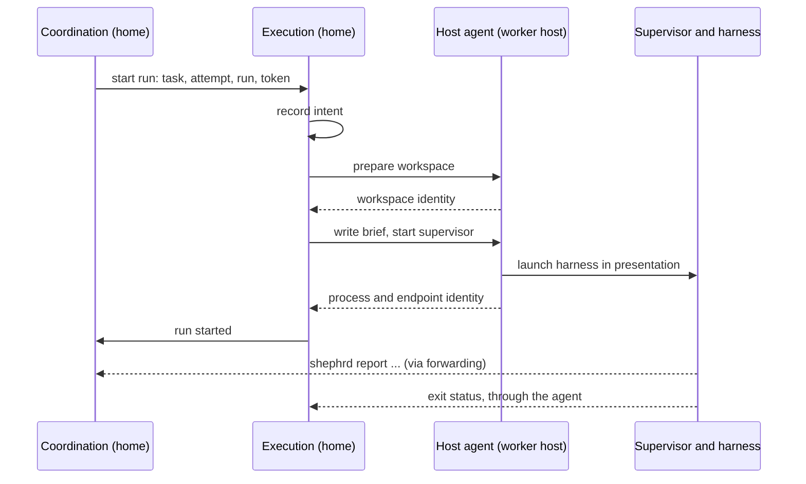
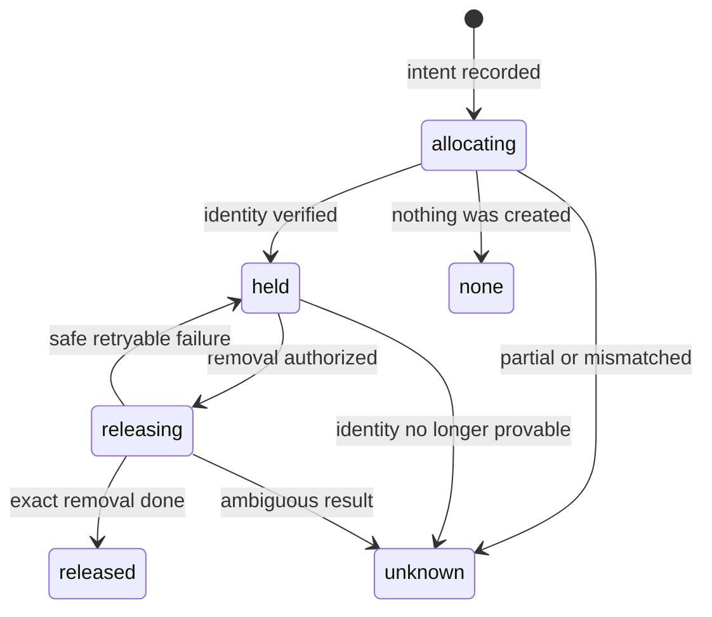

# Session execution

**Status:** approved. Implements the [system design](../design.md).

## Purpose

Session execution turns coordination's decisions into running sessions. It prepares an isolated workspace for each attempt, starts sub-driver and worker sessions in it, on the home host or a worker host, observes whether they are alive, and stops them. It never decides lifecycle outcomes. It reports what it did and observed to [coordination](coordination.md).

**Owns:** host operations, workspaces, briefs, launching and supervising sessions, liveness, stopping, session logs and reconciliation of interrupted effects.

**Does not own:** task state and run identity ([coordination](coordination.md)), how sessions report and when continuation turns start (notification and result flow), what counts as delivered and when a workspace may be removed (artifacts and authority), or transport conventions ([command surface](commands.md)).

## Hosts

Every operation on a machine goes through that machine's **host agent**, the same `shephrd` binary:

- On the home host, execution calls it in-process.
- On a worker host, the home host connects over SSH with its own key, whose forced command on the worker host is `shephrd agent`. The agent accepts only host operations from the home host, using the same JSON request format and protocol version as [forwarded commands](commands.md#requests).

A worker host's agent reports its release version and the harness and presentation providers installed on it. Execution checks these before routing anything there. A host that cannot be reached makes every run on it `unknown`, never `exited`.

## Workspaces

Every attempt of a task with a repository gets one git worktree of that repository, on the repository's host. That includes sub-driver tasks, which then read and investigate in isolation. A driver task without a repository gets an empty scratch directory.

- **Branch:** `shephrd/<task>/<attempt>`. Branches are never deleted.
- **Base:** the registered default branch, fetched from its remote when the attempt is created and recorded as an exact commit. Without a remote, the local default branch is used. If the local and fetched branches have diverged, creation is refused rather than guessing. Coordination guarantees dependencies are finished first, so the base already contains merged ones. A task that [stacks](artifacts.md#stacking) on published but unmerged code starts from that dependency's sealed commit instead.
- **Intent first:** execution records the intended path and branch before creating anything, then verifies the path, branch, common git directory and base commit before marking the workspace `held`.
- **Setup:** the repository's registered setup command runs once in a new workspace. It is trusted code chosen by the operator at registration.
- **The registered checkout is never modified.** Execution only fetches into it, and never copies its uncommitted or ignored files.
- **Not supported yet:** repositories with active submodules or Git LFS are refused at workspace creation.

Resume reuses the attempt's held workspace exactly, with no re-fetch, reset or rerun of setup. Retry creates a new attempt and a new workspace from a fresh base, and never copies anything from the old one. Removal happens only when [artifacts and authority](artifacts.md#discard-and-release) authorizes it, after execution verifies exact identity, no live process and, unless discarding, a clean tree. An `unknown` workspace is never removed automatically.

## Sessions

A run is one turn of one session. It starts, works until it reports a result, question or blocker, and exits. Nothing waits idle in a process.

### Starting a run

1. Coordination reserves the run generation and token.
2. Execution writes the **brief** into the workspace: role, title, objective, acceptance, the paths of [pinned inputs](artifacts.md#passing-artifacts-on), the latest notes, and for a driver task an overview of every open request with its children and the events since its last turn, plus a pointer to the repository's context file, and how to report. Each brief is bounded in size, and longer material is referenced by commands to read it rather than included.
3. The host agent starts `shephrd _run`, the **supervisor**, inside the chosen presentation. The supervisor starts the harness in its own process group with a clean environment: `PATH`, `HOME`, the host's `SHEPHRD_CONFIG` and `SHEPHRD_RUN_TOKEN`. Driver identity, terminal credentials and any parent Shephrd tokens are never passed through.
4. Process identity, meaning process ID with start time, and any presentation endpoint are recorded before the harness receives the brief.

### Continuation

When a waiting or done task receives a message, or a driver task's children report, [notification and result flow](notifications.md) asks execution for a new run of the same attempt. Every new run resumes the task's native harness session:

- **A worker** resumes its own session, keeping its working memory of the change it is making.
- **A sub-driver** is one continuous session for its repository. Every turn resumes it, so it keeps context across all its requests and workers. A turn handles everything new since the last one, across all requests at once, and its brief always includes the overview of open requests and children, so it stays oriented after the harness compacts its context.

**Every driver turn ends with a checkpoint note:** its plan, decisions, what it is waiting on and what comes next. The note is how a session hands over when it has to be replaced.

**Rotation.** A new session is started, seeded from the brief and the latest checkpoint note, when:

- the harness reports its context is nearly full
- the native session cannot be resumed, for example because it was lost or the harness cannot resume
- the task was retried, since a new attempt has a new workspace and may have a new harness

Rotation is recorded as an event. A harness that cannot resume at all starts a new session every turn the same way.

### Reporting and output

Sessions report only by calling `shephrd report`, defined by notification and result flow. Execution never parses harness output. The supervisor writes the session's output to a log on its host, readable with `task log`, but the log is never evidence of a result.

A run that exits without reporting a result, question or blocker gets **one nudge**: a continuation run whose brief says it finished without reporting and must call `shephrd report`. If that run also exits without reporting, the task is `held` with reason `no_report`.

### Inactivity

There is no fixed deadline. A run that reports nothing, not even progress, for its role's inactivity timeout, 30 minutes by default and configurable per role, is stopped as below and gets one nudge the same way. If the nudged run is also inactive, the task is `held` with reason `inactive`. A long run that keeps reporting progress is never stopped.

### Read-only sub-drivers

Sub-drivers plan and supervise; [workers implement](skill.md#sub-driver). Execution enforces that split:

- A driver run asks its harness provider for **read-only mode**, which disables file-editing tools where the harness supports it.
- The files in a driver task's workspace are made **read-only** before each run. Briefs and logs live outside the workspace, so nothing a driver needs to write is inside it.
- A sub-driver can still read, search and run `shephrd` commands.

This is a guard rail, not a security boundary: it turns an accidental implementation into an error, not a judgment call.

**Long turns.** A driver turn that has run longer than its turn budget, 10 minutes by default and configurable, gets one nudge: the next `shephrd` command it runs returns a `turn_long` warning telling it to delegate the remaining work and report. The turn is never stopped for length.

## Liveness and stopping

| Observation | Meaning |
|---|---|
| `live` | The recorded process exists with the recorded start time. |
| `exited` | The supervisor reported the exit, or the host agent proved the process is gone. |
| `unknown` | The host is unreachable, or the probe could not prove either. |

The supervisor reports the harness's exit through the host agent. If the supervisor itself dies, the daemon probes the recorded process. Only `exited` lets coordination resume, retry or release.

Stopping sends a termination signal to the run's whole process group, waits a bounded grace period, then kills it. The run counts as stopped only once the host agent confirms the group is reaped. If that cannot be confirmed, the run is `unknown` and nothing that needs it gone proceeds. A stop never removes the workspace.

## Reconciliation

Interrupted effects, such as a crash between recording intent and creating a worktree, are classified by reconciliation:

- An `allocating` workspace with nothing on disk becomes `none`. One whose exact worktree exists becomes `held`. Anything partial or mismatched becomes `unknown`.
- A run whose process is proven gone becomes `exited`.
- An authorized removal that was interrupted is finished once its identity is re-verified.

Reconciliation never starts a run, chooses resume or retry, or invents authority. The daemon runs it at startup and periodically, and `workspace reconcile` runs it on demand.

## Harness and model

The task's target names the harness and an opaque model string. Execution passes the model to the harness unchanged and never translates it. A model is never carried across a harness change. Resume keeps the attempt's harness and model. Retry uses the task's current target, which the owner may change.

## Commands

| Command | Effect |
|---|---|
| `task start`, `task resume`, `task retry` | Start a run on a new attempt, the same attempt or a new attempt, after coordination's checks |
| `task stop` | Stop the current run, optionally for a whole subtree |
| `task log` | Read the current or a named run's session log |
| `workspace reconcile` | Classify interrupted effects on every host |
| `host list` | Configured hosts with reachability, version and installed providers |

`shephrd agent` and `shephrd _run` are private commands between Shephrd binaries of the same release, not part of the public command surface.

## Failure behavior

| Situation | Behavior |
|---|---|
| Host unreachable | Its runs are `unknown`; resume, retry and removal on that host are refused. Starting new work there is refused. |
| Host on a different release | Refused with `version_mismatch` before anything is created. |
| Base cannot be resolved or has diverged | Workspace creation refused; the task stays as it was. |
| Setup command fails | Workspace stays `held`; the task is `held` with reason `setup_failed`. |
| Harness fails to start | Task `held` with reason `start_failed`; the workspace stays `held`. |
| Run exits without reporting | One nudge, then task `held` with reason `no_report`. |
| Run reports nothing for its inactivity timeout | Stopped, one nudge, then task `held` with reason `inactive`. |
| Process group cannot be confirmed reaped | Run `unknown`; nothing that needs it gone proceeds. |
| Workspace identity mismatched | Workspace `unknown`; never removed automatically. |

## Extensibility

Follows [plugins and extensibility](extensibility.md). Execution providers run on the host where the session runs, so each host declares the providers installed on it in its own configuration, and the host agent reports them.

### Events

| Event | `data` |
|---|---|
| `workspace.state` | Attempt, host, path, branch, base commit, from, to |
| `run.started` | Run, host, harness, model, presentation endpoint |
| `run.liveness` | Run, from, to |
| `run.exited` | Run, exit status, whether it reported |
| `run.nudged` | Run, reason: `no_report` or `inactive` |
| `session.rotated` | Task, old and new native session, reason |
| `host.reachability` | Host, reachable or unreachable |

### Intercept points

None of its own. Coordination's `task.start` gate runs before every run starts, including continuation turns.

### Providers

| Type | Request | Response | Built-in |
|---|---|---|---|
| `harness` | Mode (new or resume), read-only flag, brief path, workspace, model, native session ID when resuming | Command, extra environment, and the native session ID it assigned, if it supports resume | Claude Code, Codex, Pi |
| `presentation` | Operation: open, probe, close, focus. For open: title, command, workspace | Endpoint identity; probe answers `present`, `absent` or `uncertain` | Headless |

A harness provider only builds the command. The supervisor runs it, so the provider never owns process identity. A presentation provider such as Herdr or cmux runs the supervisor inside a terminal it creates, and only an exact `absent` answer counts as the endpoint being gone.

### Limits

Providers never decide liveness, change workspace identity, see run tokens other than through the environment they are given, or translate models. Execution re-verifies every process and workspace identity itself.

## Settled decisions

1. **Every task with a repository gets its own worktree**, sub-drivers included. Sub-driver runs are read-only, with a turn budget nudge.
2. **Every run resumes its task's native session.** A sub-driver is one continuous session per repository, ending each turn with a checkpoint note and rotating to a new session from that note when it must.
3. **No output parsing.** Sessions report only through `shephrd report`, with one nudge before `no_report`.
4. **Built-in providers:** Claude Code, Codex and Pi harnesses and headless presentation ship in core. Herdr and cmux are plugins.
5. **Execution providers are declared per host**, in that host's configuration.
6. **Inactivity timeout instead of deadlines**, for both roles, with one nudge before `inactive`.
