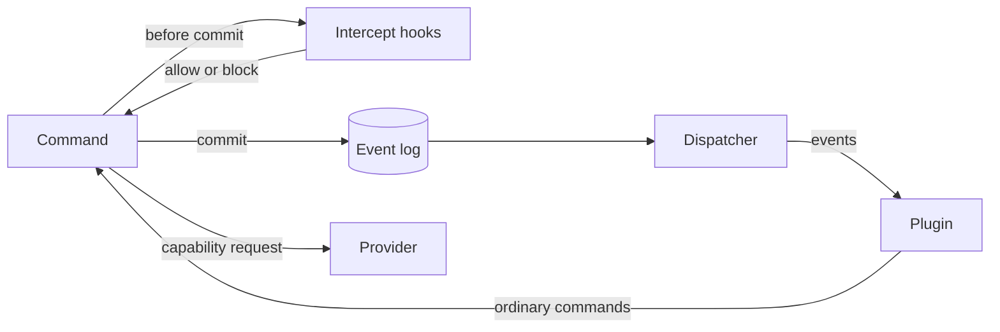

# Plugins and extensibility

**Status:** approved. Implements the [system design](../design.md).

## Purpose

Plugins let people add or replace Shephrd behavior without forking it: react to what happens, enforce their own policy, swap adapters, and add commands and skills. This spec defines the shared mechanism. Each system's spec defines the events, intercept points and providers it offers, in its own Extensibility section.

The model follows Pi's extensions: named lifecycle events, hooks that can block an action, and registered commands and providers. Unlike Pi, plugins run out of process, because Shephrd is a short-lived Go CLI spanning several hosts and a plugin must never be able to crash it or corrupt its state.

## Rules

- **Out of process, any language.** A plugin is an executable that exchanges JSON with Shephrd over stdin and stdout.
- **Durable.** Events come from the durable event log, so nothing is lost while a plugin or the dispatcher is down.
- **Tighten, never loosen.** A plugin can refuse an action. It can never allow something the core refuses or skip a core check.
- **Same rules as any caller.** When a plugin calls Shephrd, it is an ordinary caller with an identity and permissions.
- **Recorded.** Every block and every provider answer that affects a task is recorded in that task's event log, naming the plugin.

## Surfaces

| Surface | Direction | Timing | Can change the outcome |
|---|---|---|---|
| **Events** | Shephrd pushes facts to the plugin | After commit, through the dispatcher | No. The plugin may react by calling commands. |
| **Intercept hooks** | Shephrd asks the plugin before acting | Inside the command, before commit | Allow or block only |
| **Providers** | Shephrd asks the plugin to perform a capability | When the capability is needed | Within the provider type's contract |
| **Commands and skills** | The plugin adds `shephrd <name>` subcommands and driver Markdown | On demand | Only through ordinary commands |



### Events

Events are the public form of the event log. Each has a name `<system>.<fact>`, such as `task.created`, and a common envelope:

```json
{"seq": 812, "name": "task.state", "time": "2026-10-09T18:00:00Z",
 "task": "t_1", "attempt": 1, "run": 2, "caller": "driver:main",
 "data": {"from": "running", "to": "waiting"}}
```

- A plugin subscribes to event names in its manifest, optionally limited to repositories.
- The dispatcher delivers events in order per plugin, in batches, at least once. It keeps one cursor per plugin in the store and advances it when the plugin acknowledges the batch. Plugins deduplicate by `seq`.
- A failing plugin is retried with backoff. After repeated failures its delivery pauses and is reported by `plugin status`. A slow or broken plugin never delays commands or other plugins.
- Handling an event never mutates state by itself. A plugin that wants to act calls ordinary commands as itself.

### Intercept hooks

Intercept hooks are gates. Each system declares intercept points, such as `task.create` or `task.land`, and what each one gates.

- The command calls every plugin registered for the point, in configured order, before it commits. The first block wins.
- A plugin answers `allow`, or `block` with a reason. Hooks never modify the action.
- A block refuses the command with `plugin_blocked`, naming the plugin and its reason, and changes nothing.
- **Hooks fail closed.** A timeout, crash or malformed answer refuses the command with `plugin_failed`, because skipping a gate would bypass the policy it enforces. The error names the plugin. The way forward is to fix it or remove it from configuration.
- Hooks run on the home host, where commands commit. A hook can never change ownership, state, identity or authority, or allow a refused action.

**Enrichment uses events, not hooks.** A plugin that adds information, such as linking each task to an issue tracker, subscribes to the event and calls `task data set` after the fact. The command never waits on it, and a failure only delays the data while delivery retries.

### Providers

A provider type is a capability the core needs and a plugin can supply, such as a harness adapter, terminal presentation, routing or forge observation. Each system spec defines its provider types, their request and response schemas, and the built-in default.

- Configuration selects the provider for each type. Built-in defaults implement the same contract.
- Core validates every answer. A provider's answer is evidence, never authorization, and a failure fails the action that needed it, with nothing guessed.

### Commands and skills

- A plugin may add `shephrd <plugin-name> ...` subcommands. Core command names always win, and a collision stops the plugin loading.
- Plugin commands are forwarded and run on the home host like any command, so SSH parity holds. The plugin runs on behalf of the caller, with a call token that lets it act only with the caller's permissions, for that one command.
- A plugin may ship skills: Markdown that teaches drivers its workflow. `shephrd plugin skill <name>` prints them on any host.

## Plugins as callers

A plugin acting on its own, such as when handling an event, is the caller `plugin:<name>`. By default it can:

- read all tasks, since the operator declared it on the home host
- create root tasks, which it then owns as their driver
- write only its own namespace of plugin data on tasks

Anything more, including irreversible actions, needs the same explicit grants as any other caller. A plugin running elsewhere can use its own SSH key whose forced command is `shephrd serve --as plugin:<name>`.

A plugin process runs as the home host's OS user, with that user's access to the machine, like a Pi extension. Shephrd's rules govern what a plugin does through Shephrd, not what trusted code can do on the machine. Only declare plugins you trust.

## Manifest

A plugin is a directory inside a [package](#packages-and-configuration), with a `plugin.toml`. Paths in it are relative to that directory:

```toml
name = "linear"
version = "0.3.0"
protocol = 1
exec = ["bin/shephrd-linear"]

[events]
subscribe = ["task.created", "task.state", "task.result"]

[commands]
linear = "Sync tasks with Linear issues"

skills = ["skills/linear.md"]
```

A gate or provider is declared the same way:

```toml
name = "freeze"
version = "1.0.0"
protocol = 1
exec = ["bin/shephrd-freeze"]

[[intercept]]
point = "task.create"

[[provide]]
type = "router"
```

## Packages and configuration

A **package** is a source of plugins: one git repository pinned to one commit, or a local path. A **plugin** is what runs: one `plugin.toml` inside a package. A package may contain any number of plugins, and they may share code, such as a common `lib/` or one executable called with different arguments.

A package declares its plugins explicitly or by convention:

- **Explicit:** a root `shephrd-package.toml` lists plugin directories, globs allowed:

  ```toml
  plugins = ["plugins/*"]
  ```

- **Convention**, with no package file: a root `plugin.toml` is a single-plugin package, and each `plugins/*/plugin.toml` is one plugin.

**Configuration is the only source of truth.** The home host's configuration declares every package and every plugin that runs. There are no commands to install, enable or disable plugins, so a host's plugin setup can be rebuilt from its configuration files alone, for example with Nix.

```toml
[packages.acme]
git = "https://github.com/acme/shephrd-plugins"
rev = "3f2c1e0b9a7d4c6e8f1a2b3c4d5e6f708192a3b4"

[packages.tools]
path = "/nix/store/abc123-shephrd-tools"

[plugins.linear]
package = "acme"

[plugins.linear.options]
team = "ENG"

[plugins.freeze]
package = "tools"
order = 10
```

- **Declaring a plugin enables it.** Plugins in a package that configuration does not declare never run.
- **The configuration key is the plugin's name**, so names are unique by construction. The named package must contain a plugin with that name.
- A **git package** is pinned to a full commit. `shephrd plugin sync` fetches declared git packages into the data directory at their pinned commits and removes undeclared ones. Shephrd never builds plugins, so a git package must contain runnable executables, such as scripts or committed binaries. Plugins that need building belong in a path package. Before every use, Shephrd checks that the checkout is still at its commit with no local changes, which covers code shared between plugins.
- A **path package** is used as it is. The operator is responsible for its contents; immutable paths such as Nix store paths are the intended use.
- Every command reads configuration, and the daemon rereads it before each delivery pass, so changes apply without restarts.
- When the daemon sees the declared set of plugins change, it records a `plugins.changed` event, so removing a gate leaves a trace.
- `plugin list`, `plugin status` and `plugin skill` inspect declared plugins. `plugin sync` is operator-only.

**A declared plugin that cannot run fails closed.** If its package is missing, not at its pinned commit, has local changes or lacks that plugin, the plugin is unavailable. Its gates refuse commands with `plugin_failed`, its events wait, and `plugin status` reports why. A missing install never silently bypasses a gate.

**Runtime identity stays per plugin.** Each plugin has its own `plugin:<name>` caller, data namespace, permissions and event cursor. The package exists only for sourcing and pinning.

## Protocol

Every call starts the plugin executable, writes one JSON request to stdin and reads one JSON response from stdout. The exit status must be 0. stderr goes to the plugin's log.

```json
{"protocol": 1, "kind": "event | intercept | provide | command",
 "plugin": {"name": "linear", "options": {"team": "ENG"}},
 "body": {}}
```

- Every call has a timeout and a response size limit. Intercept hooks default to 5 seconds, and each provider type sets its own.
- The plugin receives a clean environment: `PATH`, `HOME`, `SHEPHRD_PLUGIN` and, when it may call back, `SHEPHRD_CALL_TOKEN`. Shephrd identity variables from the parent, such as a run token, are never passed through.
- A manifest whose protocol version Shephrd does not support is not loaded and is reported.

Starting a process per call keeps plugins stateless, isolated and simple to write. Plugins that need state keep their own.

## Dispatcher

`shephrd daemon` is one long-running process on the home host, guarded by a lock. It delivers events to plugin subscribers, [wakes owners and sessions](notifications.md#waking-turns), pushes inbox items, and runs [reconciliation](execution.md#reconciliation). It decides nothing. It delivers durable facts to whoever subscribed.

**The daemon is expected to run whenever Shephrd is in use.** Delegation depends on it, since it is what wakes sub-drivers when their children report. If it is not running, nothing is lost and every command still works, but nothing is pushed until it starts. Every command's output then carries a `daemon_not_running` warning, so the gap is never silent.

## Failure behavior

| Situation | Behavior |
|---|---|
| Intercept hook times out, crashes or answers invalidly | Command refused with `plugin_failed`; nothing changes. |
| Intercept hook blocks | Command refused with `plugin_blocked` and the plugin's reason. |
| Event delivery fails | Retried with backoff, then paused for that plugin. Other plugins and commands are unaffected. |
| Daemon not running | Commands work and nothing is lost; output carries `daemon_not_running`. |
| Provider fails | The action that needed it fails closed. |
| Declared plugin's package missing, changed or not at its pinned commit | Plugin unavailable: its gates refuse with `plugin_failed`, its events wait, `plugin status` reports why. |
| Unsupported protocol version | Plugin unavailable, as above. |
| Declared plugin set changes | Daemon records `plugins.changed`. |

## What each system spec defines

Every system spec has an **Extensibility** section that lists:

1. **Events** it emits, with their `data` fields.
2. **Intercept points**, with what each one gates.
3. **Provider types**, with request and response schemas and the built-in default.
4. **Plugin data**, if the system stores any.
5. **Limits**: what plugins can never do in that system.

## Settled decisions

1. **Process per call** for every surface in version 1. Plugins that need state or open connections run as their own programs, using `shephrd events --follow` and ordinary commands. A long-lived mode for event subscribers can be added later behind the same message format.
2. **Global plugins only** in version 1. Repository-local plugins, gated by explicit trust as in Pi, can come later.
3. **Intercept hooks only allow or block, and always fail closed.** Enrichment goes through events, which never block a command.
4. **`shephrd daemon` runs on the home host** whenever Shephrd is in use. It is one local process, not a distributed deployment.
5. **Plugins are declared in configuration only.** There are no install, enable or disable commands. Recovering from a broken plugin means fixing or removing it in configuration.
6. **Git and path packages are both supported.** Git packages are fetched and pinned by Shephrd. Path packages are built and pinned by the operator's package manager, such as Nix.
