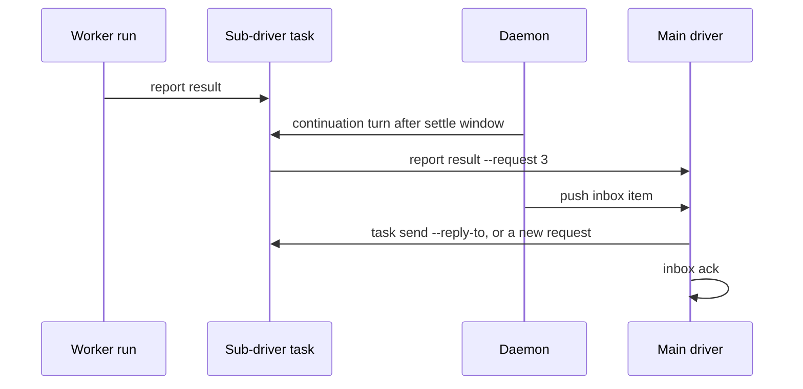

# Notification and result flow

**Status:** approved. Implements the [system design](../design.md).

## Purpose

Notification and result flow carries what sessions report up to the owner that delegated to them, and carries replies and new requests back down, until someone takes responsibility for each. It decides when an owner needs a new turn and wakes it. It never decides lifecycle outcomes: handling a notification is evidence, never approval.

**Owns:** the `report` command, which reports count as a finished turn, routing to owners, the inbox for drivers, waking sub-drivers and workers for continuation turns, and push delivery to drivers.

**Does not own:** the event log and task state ([coordination](coordination.md)), starting and stopping runs ([session execution](execution.md)), whether a result is valid or delivered (artifacts and authority), or the daemon and event subscriptions themselves ([plugins and extensibility](extensibility.md#dispatcher)).

## Reporting

A session reports by running `shephrd report`, with its run token from the environment. Over SSH it is forwarded like any command. Only the current run of the current attempt can report, and every report is checked immediately, so a mistake comes back to the agent as an error it can fix and retry, with no output parsing or repair turns.

| Command | Records | Notes |
|---|---|---|
| `report progress <text>` | `progress` | Quiet. Resets the inactivity timeout. |
| `report question <text>` | `question` | The task becomes `waiting`. |
| `report result <text>` | `result` | Validated against the deliverable by artifacts and authority. |
| `report blocker <text>` | `blocker` | The task becomes `held` with reason `blocked`. |
| `report note <text>` | `note` | Inert. A driver's checkpoint note. |

- Text comes from an argument or stdin. Bodies are bounded at 8 KiB, and notes at 4 KiB; longer material belongs in the deliverable itself.
- A driver run adds `--request <seq>` to a question or result, naming the request it answers. A worker needs none.
- Every report takes a `--key`, so a retried report never duplicates.

### What ends a turn

| Role | Turn is reported when | After that |
|---|---|---|
| Worker | It reports a `result`, `question` or `blocker` | The supervisor gives it a short grace period to exit, then stops it. |
| Driver | It reports a closing `note` after its last other report, then exits | The turn ends when the session exits. A driver may report several results and questions in one turn. |

A run that exits without its turn being reported gets execution's [one nudge](execution.md#reporting-and-output), then is held with `no_report`.

## Routing

Every report is recorded on the reporting task. Whether it also needs someone's attention depends on its kind:

| Kind | Wakes the owner |
|---|---|
| `question`, `result`, `blocker` | Yes |
| The task becoming `held` for any other reason, such as `no_report`, `inactive` or a lost run | Yes |
| `progress`, `note` | No. Visible in `task show` and the event stream. |

Where the wake goes depends on who the owner is:

- **A driver task owner**, meaning a sub-driver, gets a continuation turn. The event appears in that turn's brief.
- **A driver**, such as the main driver or a plugin, gets an **inbox item**.

Because owners are fixed by the tree, a main driver only ever hears from its direct children. A worker's question reaches its sub-driver, which answers it or asks its own owner.

Going down, `task send <task> <text> [--reply-to <seq>]` records a `message`, or a `reply` when it answers a question. It wakes the task for a continuation turn. A message to a driver task is a new request.

## Waking turns

The daemon starts continuation turns through session execution, under coordination's `task.start` gate:

- **A worker** that is `waiting` or `done` gets a turn when its owner sends it a reply or message.
- **A driver task** gets a turn when it has anything new: a request, a reply, or a wake-worthy event from a child. If a turn is already running, new events wait and appear in the next turn's brief.
- **Coalescing:** the daemon waits a short settle window, 5 seconds by default, before starting a driver turn, so several children finishing together are handled in one turn.
- A task that is `held`, or whose owner stopped it, gets no automatic turns. Events still accumulate for when it resumes.

## Inbox

A driver's inbox is the durable record of the items that need its attention: questions, results, blockers and held tasks among its root tasks. Drivers normally learn about new items by [push](#push-delivery); the inbox commands read and settle them.

- **`inbox`** lists pending items, each with the event, the task and its current state, and the exact commands to read more, reply or acknowledge.
- **`inbox ack <item>`** marks an item handled.
- **`inbox wait [--after <seq>]`** is for a driver that would rather hold a connection open than receive pushes. It blocks, without polling, and streams new items as JSON lines, resuming from a cursor after a dropped connection.

An item is `pending` until acknowledged. Acknowledging means "handled," not "answered" or "approved." Answering is `task send`, and approving is an artifacts and authority action. Acknowledging the same item again is a no-op. Closing a task acknowledges its pending items automatically, recorded as a system acknowledgement.

There are no claims or leases. Delivery is at least once, and consumers deduplicate by item ID. A driver should have one consumer at a time. Two consumers are safe, since acknowledgement grants nothing, but may handle an item twice.

## Push delivery

Push is how drivers normally learn about new items, so nothing polls. Configuration names a `delivery` provider for each driver, and the daemon calls it as soon as an item is added. A webhook provider is built in; others, such as one that starts a turn in a Pi session, are plugins.

```toml
[drivers.main.delivery]
provider = "webhook"
url = "https://hermes.internal/shephrd"
secret_file = "/run/secrets/shephrd-webhook"
```

- The provider answers `delivered`, `retryable` or `rejected`.
- Delivery never acknowledges. The driver acknowledges after handling, with the `inbox ack` command included in the delivery.
- Items are delivered independently, not one at a time in order, so one failing item never blocks the others. A failing item is retried with backoff up to a cap, and `inbox` shows its delivery status.



## Failure behavior

| Situation | Behavior |
|---|---|
| Report from a non-current run | Recorded as `stale`, refused with `stale_run`. |
| Report on a task that is not running | Refused with `not_running`. |
| Report fails validation or a gate | Refused with the reason; the agent can fix it and report again. |
| Daemon not running | Reports and inbox still work; no turns start and nothing is pushed until it starts. Every command warns `daemon_not_running`. |
| Continuation turn blocked by a `task.start` gate | Task `held` with reason `start_blocked`; its owner is woken. |
| Push delivery keeps failing | Retried with capped backoff; the item stays pending and readable with `inbox`. |

## Extensibility

Follows [plugins and extensibility](extensibility.md).

### Events

| Event | `data` |
|---|---|
| `inbox.added` | Driver, item, task, event |
| `inbox.acked` | Driver, item, whether it was a system acknowledgement |
| `delivery.attempted` | Driver, item, provider, outcome |
| `turn.woken` | Task, reason, the events included |

Reports themselves are coordination's `task.progress`, `task.question`, `task.result`, `task.blocker` and `task.note` events.

### Intercept points

| Point | Gates |
|---|---|
| `report.result` | Accepting a result, before it is recorded. A block returns the reason to the reporting session, so a policy such as "results must cite passing checks" is enforced while the agent can still act on it. |

### Providers

| Type | Request | Response | Built-in |
|---|---|---|---|
| `delivery` | Driver, item, task summary, event body, and exact commands to read, reply and acknowledge | `delivered`, `retryable` or `rejected`, with a bounded detail | Webhook, signed, with a stable delivery ID per item for deduplication |

Delivery into a Pi session is a first-party plugin. Desktop notifications are an event subscriber, not a delivery provider.

### Limits

Plugins never acknowledge for another driver, answer on a driver's behalf, or start turns except through ordinary commands. A delivery outcome is never an acknowledgement.

## Settled decisions

1. **No claims or leases.** At-least-once delivery with explicit acknowledgement and deduplication by item ID replaces drain, renew, claim tokens, parking and pump.
2. **Driver turns coalesce** over a settle window, 5 seconds by default and configurable.
3. **A `report.result` gate**, so plugins can enforce result policy while the agent can still fix it.
4. **Push first.** Drivers learn about items by push, with a built-in webhook provider. `inbox wait` is available for drivers that hold a connection instead. Nothing polls.
5. **Closing a task acknowledges its pending items**, recorded as a system acknowledgement.
6. **Reports carry summaries; large content moves by reference.** Reports are bounded at 8 KiB and notes at 4 KiB. Documents and other large results are deliverables, stored and passed on by artifacts and authority, so a driver reads them only if it chooses to.
